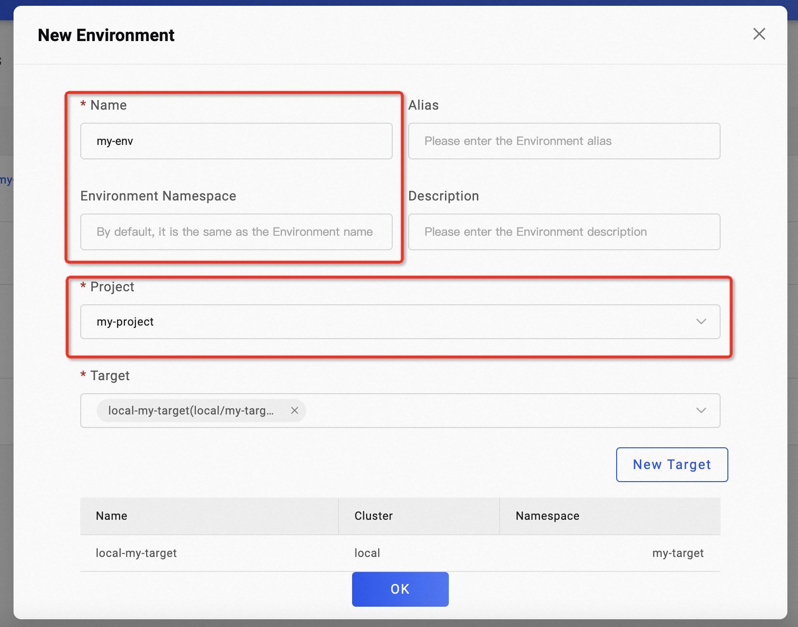

项目提供了应用、环境和资源的逻辑分组，它适用于多个团队或项目组使用VelaUX的场景，他具有以下能力设定：

* 限制应用部署的目标，即哪些集群的哪些命名空间。
* 限制可用的集成配置，包括镜像仓库、制品仓库、云服务授权等。
* 限制不同的用户的 RBAC 授权，实现项目和应用多级权限控制。

## 默认项目

VelaUX 安装后会默认生成一个`Default`的项目空间，授权给管理员用户。同时也默认生成了默认交付目标和环境绑定在该项目中。

## 创建项目

具有项目管理权限的用户可查看到 `Platform/Projects` 页面，进入该页面即可创建项目。

点击右上方的`创建项目` 按钮即可进入项目创建页面，每一个项目需要设置一个负责人，项目创建后负责人自动授予项目管理员角色。

### 创建项目关联的环境

一个项目可以有多个关联的环境。环境是一个逻辑概念，指向集群中的一个命名空间，默认不指定的情况下，环境的命名空间与环境同名。在创建环境时，你需要为其关联一个项目。

## 编辑项目

项目负责人、别名和描述信息支持更新编辑。点击项目名称进入项目详情页后可继续管理项目下的成员、角色和应用。

## 删除项目

当项目下存在应用等资源时不能删除，如需删除一个项目，需要先删除项目下的应用、环境、交付目标等资源。
