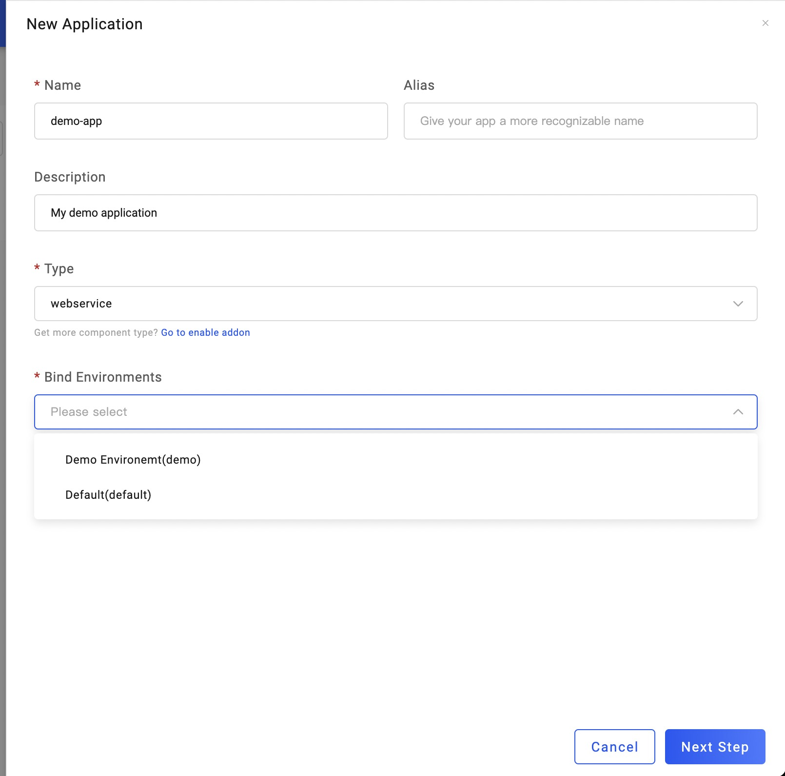
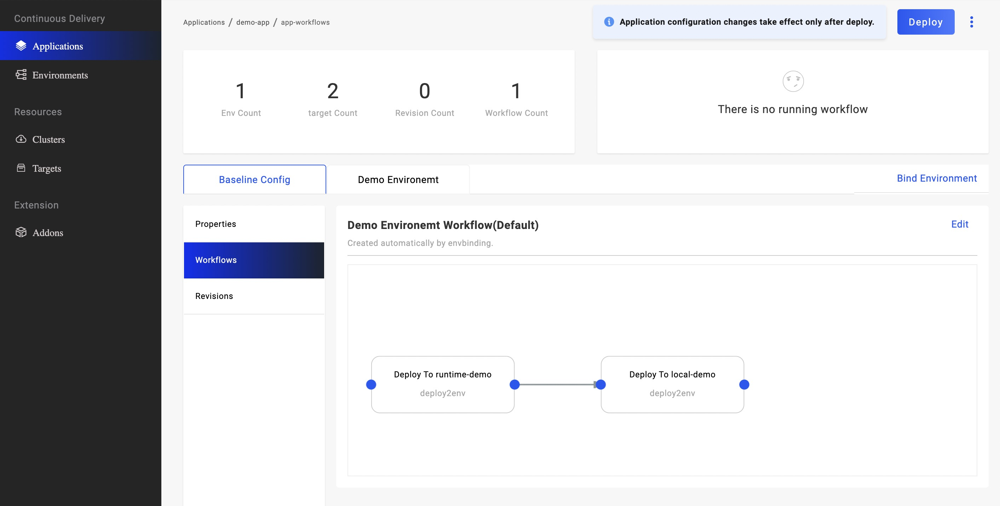

为了将应用组件部署在不同的地方，VelaUX 提供了 **部署目标（Target）** 方便用户管理要部署的具体位置，比如集群或者命名空间。

## 集群

首先，在配置部署目标之前，你需要确认你需要使用的集群已经加入到 KubeVela 的管控面中。你可以在 Cluster 页面查看你的集群。**local** 集群会默认加入其中，它代表了 KubeVela 管控组件所在的集群。如果你有其他的集群，你可以通过提供 KubeConfig 的形式将集群加入其中，或者是通过接入你的云服务厂商（如阿里云）来接入对应平台上的集群。

在向 KubeVela 添加完集群之后，你可以编辑它的基本描述信息，或者在没有应用使用它的时候将它从 KubeVela 管控平台上移除。

## 创建部署目标

现在你可以为你的应用创建部署目标了。一个部署目标包含了一个集群中的一个特定命名空间。如果命名空间在集群中还不存在，你可以通过点击 **New** 按钮进行创建。

如果你想要使用云资源（如阿里云上的 RDS 数据库），你可以设置在 *Shared Variables* 中设置云服务厂商的名字（provider name）以及区域名称（region name）。在使用云服务厂商之前，你需要确保相关的 Terraform 组件已经安装完成。

## 将部署目标绑定在环境中

进入到 **Environment** 页面，你可以将刚刚创建好的部署目标绑定在环境中。

## 在环境中创建应用

现在你可以在含有部署目标的环境中创建应用了。

在新创建的应用中，你可以看到有两个部署目标包含在工作流（Workflow）中，这意味着当你部署该应用时，里面的组件会被分发到两个位置（两个集群的两个命名空间中）。

