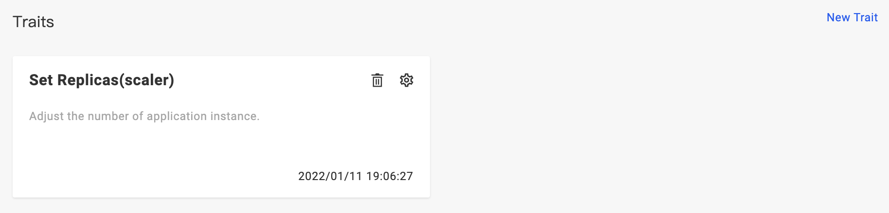
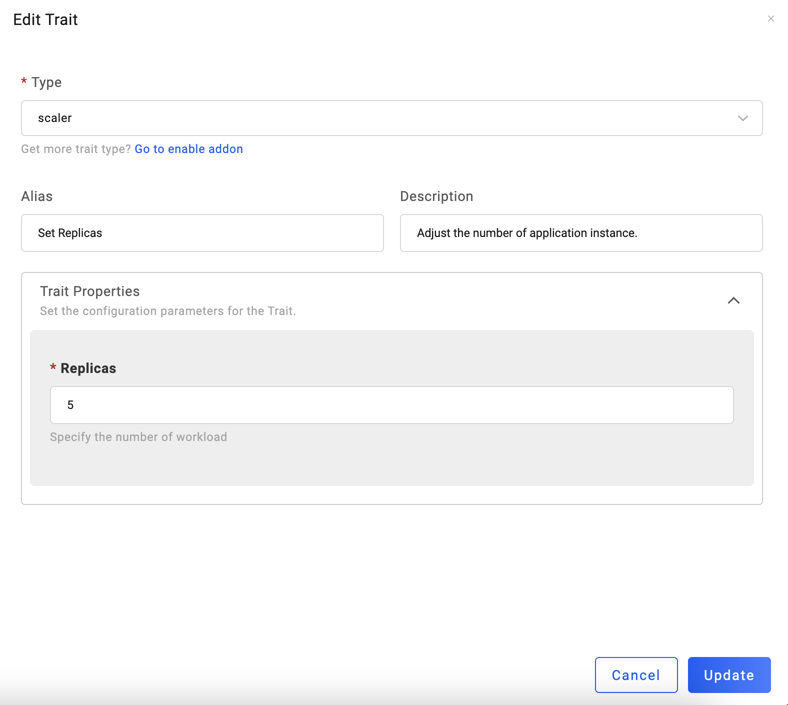

应用在创建完成后，会默认绑定一个 `scaler` 设置副本数的运维特征，你可以更新、删除或者绑定其他的运维特征。

> 注意，对运维特征进行变更后，需要重新部署应用才能使更新生效。

## 绑定运维特征

点击 `New Trait`，可以为应用绑定新的运维特征。

在 `Type` 列可以选择不同类型的运维特征，你也可以开启 `Addon` 插件来启用更多类型的运维特征。

## 更新运维特征

点击运维特征旁的齿轮即可进入编辑页面，此处我们可以将 `scaler` 运维特征的副本数设置为 5：

## 删除运维特征

点击运维特征旁的垃圾桶即可删除运维特征：

## 更多

关于所有运维特征的详细信息，请参考 [运维特征](../../../end-user/traits/scaler)。