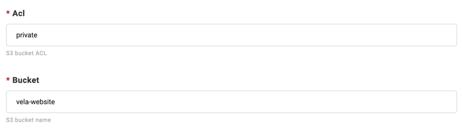

集成云服务是实际开发中最频繁的使用需求之一。从基础的对象存储、云数据库到负载均衡、云缓存，再到基于业务的搜索引擎等等，快速的接入云服务并便捷的使用它们可以大大降低开发成本。与此同时，由于可供选择的云服务厂商非常多，多云交付已成为未来必然形态，如何管理好接入混合云环境时各类资源之间的关系，也成为必须解决的最大挑战。

在本文中，我们介绍一个例子，向你展示如何部署云服务。

## 开始之前

- 拥有一个能适当权限访问你的目标云资源的云供应商账户

- 确保云账号具有足够的费用。

- 对接一个处在同一个云上的 Kubernetes 集群，用以验证云服务的正常开通与使用。

## 开启对应云服务商的插件

首先，访问[VelaUX (KubeVela Dashboard)](../install#3-安装-VelaUX)，切换到 "Addon" 标签，并点击 addon
`terraform-xxx`。`xxx`代表云提供商的名称。我们支持以下的插件：

- provider-alibaba
- provider-aws
- provider-azure
- provider-tencent

我们可以分别在阿里巴巴云、AWS、Azure 和腾讯云配置云资源。

按照每个云提供商的插件的所有属性上的说明来设置插件并启用它。

例如，对于阿里巴巴云，你需要设置以下属性：

> 注意。KubeVela 对所有的密钥进行了加密，因此不必担心它的安全问题。

然后填写你的 ALICLOUD_ACCESS_KEY，ALICLOUD_REGION，和 ALICLOUD_SECRET_KEY 来启用它。

云服务的创建过程会从 GitHub 中提取配置。如果你的控制平面 运行 KubeVela 的集群很难连接到 GitHub，请在`terraform`插件中打开`GithubBlocked`选项。

KubeVela 支持以下类型的资源，以后还会有更多：

| 编排类型  | 云服务商 | 云资源                                                                                   | 描述                                                                  |
| --------- | -------- | ---------------------------------------------------------------------------------------- | --------------------------------------------------------------------- |
| Terraform | 阿里云   | [ACK](../end-user/components/cloud-services/terraform/alibaba-ack)                       | Terraform configuration for Alibaba Cloud ACK cluster                 |
|           |          | [AMQP](../end-user/components/cloud-services/terraform/alibaba-amqp)                     | Terraform configuration for Alibaba Cloud AMQP (RabbitMQ)             |
|           |          | [ASK](../end-user/components/cloud-services/terraform/alibaba-ask)                       | Terraform configuration for Alibaba Cloud Serverless Kubernetes (ASK) |
|           |          | [EIP](../end-user/components/cloud-services/terraform/alibaba-eip)                       | Terraform configuration for Alibaba Cloud EIP                         |
|           |          | [MSE](../end-user/components/cloud-services/terraform/alibaba-mse)                       | Terraform configuration for Alibaba Cloud MSE                         |
|           |          | [OSS](../end-user/components/cloud-services/terraform/alibaba-oss)                       | Terraform configuration for Alibaba Cloud OSS                         |
|           |          | [RDS](../end-user/components/cloud-services/terraform/alibaba-rds)                       | Terraform configuration for Alibaba Cloud RDS                         |
|           |          | [Redis](../end-user/components/cloud-services/terraform/alibaba-redis)                   | Terraform configuration for Alibaba Cloud Redis                       |
|           |          | [RocketMQ](../end-user/components/cloud-services/terraform/alibaba-rocketmq)             | Terraform configuration for Alibaba Cloud RocketMQ                    |
|           |          | [SLS Project](../end-user/components/cloud-services/terraform/alibaba-sls-project)       | Terraform configuration for Alibaba Cloud SLS Project                 |
|           |          | [SLS Store](../end-user/components/cloud-services/terraform/alibaba-sls-store)           | Terraform configuration for Alibaba Cloud SLS Store                   |
|           |          | [VPC](../end-user/components/cloud-services/terraform/alibaba-vpc)                       | Terraform configuration for Alibaba Cloud VPC                         |
|           |          | [VSwitch](../end-user/components/cloud-services/terraform/alibaba-vswitch)               | Terraform configuration for Alibaba Cloud VSwitch                     |
|           | AWS      | [S3](../end-user/components/cloud-services/terraform/aws-s3)                             | Terraform configuration for AWS S3 bucket                             |
|           |          | [S3](../end-user/components/cloud-services/terraform/aws-rds)                            | Terraform configuration for AWS RDS                                   |
|           |          | [S3](../end-user/components/cloud-services/terraform/aws-security-group)                 | Terraform configuration for AWS Security Group                        |
|           |          | [S3](../end-user/components/cloud-services/terraform/aws-subnet)                         | Terraform configuration for AWS S3 Subnet                             |
|           |          | [S3](../end-user/components/cloud-services/terraform/aws-vpc)                            | Terraform configuration for AWS S3 VPC                                |
|           | Azure    | [Mariadb](../end-user/components/cloud-services/terraform/azure-database-mariadb)        | Terraform configuration for Azure Database Mariadb                    |
|           |          | [Storage Account](../end-user/components/cloud-services/terraform/azure-storage-account) | Terraform configuration for Azure Storage Account                     |
|           |          | [Storage Account](../end-user/components/cloud-services/terraform/azure-resource-group)  | Terraform configuration for Azure Resource group                      |
|           |          | [Storage Account](../end-user/components/cloud-services/terraform/azure-subnet)          | Terraform configuration for Azure Subnet                              |
|           |          | [Storage Account](../end-user/components/cloud-services/terraform/azure-virtual-network) | Terraform configuration for Azure Virtual network                     |
|           | 腾讯云   | [Mariadb](../end-user/components/cloud-services/terraform/tencent-vpc)                   | Terraform configuration for Tencent Cloud VPC                         |
|           |          | [Mariadb](../end-user/components/cloud-services/terraform/tencent-subnet)                | Terraform configuration for Tencent Cloud Subnet                      |

## 创建你的云服务

首先[创建一个应用程序](../how-to/dashboard/application/create-application)。请选择你的云服务的类型。
其前缀为`aws-`、`azure`、`alibaba-`或 `tencent-`。

对于不同的供应商，这些参数会相应更新。

例如，`aws-s3` 有以下参数。

`azure-database-mariadb` 有以下参数。

`alibaba-rds` 有以下参数。

所有的云资源都有一些共同的参数。

- DeleteResource：当应用程序被删除时，是否要删除相应的云服务
- ProviderRef：被云服务引用的提供者。
- Region：Region 是云提供商的区域。它将覆盖`providerRef`。

根据你的需要设置上述参数，完成应用程序的创建，然后[部署应用程序](../how-to/dashboard/application/deploy-application)。

##查看云资源创建状态

- 查看云实例列表

与其他应用程序一样，云服务应用程序也需要切换到相应的环境页面来查看实例信息。 默认情况下，一个环境中有多个目标，云服务会生成相应数量的实例。

在实例列表中，会显示实例名称、状态、资源类型和位置。在开始时，名称是空的。 因为云服务实例的生成需要一定的时间，当实例正常生成后，名称会出现。

- 在云提供商的控制台中查看云资源

您可以在云提供商的控制台中访问该实例。例如，您可以检查名称或控制台来访问它。

例如，你可以在[https://console.aliyun.com](https://console.aliyun.com)中查看阿里巴巴云 RDS 实例。

- 检查云实例的细节和状态

点击 "检查细节 "按钮来查看应用程序的细节。

你会发现，每个实例都会生成一个 Secret 资源，一般来说，它记录了服务的访问地址和密钥信息。秘密资源将被分配到目标所在的集群和命名空间，而
控制集群存在。因此，同一环境中的其他应用程序可以直接使用资源中的环境变量来获取访问地址和密钥。

在最后一节 `Component Status` 中，显示了云服务实例的健康状态和信息。

## 常见错误

- 云服务一直处在 ProvisioningAndChecking 状态，且无名称。

> 云服务的创建一般需要一定时间，请等候或者进入云厂商控制台查看创建进度。
