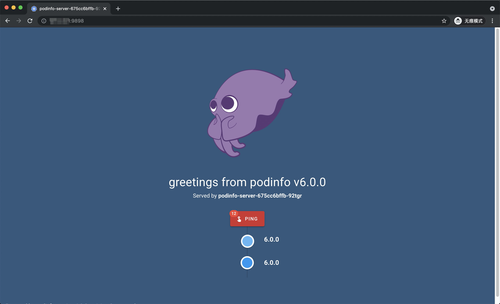

本案例，将为你讲述如何使用 KubeVela 做多集群应用部署，将包含从集群创建、集群注册、环境初始化、多集群调度，一直到应用多集群部署的完整流程。

- 通过 KubeVela 中的环境初始化（Initializer）功能，我们可以创建一个 Kubernetes 集群并注册到中央管控集群，同样通过环境初始化功能，可以将应用管理所需的系统依赖一并安装。
- 通过 KubeVela 的多集群多环境部署（EnvBinding）功能，可以对应用进行差异化配置，并选择资源下发到哪些集群。

## 开始之前

- 首先你需要有一个 Kubernetes 版本为 1.20+ 的集群作为管控集群，并且已经安装好 KubeVela ，管控集群需要有一个可以通过公网访问的 APIServer 
  的地址。如果不做特殊说明，实践案例上的所有步骤都在管控集群上操作。
  

- 在这个场景中，KubeVela 背后采用[OCM(open-cluster-management)](https://open-cluster-management.io/getting-started/quick-start/)技术做实际的多集群资源分发。


- 本实践案例相关的 YAML 描述和 Shell 脚本都在 KubeVela 项目的 [docs/examples/workflow-with-ocm](https://github.com/oam-dev/kubevela/tree/master/docs/examples/workflow-with-ocm) 下，
  请下载该案例，在该目录执行下面的终端命令。


- 本实践案例将以阿里云的 ACK 集群作为例子，创建阿里云资源需要使用相应的鉴权，需要保存你阿里云账号的 AK/SK 到管控集群的 Secret 中。

  ```shell
  export ALICLOUD_ACCESS_KEY=xxx; export ALICLOUD_SECRET_KEY=yyy
  ```

  ```shell
  # 如果你想使用阿里云安全令牌服务，还要导出环境变量 ALICLOUD_SECURITY_TOKEN 。
  export ALICLOUD_SECURITY_TOKEN=zzz  
  ```

  ```shell
  # prepare-alibaba-credentials.sh 脚本会读取环境变量并创建 secret 到当前集群。
  sh hack/prepare-alibaba-credentials.sh
  ```
  
  ```shell
  $ kubectl get secret -n vela-system
  NAME                                         TYPE                                  DATA   AGE
  alibaba-account-creds                        Opaque                                1      11s
  ```

## 初始化阿里云资源创建功能

我们可以使用 KubeVela 的环境初始化功能，开启阿里云资源创建的系统功能，这个初始化过程主要是将之前配置的鉴权信息提供出来，并初始化 Terraform 系统插件。我们将这个初始化对象命名为：`terraform-alibaba`，并部署：

```shell
kubectl apply -f initializers/init-terraform-alibaba.yaml
```

### 创建环境初始化 `terraform-alibaba`

```shell
kubectl apply -f initializers/init-terraform-alibaba.yaml
```

当环境初始化 `terraform-alibaba` 的 `PHASE` 字段为 `success` 表示环境初始化成功，这可能需要等待1分钟左右的时间。

```shell
$ kubectl get initializers.core.oam.dev -n vela-system
NAMESPACE     NAME                  PHASE     AGE
vela-system   terraform-alibaba     success   94s
```

## 初始化多集群调度功能

我们使用 KubeVela 的环境初始化功能，开启多集群调度的系统功能，这个初始化过程主要是创建一个新的 ACK 集群，使用 OCM 多集群管理方案管理新创建的集群，我们将这个初始化对象命名为：`managed-cluster`，并部署：

```shell
kubectl apply -f initializers/init-managed-cluster.yaml
```

除此之外，为了让创建好的集群可以被管控集群所使用，我们还需要将创建的集群注册到管控集群。我们通过定义一个工作流节点来传递新创建集群的证书信息，再定义一个工作流节点来完成集群注册。

**自定义执行集群创建的工作流节点，命名为 `create-ack`**，进行部署：

```shell
kubectl apply -f definitions/create-ack.yaml
```

**自定义集群注册的工作流节点，命名为 `register-cluster`**，进行部署：

```shell
kubectl apply -f definitions/register-cluster.yaml
```

### 创建环境初始化  

1. 安装工作流节点定义 `create-ack` 和 `register-cluster`：

```shell
kubectl apply -f definitions/create-ack.yaml.yaml
kubectl apply -f definitions/register-cluster.yaml
```

2. 修改工作流节点 `register-ack` 的 hubAPIServer 的参数为管控集群的 APIServer 的公网地址。

```yaml
  - name: register-ack
    type: register-cluster
    inputs:
      - from: connInfo
        parameterKey: connInfo
    properties:
      # 用户需要填写管控集群的 APIServer 的公网地址
      hubAPIServer: {{ public network address of APIServer }}
      env: prod
      initNameSpace: default
      patchLabels:
        purpose: test
```

3. 创建环境初始化 `managed-cluster`。

```
kubectl apply -f initializers/init-managed-cluster.yaml
```

当环境初始化 `managed-cluster` 的 `PHASE` 字段为 `success` 表示环境初始化成功，你可能需要等待 15-20 分钟左右的时间（阿里云创建一个ack集群需要 15 分钟左右）。

```shell
$ kubectl get initializers.core.oam.dev -n vela-system
NAMESPACE     NAME                  PHASE     AGE
vela-system   managed-cluster       success   20m
```

当环境初始化 `managed-cluster` 初始化成功后，你可以看到新集群 `poc-01` 已经被被注册到管控集群中。

```shell
$ kubectl get managedclusters.cluster.open-cluster-management.io
NAME     HUB ACCEPTED   MANAGED CLUSTER URLS         JOINED   AVAILABLE   AGE
poc-01   true          {{ APIServer address }}       True     True        30s
```

## 部署应用到指定集群

管理员完成多集群的注册之后，用户可以在应用部署计划中指定将资源部署到哪个集群中。

```shell
kubectl apply -f app.yaml
```

检查应用部署计划 `workflow-demo` 是否成功创建。

```shell
$ kubectl get app workflow-demo
NAME            COMPONENT        TYPE         PHASE     HEALTHY   STATUS   AGE
workflow-demo   podinfo-server   webservice   running   true               7s
```

你可以切换到新创建的 ACK 集群上，查看资源是否被成功地部署。

```shell
$ kubectl get deployments
NAME             READY   UP-TO-DATE   AVAILABLE   AGE
podinfo-server   1/1     1            1           40s
```

```shell
$ kubectl get service
NAME                                          TYPE           CLUSTER-IP      EXTERNAL-IP     PORT(S)          AGE
podinfo-server-auxiliaryworkload-85d7b756f9   LoadBalancer   192.168.57.21   < EIP >         9898:31132/TCP   50s
```

Service `podinfo-server` 绑定了一个 EXTERNAL-IP，允许用户通过公网访问应用，用户可以在浏览器中输入 `http://<EIP>:9898` 来访问刚刚创建的应用。



上述应用部署计划 `workflow-demo` 中使用了内置的应用策略 `env-binding` 对应用部署计划进行差异化配置，修改了组件 `podinfo-server` 的镜像，
以及运维特征 `expose` 的类型以允许集群外部的请求访问，同时应用策略 `env-binding` 指定了资源调度策略，将资源部署到新注册的 ACK 集群内。

应用部署计划的交付工作流也使用了内置的 `multi-env` 交付工作流定义，指定具体哪一个配置后的组件部署到集群中。