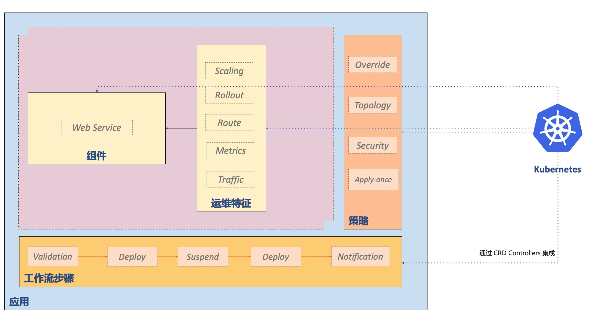

KubeVela 围绕着云原生应用交付和管理场景展开，背后的应用交付模型是 [Open Application Model](../platform-engineers/oam/oam-model)，简称 OAM ，其核心是将应用部署所需的所有组件和各项运维动作，描述为一个统一的、与基础设施无关的“部署计划”，进而实现在混合环境中标准化和高效率的应用交付。KubeVela 包括以下核心概念：

## 应用（Application）

应用是定义了一个微服务业务单元所包括的制品（二进制、Docker 镜像、Helm Chart...）或云服务的交付和管理需求，它由[组件](#组件（component）)、[运维特征](#运维特征（Trait）)、[工作流](#工作流（workflow）)、[应用策略](#应用策略（Policy）)四部分组成。

### 组件（Component）

定义一个制品或云服务的交付和管理形式，一个应用中可以包括多个组件，最佳的实践方案是一个应用中包括一个主组件（核心业务）和附属组件（强依赖或独享的中间件，运维组件等）。组件的类型由 [Component Definition](../platform-engineers/oam/x-definition#组件定义（componentdefinition）) 定义。

### 运维特征（Trait）

运维特征是可以随时绑定给待部署组件的、模块化、可拔插的运维能力，比如：副本数调整（手动、自动）、数据持久化、 设置网关策略、自动设置 DNS 解析等。用户可以从社区获取成熟的能力，也可以自行定义。运维特征的类型由 [Trait Definition](../platform-engineers/oam/x-definition#运维特征定义（traitdefinition）) 定义。

### 工作流（Workflow）

工作流由多个步骤组成，允许用户自定义应用在某个环境的交付过程。典型的工作流步骤包括人工审核、数据传递、多集群发布、通知等。工作流步骤类型由 [Workflow Step Definition](../platform-engineers/oam/x-definition#工作流节点定义（workflowstepdefinition）) 定义。

### 应用策略（Policy）

应用策略（Policy）负责定义指定应用交付过程中的策略，比如质量保证策略、安全组策略、防火墙规则、SLO 目标、放置策略等。应用策略的类型由 [Policy Definition](../platform-engineers/oam/x-definition#应用策略定义（policydefinition）) 定义。

## 集群（Cluster）

Kubernetes 集群描述，它包括了集群通信密钥等信息，Kubernetes 集群目前是 KubeVela 应用交付的主要途径。

## 插件（Addon）

平台扩展插件描述，KubeVela 遵从微内核、高度可扩展的设计模式。KubeVela 在应用交付和管理的完整场景中基于 OAM 模型的概念，将应用组件类型、运维特征、工作流步骤、应用策略等功能均设计成可插拔可扩展的模式。这些可扩展的机制定义与第三方解决方案结合形成插件（ Addon）。每一个插件一般会包括模块定义 [X-Definition](../platform-engineers/oam/x-definition) ，代表它扩展的能力集合，以及第三方解决方案的安装包，如 Kubernetes CRD 及其控制器等。

## 下一步

- 查看 [架构文档](./architecture)，了解 KubeVela 的整体架构。
- 查看 [快速开始](../end-user/quick-start-cli)，了解更多使用场景和最佳实践。
- 查看 [操作手册](../end-user/components/helm) 以便了解更多功能。