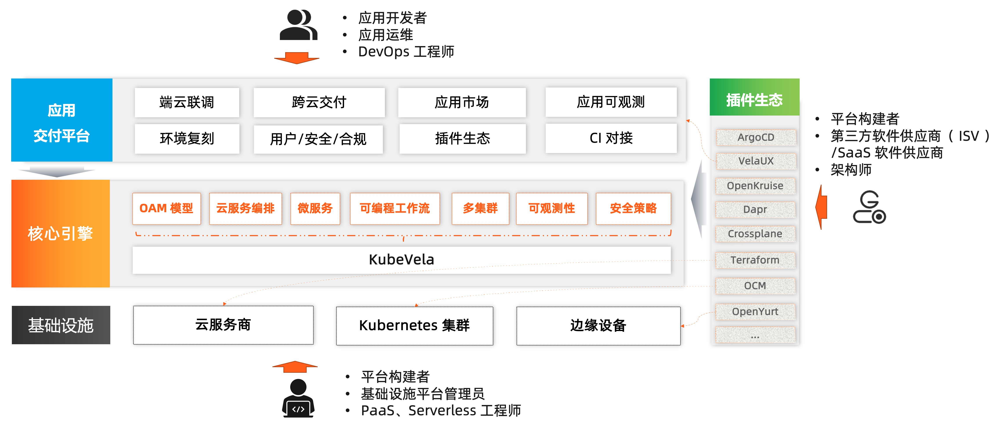

## 什么是 KubeVela？

KubeVela 是一个开箱即用的、现代化的应用交付与管理平台。

KubeVela 通过以下设计，使得面向混合/多云环境的应用交付变得非常简单高效：

- **完全以应用为中心** - KubeVela 创新性的提出了 [开放应用模型（OAM）](https://oam.dev/)来作为应用交付的顶层抽象，并通过声明式的交付工作流来捕获面向混合环境的微服务应用交付的整个过程，甚至连多集群分发策略、流量调配和滚动更新等运维特征，也都声明在应用级别。用户无需关心任何基础设施细节，只需要专注于定义和部署应用即可。
- **多环境/多集群交付** - KubeVela 原生支持多环境/多集群两个维度的混合应用交付，帮助用户大大降低了多集群分布式应用的云原生交付门槛。
- **基础设施无关** - KubeVela 是一个完全与运行时基础设施无关的应用交付与管理控制平面。所以它可以按照你定义的工作流与策略，面向任何环境交付和管理任何应用组件，比如：容器、云函数、数据库，甚至网络和虚拟机实例等等。
- **应用交付工作流** - KubeVela 的交付模型是利用 [CUE](https://cuelang.org/) 来实现的。CUE 是一种诞生自 Google Borg 系统的数据配置语言，它可以将应用交付的所有步骤、所需资源、关联的运维动作以可编程的方式粘合成一个 DAG（有向无环图）来作为最终的声明式交付计划。相比于其他系统的复杂性和不可扩展性，KubeVela 基于 CUE 的实现不仅使用简单、扩展性极强，也更符合现代 GitOps 应用交付的趋势与要求。

## 为什么要用 KubeVela？

云原生技术的发展趋势正在朝着利用 Kubernetes 作为公共抽象层来实现高度一致的、跨云、跨环境的的应用交付而不断迈进。然而，尽管 Kubernetes 在统一底层基础架构细节方面表现出色，它并没有在混合的分布式部署环境之上提供应用层的软件交付模型和抽象。我们已经看到，这种缺乏统一上层抽象的软件交付过程，不仅降低了生产力、影响了用户体验，甚至还会导致生产中出现错误和故障。

然而，为现代微服务应用的交付过程建模是一个高度碎片化且充满挑战的事情。到目前为止，绝大多数试图解决上述问题的技术方案，要么过于简单以致于无法覆盖实际生产使用中的问题，要么过于复杂难以落地使用。云原生带来的基础设施能力爆发式增长也决定了新一代的应用管理平台不能以硬编码的方式做能力的集成和 UI 的构建，除了满足基础的功能和场景，平台本身的扩展能力成为了新时代应用管理平台的核心诉求。这就意味着平台不仅要简单易用，还要能够随着应用交付和管理的需求复杂度提升能够不断扩张，能够让开发者自助式的接入和使用，充分享受云原生生态的红利。

这也是 KubeVela 出现的核心价值：它既能够简化面向混合环境（多集群/多云/混合云/分布式云）的应用交付过程；同时又足够灵活可以随时满足业务不断高速变化所带来的迭代压力。它本身是一个面向混合交付环境同时又高可扩展的应用交付引擎，满足平台构建者的扩展和自建需求；同时又附加了一系列开箱即用的扩展组件，能够让开发者自助式的开发、交付云原生应用。

## 谁应该使用 KubeVela？

- 云原生应用平台的构建者、PaaS、Serverless 平台工程师、基础设施平台管理员：
  - KubeVela 是一个普适的、高可扩展的应用交付引擎与内核，它以极简的架构实现了原生 Kubernetes 多集群控制平面的能力，能够将 OAM 应用引擎直接植入企业已有的 PaaS 平台之中并不破坏已有的能力，从而实现标准化应用交付。
- 第三方软件供应商（ISV）、垂直领域软件开发者、架构师：
  - KubeVela 提供的充分的可扩展和集成能力，可以允许你[自定义插件](./platform-engineers/addon/intro) 完成复杂应用的构建和分发，是一个 Kubernetes 和云平台之上的应用商店（App Store）。
- 云原生时代的应用研发、运维人员、DevOps 工程师：
  - VelaUX 是一个基于 Vela Addon 机制构建的扩展能力集，安装这个插件后，你就拥有了一个开箱即用的现代化持续交付（CD）和应用管理平台。

## OAM、KubeVela 和 VelaUX 是什么关系？

- [OAM(Open Application Model)](https://github.com/oam-dev/spec) 是 KubeVela 背后的模型，它提供了一组平台无关的最佳实践和方法论，能够为不同的公司和厂商构建应用平台提供理论指导，共同提供标准化应用支撑，让应用可以在不同的平台顺畅的运行、平滑的迁移。当前 OAM 模型的演进主要基于 KubeVela 的实践。
- KubeVela 是基于 Kubernetes 的混合云应用交付和管理控制平面，它以 [CRD 控制器](https://kubernetes.io/docs/concepts/extend-kubernetes/api-extension/custom-resources/) 的形式运行，可以很轻量的安装到企业现有的 PaaS 体系中，并带来 OAM 的标准化模型和基于模型高可扩展功能的丰富社区插件。
- VelaUX 是 KubeVela 的众多插件之一，这个插件为应用开发者提供了开箱即用的应用交付和管理能力，包括一组 **restful API** 和 **UI 控制台**。

KubeVela 团队将主要聚焦在核心控制器层面，面向所有用户提供可靠、易用的核心框架和能力。另一方面，我们通过构建 VelaUX 插件为中小型企业提供开箱即用的应用交付和管理功能，不仅可以扩大 OAM 模型的受众，也能吃自己的狗粮打磨 KubeVela 核心框架的可扩展性和插件体系。我们将在打磨核心控制器的同时，持续提供开箱即用的插件能力，并与开源社区的优质项目做更多更好的集成。

## 产品形态对比

### KubeVela vs. CI/CD 系统

KubeVela 是一个工作在 CI 流程下游的 CD 控制平面（Continuous Delivery Control Plane）。所以 KubeVela 希望你保持现有的 CI 流程，而在需要开始制品部署时让 KubeVela 接管 CD 流程。KubeVela 会给你的 CD 流程带来大量的现代化应用交付最佳实践，比如：声明式交付工作流、可编程的工作流步骤、Pull 模型、多云/多集群交付流程、统一的云服务部署和绑定等等。

如果你已经在 CD 环节中采纳了 GitOps 实践，KubeVela 会更容易跟你的 CI/CD 系统集成，因为 KubeVela 是完全声明式的。只需要把 KubeVela 的应用部署描述文件放置在你的配置仓库当中，所有的 KubeVela 特性（包括声明式交付工作流、多云/多集群交付流程等）就会立刻在你 的 GitOps 流程中出现。

> 欢迎查阅 [最佳实践](../tutorials/jenkins) 文档来了解更多关于 KubeVela 与各类 CI/CD 系统协作的实践.

### KubeVela vs. 平台即服务 (PaaS)

典型的例子是 Heroku 和 Cloud Foundry。 它们提供完整的应用程序部署和管理功能，旨在提高开发人员的体验和效率。在这个场景下，KubeVela 也有着相同的目标。

不过，KubeVela 和它们最大的区别在于其**可扩展性**。

KubeVela 是可编程的。它的交付工作流乃至整个应用交付与管理能力集都是由独立的可插拔模块构成的，这些模块可以随时通过编写 CUE 模板的方式进行增/删/重定义且变更会即时生效。与这种机制相比，传统的 PaaS 系统的限制非常多：它们需要对应用类型和提供的能力进行各种约束来实现更好的用户体验，但随着应用交付需求的增长，用户的诉求就一定会超出 PaaS 系统的能力边界。这种情况在 KubeVela 平台中则永远不会发生。

此外，KubeVela 是一个独立于运行时集群的应用交付控制平面（这是我们认为的下一代 PaaS 系统的合理形态），而现有的 PaaS 则往往选择以插件形式部署在运行时集群当中。

### KubeVela vs. Serverless

AWS Lambda 等 Serverless 平台可以为 Serverless 应用管理提供极佳的用户体验和敏捷性。然而，这些平台本质上也带来了更多限制，它们可以说是 PaaS 的一类极端情况，同 KubeVela 的区别也是类似。

另一方面，KubeVela 可以轻松部署任何函数类型的组件，包括基于 Kubernetes 的 Serverless 工作负载（例如 KNative/OpenFaaS 函数）或云函数（例如 AWS Lambda）。

### KubeVela vs. 跨平台开发者工具

典型的例子是 Hashicorp 的 Waypoint。 Waypoint 是一个面向开发者的应用部署工具，它引入了一个一致的工作流（即构建、部署、发布）来模拟在不同平台上交付应用程序的过程。

KubeVela 可以与此类工具无缝集成。在这种情况下，开发人员将使用 Waypoint 工作流作为平台的 UI，然后通过 KubeVela 来完成跨混合环境的应用部署、管理和发布。

### KubeVela vs. Helm

Helm 是 Kubernetes 的包管理器，它能够以 Chart 为一个单元，提供打包、安装和升级的一组 YAML 文件的能力。

KubeVela 作为一个应用交付系统天然可以部署各种制品类型，Kustomize、Kubernetes Yaml 等，当然也包括 Chart。Helm 可以便捷的把 Chart 交付到一个集群，KubeVela 可以帮你把 Chart 交付到多个集群。

当然，KubeVela 还支持其他制品格式比如 Kustomize。

### KubeVela vs. Kubernetes

KubeVela 是一个基于云原生技术栈构建的现代应用交付系统。它利用了开放应用程序模型（Open Application Model）和 Kubernetes 作为控制平面来解决一个旷日已久的难题——如何让应用交付变得更加轻松愉快。

## 下一步

接下来，我们推荐你：

- 开始 [安装使用 KubeVela](./install)。
