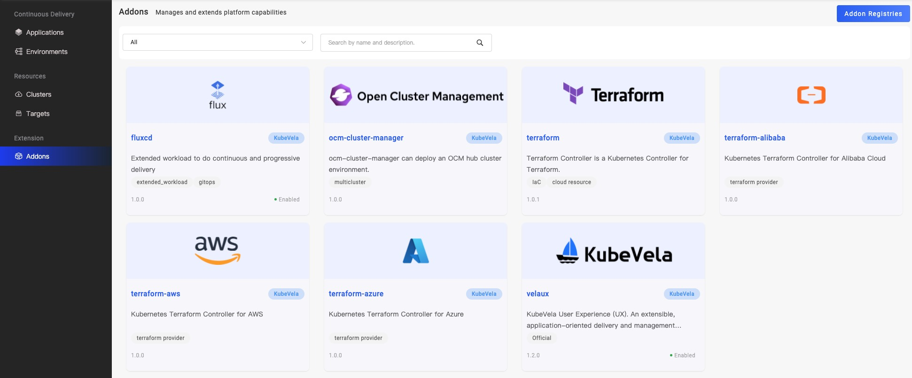
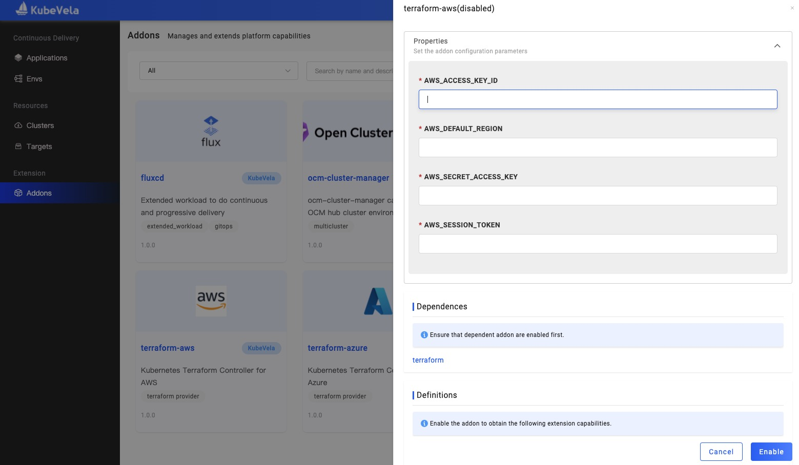
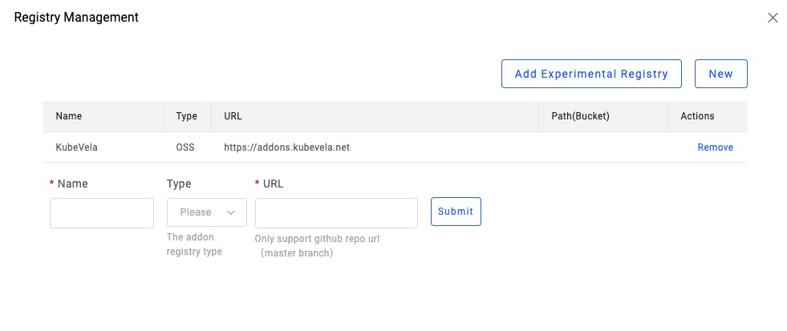

你可以在 VelaUX 的 Addon 页面管理平台插件，以获取更多的系统功能。

## 启用/停用插件 (Enable/Disable Addon)

如下图所示，在某个插件页面点击 `Enable` 启用一个插件

如果某个插件需要依赖其他插件，只有当被依赖的的插件被启用之后，该插件才能被启用，如下图所示。

有些复杂的插件需要设置一些参数才能启用，如下图所示。

通过点击插件页面的 `Disable` 停用一个插件

> 停用前请确认插件对应的能力没有被任何应用所使用。

你也可以通过点击页面的 `Upgrade` 来更新插件。

## 多集群环境中启用插件

如果插件的部署目标设置为子集群部署，在启用插件时首先需要选择你希望启用的集群。如果插件启用完成后又新增了集群，你需要增加选择新的集群然后更新插件即可。

## 插件仓库 (Addon Registry)

插件仓库是一个存储、发现和下载插件的地方。 插件仓库的地址可以是一个 Git 仓库或者一个对象存储 Bucket。

KubeVela 社区在 Github 上维护了一个官方的[正式插件仓库](https://github.com/oam-dev/catalog/tree/master/addons) 和一个[试验阶段插件仓库](https://github.com/oam-dev/catalog/tree/master/experimental) 。

你也可以参考这两个仓库，自己定制一个插件仓库， 下图展示如何通过 VelaUX 来管理插件仓库，你可以在这里添加、更新或删除一个插件仓库。

需要注意的是，KubeVela 默认没有添加试验性的插件仓库，但你可以通过点击 `Add Experimental Registry` 一键将它添加进来，并使用其中的插件。

