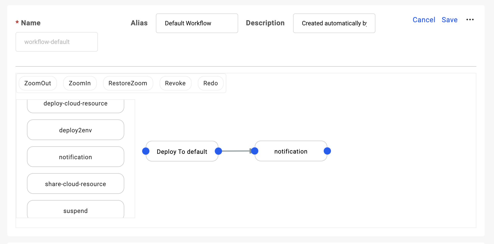
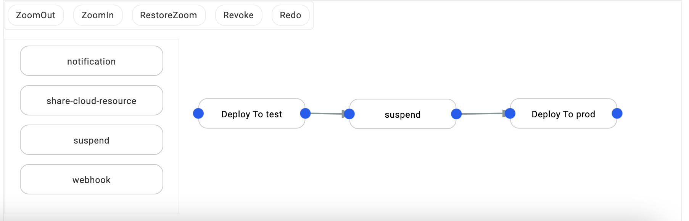
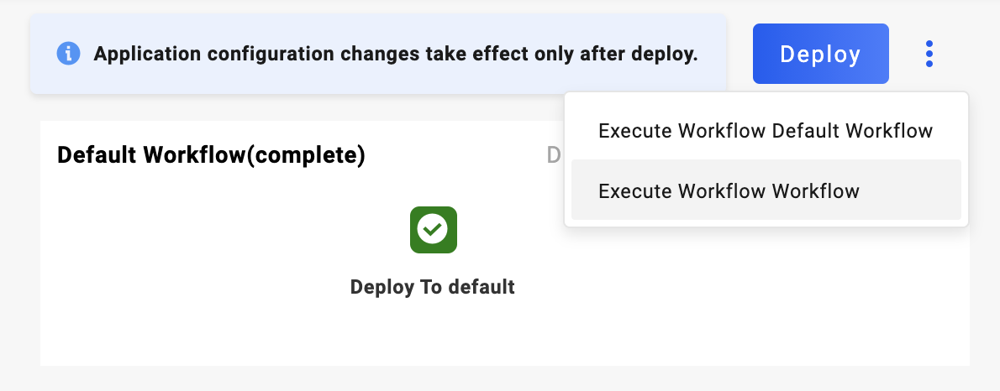
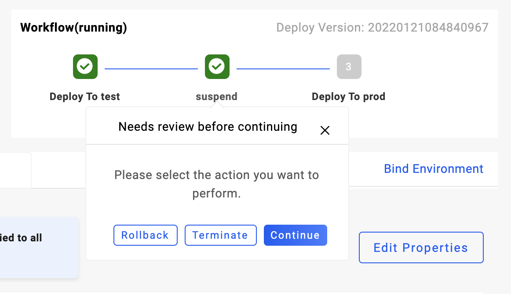

应用在创建时，会关联一个环境。而每个环境都会关联一条工作流用于部署。工作流创建后默认只有一个部署到关联环境的步骤，通过点击 `Edit` 文字按钮进入工作流编辑模式。

## 编辑工作流步骤

点击 `Edit` 进入编辑页面，除了修改工作流的名字、描述以外，还可以添加不同类型的工作流步骤并进行编排。在这里我们在部署步骤后添加了一个 `notification` 类型的步骤，可以在部署完成后发送一个消息通知。

关于所有工作流步骤的详细信息，请参考 [内置工作流步骤](../../../end-user/workflow/built-in-workflow-defs)。

## 创建工作流

每个环境绑定一条工作流，你可以通过绑定新的环境来使用新的工作流去部署。

每个环境中可以有多个部署目标，我们以一个包含了测试部署目标以及生产部署目标的环境为例。

为应用绑定好该环境后，可以看到新增了一条新的工作流：默认有两个步骤，一个是部署到测试目标，一个是部署到生产目标：

我们来编辑一下这条工作流，在两步之间加个暂停步骤，并且调整一下顺序。

修改完毕后，我们选择这条新增的工作流进行部署：

部署后，当测试目标中的资源被部署完毕后，工作流会暂停住，此处我们可以进行手动操作：

1. 选择 Rollback，工作流会自动回退到上一个被成功部署的版本并重新部署。
2. 选择 Terminate，工作流会自动终止，本次部署结束。
3. 选择 Continue，工作流会继续往下执行。
