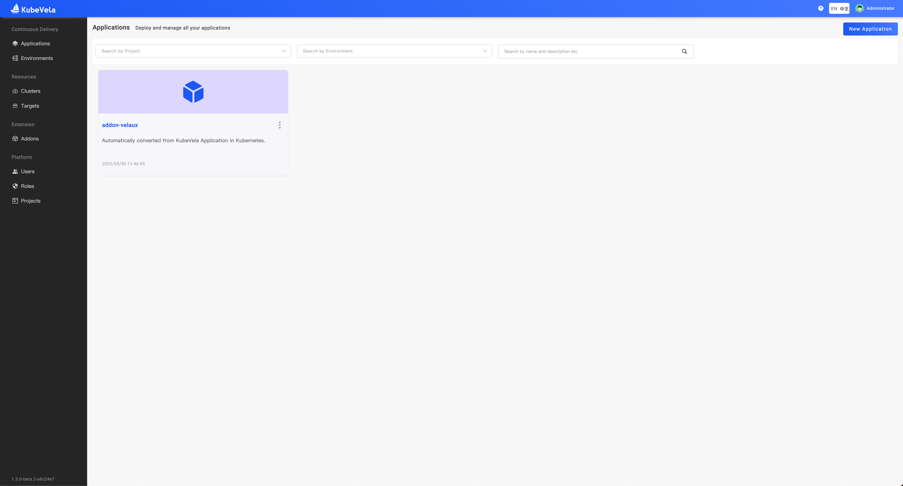
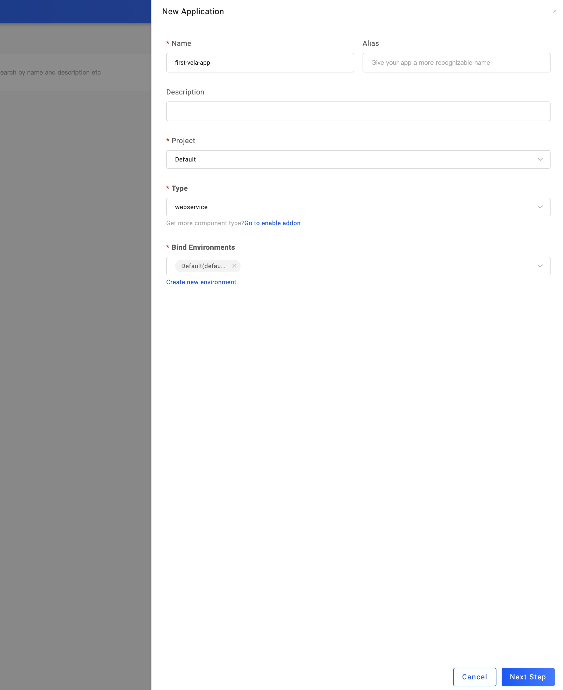
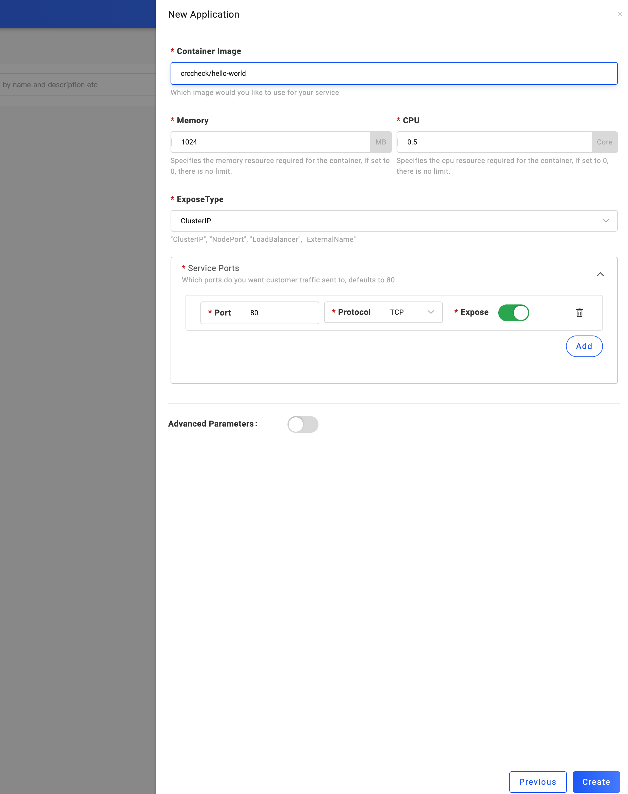
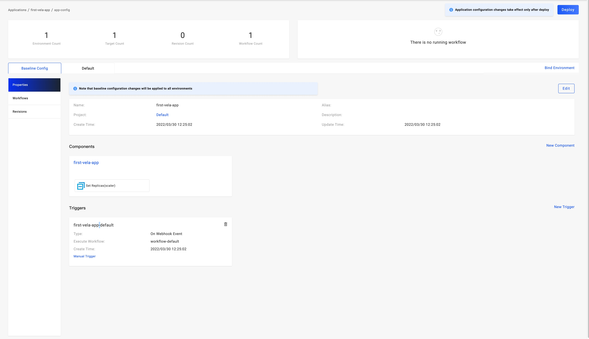
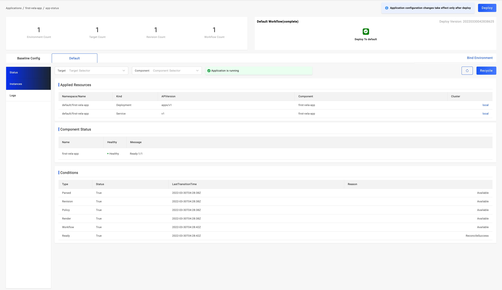
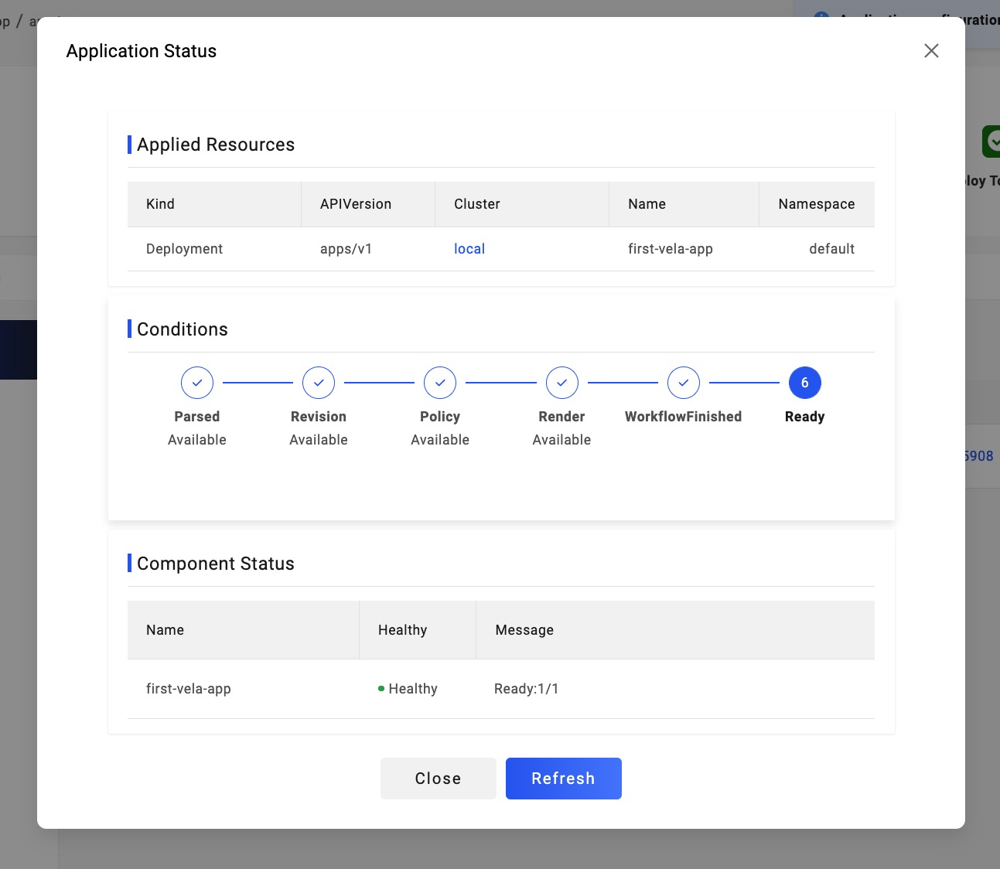

> 在实践之前，请确保你已经按照 [快速安装](./install.mdx) 文档，在你的控制平面集群中安装了 KubeVela Core 和 VelaUX。
>
> 如果你希望通过使用 KubeVela CLI 来进行应用交付，请查看 Vela CLI 手册的 [交付第一个应用](./end-user/quick-start-cli)。

欢迎来到 KubeVela！在本小节中，我们会向你介绍如何使用 VelaUX 来交付一个简单的应用。

你将会操作的步骤有：

1. 准备一个服务镜像，本例中我们将使用： [crccheck/hello-world](https://hub.docker.com/r/crccheck/hello-world)，请确保你的环境可以正常下载该镜像；
2. 基于服务镜像创建第一个 `webservice` 类型的 `Application`，这是无状态服务最简化的交付方式；
3. 查看应用实例运行状态；

你将学习到内容的有：

- 初步接触 [应用(Application)](./getting-started/core-concept#应用（application）)、[环境(Environment)](getting-started/core-concept#环境（Environment））) 和 [交付目标(Target)](getting-started/core-concept#交付目标（target）) 等核心概念。

- 通过操作 VelaUX 完整交付一个应用。

## 登陆到 VelaUX

正常安装 VelaUX 后你需要登陆。默认账号为admin，通过以下方式获取密码

```shell
vela logs -n vela-system --name apiserver addon-velaux | grep "initialized admin username"
```

## 选择应用的部署类型/规划应用部署环境

你进入的第一个页面即应用交付管理页面。



然后点击右上角的 `New Application` 按钮开始创建应用，按照 UI 提示填写以下四个维度的信息：

- 应用的名称等基础信息；
<!-- - 选择所属的项目，我们已为你自动生成了默认项目，你也可以点击 `New` 进行创建； -->
- 选择应用的部署类型，本例中我们选择 `webservice` 类型，部署无状态服务，请注意，企业大多数业务应用都可以直接使用该类型进行部署。
- 规划应用交付的环境，我们选择基于默认 `Default` 交付目标创建的默认 `Default` 环境；



<!-- TODO v1.2 更新截图，去掉 Proejct -->

## 设置应用的部署参数

接下来看到应用的部署配置页面，我们需要配置的以下信息：

- Image 地址，填入 `crccheck/hello-world`。

> 其他参数设置在当前用例中无需进行设置。



确认创建后即可进入应用管理页面，这时应用还没有开始进行部署，VelaUX 默认生成了默认环境的交付 [工作流](./getting-started/core-concept#工作流（workflow）) 和调整应用副本数量的 [运维特征](./getting-started/core-concept#运维特征（trait）)。



## 执行环境的部署

直接点击页面右上方的部署按钮。工作流执行完成后刷新应用实例列表即可查看到已经部署完成的实例。



在部署的过程中，你可以点击 `Check the details` 来查看应用的相关状态信息：



## 应用删除

体验完成后如何你需要删除部署的应用，你需要进行如下操作：

（1）进入应用的环境页面，点击 `Recycle`，即可完成该环境的部署资源回收。

（2）回到应用列表页面，点击应用卡片的操作按钮，选择删除即可。

通过上述操作，你已经完成了第一个应用的交付，完成了进阶。

## 下一步

- 阅读并参考 [实践教程](./tutorials/k8s-object) 章节文章，解锁更多 KubeVela 能力。
