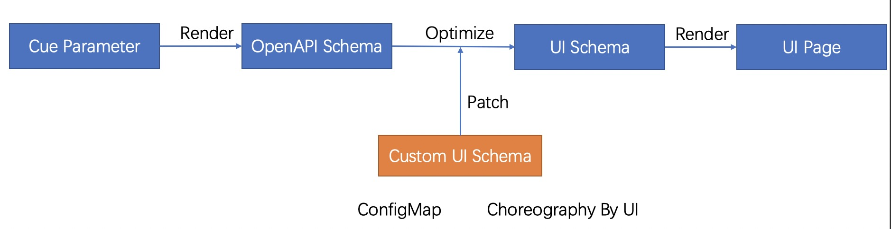

VelaUX 针对组件、工作流步骤、运维特征资源的可扩展性，在可变输入参数项的情况下，为了实现较为原生的 UI 体验，设计并实现了 UI-Schema 规范。

目前 UI-Schema 规范主要作用于数据输入侧，未来将扩展到数据可视化侧。

### UI-Schema 作用原理

不同的组件、工作流步骤、运维特征类型通过 CUE 进行定义，我们称其为 XDefinition, 几乎每一种定义都包括了输入参数的定义。比如：

```cue
scaler: {
	type: "trait"
	annotations: {}
	labels: {}
	description: "Manually scale K8s pod for your workload which follows the pod spec in path 'spec.template'."
	attributes: {
		podDisruptive: false
		appliesToWorkloads: ["*"]
	}
}
template: {
	parameter: {
		// +usage=Specify the number of workload
		replicas: *1 | int
	}
	// +patchStrategy=retainKeys
	patch: spec: replicas: parameter.replicas
}
```

如上的例子，需要用户输入参数为`replicas`，代表副本数量。

在 UI 中我们希望用户可以通过一个数字输入表单来设置副本数。



它的工作流程如上图所示，通过定义的 CUE 生成 API Schema，然后再通过 API Schema 生成 默认的 UI Schema，如果存在自定义的 UI Schema，使用自定义的配置对默认配置进行更新。UI 基于最终的 UI Schema 渲染出前端页面。

UI Schema 包含的字段如下：

```yaml
- jsonKey: string             字段名称
  label: string UI            显示名称
  description: string         描述信息
  uiType: string              UI 组件类型
  sort: int                   排序
  disabled: bool              是否禁用该字段
  style:                      样式定义
    colSpan: int              表单栅格大小，24 代表 100% 宽度
  conditions:                 表单显示行为的条件
    - jsonKey: string         数据来源字段名称
      op: == | != | in        判断方式
      value: any              预期的值
      action: enable|disable  表单满足条件时是启用还是禁用
  validate:                   数据校验规则，自定义后整体替换默认配置
    defaultValue: any         默认值
    required: bool            是否是必填参数
    max: int                  数字最大值
    min: int                  数字最小值
    maxLength: int            最大字符长度
    minLength: int            最小字符长度
    pattern: string           正则校验规则
    options:                  可选项，适用于选择性表单
    - label: string           可选项显示名称
      value: string           可选项值
    immutable: bool           是否为不可变字段，设为 true 则代表该字段不能在编辑中更改。
  subParameters:              下级参数，结构一致
    - jsonKey: string
      ...
```

### 已支持的类型

#### 基础表单

- [x] Input: 基础 Input 表单
- [x] Number: 数字输入表单
- [x] Select: 固定可选值表单
- [x] Switch: 开关选择器
- [x] Radio: 单选表单
- [x] Password: 密码输入表单

#### 业务表单

- [x] Ignore: 当前字段存在下级字段，本级不显示。
- [x] SecretSelect: 目标集群密钥选择器 （参数：clusterName）
- [x] SecretKeySelect: Secret 资源中的 Key 选择，它必须与 SecretSelect 表单级联存在。 （参数：secretKeys）
- [x] CPUNumber: cpu 数值输入框 支持小数点后 2 位，默认单位为 Core
- [x] MemoryNumber: 内存数值输入框 2^n 数值输入方式，默认单位为 MB
- [x] DiskNumber: 默认单位为 GB
- [x] K8sObjectsCode: kubernetes yaml 编辑框，支持上传 yaml，输出多个 k8s 资源对象。
- [x] HelmRepoSelect: 选择 Helm 仓库，数据来源于配置管理
- [x] HelmChartSelect: 从选择的仓库中加载 Chart 列表辅助用户选择
- [x] HelmChartVersionSelect: 从选择的 Chart 加载版本列表辅助用户选择
- [x] HelmValues: 从用户选择的 Chart 和 版本加载可配置的参数，供用户进行 Values 配置。
- [x] ImageInput: 镜像输入框，针对镜像进行有效性检测并响应其匹配的镜像仓库认证信息。

#### 组合表单

- [x] KV: KV 组合输入框
- [x] Strings: 多行 Input 输入框
- [x] Structs: 多个表单组合成单行 形成 多行输入表单。
  > 支持基于 Options 定义差异性子集，即不同的下级属性组成不同的表单集合。
  > AddByKV:env.name|env.value
  > AddBySecret:env.name|env.valueFrom
- [x] Group: 组合（渲染为一个带标题的容器)

### 配置案例

参考：[https://github.com/oam-dev/catalog/tree/master/addons/velaux/schemas](https://github.com/oam-dev/catalog/tree/master/addons/velaux/schemas)

### 如何扩展

UI-Schema 主要扩展的是前端组件，参考 [https://github.com/oam-dev/velaux/tree/main/src/extends](https://github.com/oam-dev/velaux/tree/main/src/extends)
