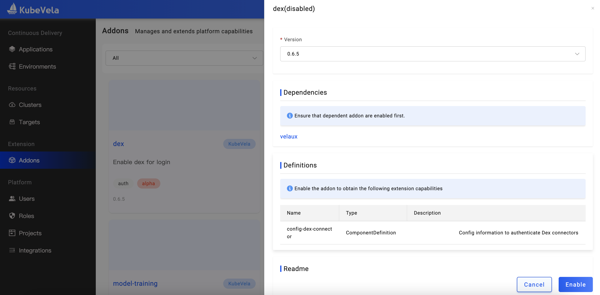
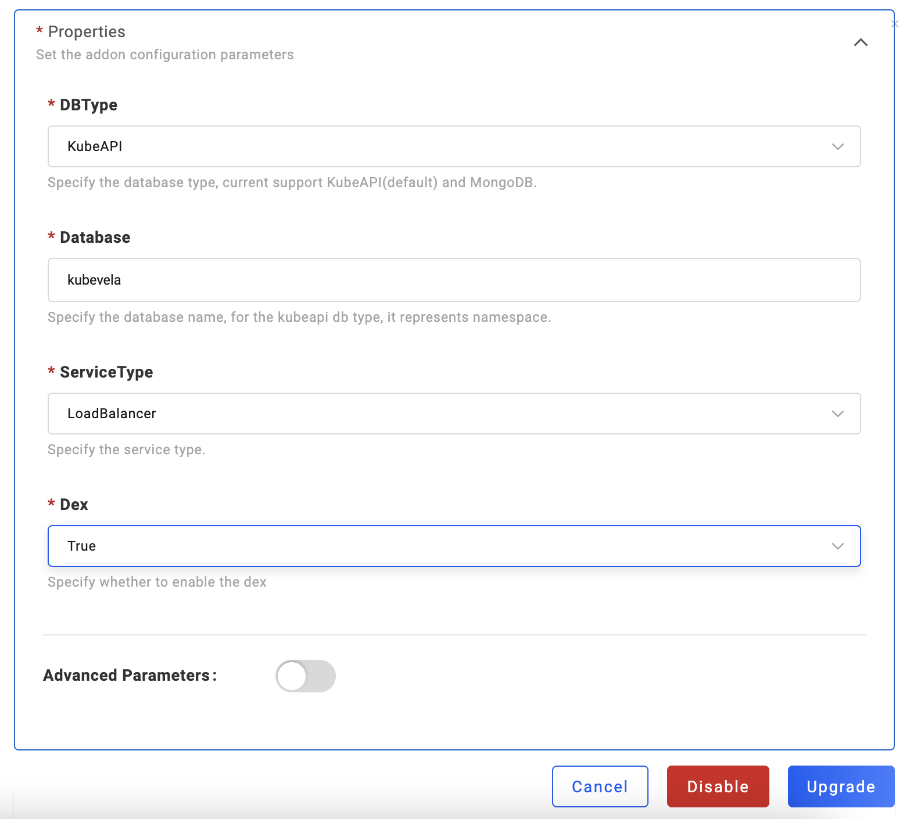
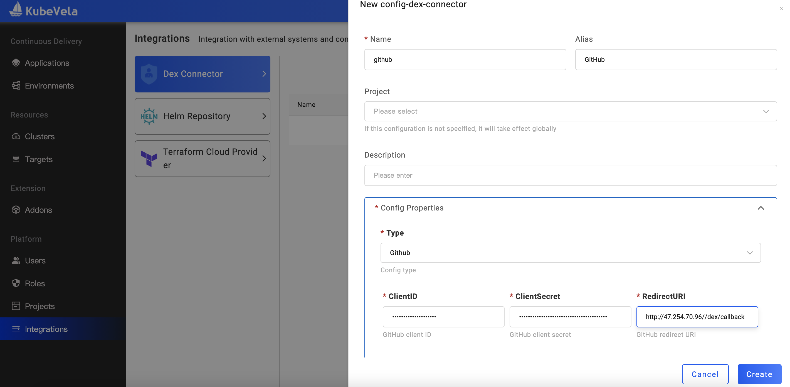
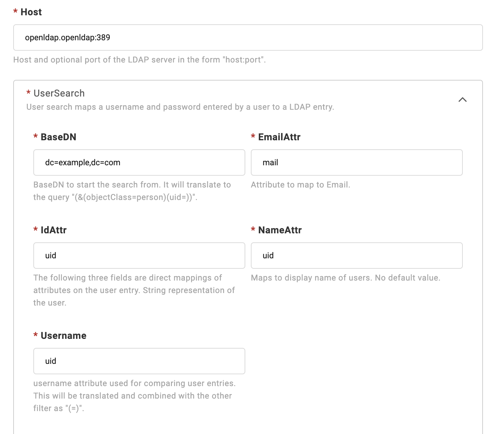
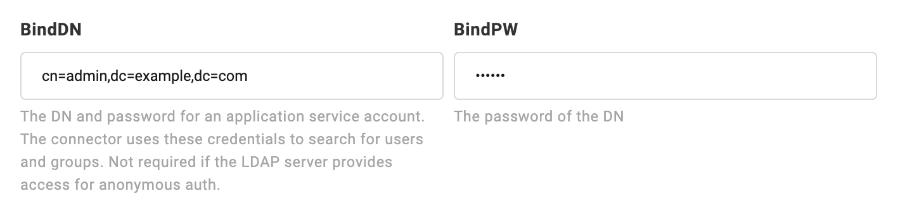
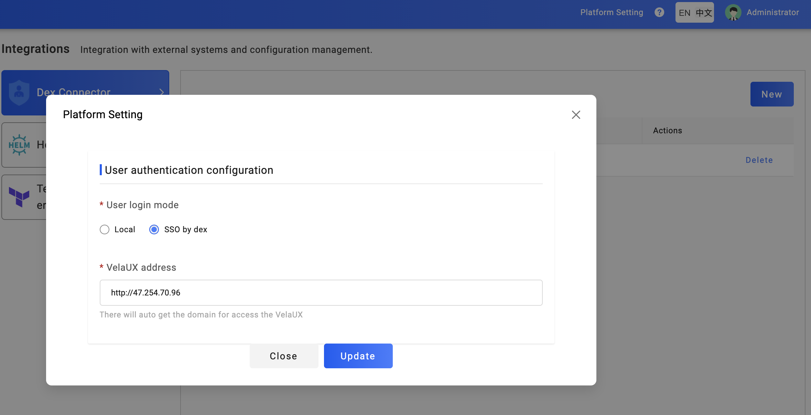
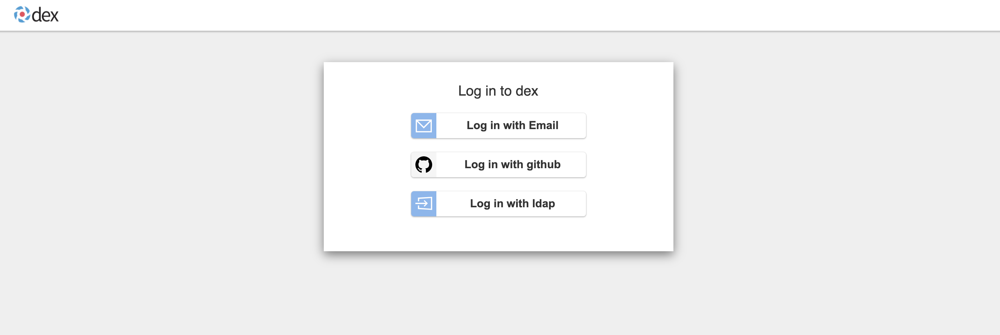
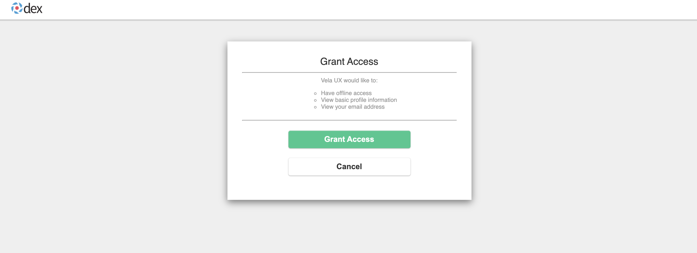

## 简介

在 KubeVela 1.3 版本中，默认提供了两种方式：本地登录以及单点登录。

本地登录使用本地数据库中存储的用户名密码进行登录，而单点登录集成了 [Dex](https://dexidp.io/)，可以通过配置 Dex 的 [OpenID Connect](https://dexidp.io/docs/openid-connect) 来实现多种不同方式的登录，如：GitHub、LDAP 等等。

平台初始化后，默认使用本地登录。平台管理员可以通过平台配置页面，配置单点登录。在本教程中，我们将分别使用 GitHub 和 LDAP Connector 来演示单点登录。

## 开启 Dex 插件

要想使用 Dex，首先需要在插件页面中开启 Dex 插件：

开启完毕后，我们还需要更新一下 VelaUX 插件，打开其 Dex 选项。同样，我们在插件列表中找到 VelaUX，进行更新：

## 配置 Dex Connectors

接着，我们需要配置 Dex Connectors。

### 配置 GitHub Connector

以 GitHub Connector 为例，如果你没有 GitHub Oauth App，需要首先在 GitHub 的 Developer settings 上创建一个 Oauth App，并且设置该 App 的 Authorization callback URL 为 `[Vela UX 地址]/dex/callback`。

> 注意，由于涉及到第三方跳转，请确保你的 Vela UX 拥有公网地址。

完成 Oauth App 的创建后，在 Vela UX 的集成配置页面中，进行 Dex Connector 的配置。我们选择类型为 `GitHub`，并且设置对应 Oauth App 的 Client ID 以及 Client Secret，注意，此处的 Redirect URI 必须与之前在创建 Oauth App 时配置的 `[Vela UX 地址]/dex/callback` 保持一致。

### 配置 LDAP Connector

如果你希望使用 LDAP 进行单点登录，需要在这里配置 LDAP Connector。

> 在进行配置前，请确保你已经正确安装了 LDAP，并且 LDAP 能与 Vela UX 网络通信。

选择 Connector 类型为 LDAP 后，在 Host 处填写 LDAP 服务器的地址，并且指定 BaseDN。

如果你的 LDAP 没有提供匿名身份验证访问，那么你还需要打开高阶参数，填写 BindDN 和 BindPW，Connector 将使用这些信息进行用户的搜索。

> 关于更多类型的 Dex Connectors 配置，请查阅 [Dex Connectors 配置](../how-to/dashboard/config/dex-connectors)

### 平台配置

通过单点登录进来的用户，如果之前在本地数据库中存在与此邮箱相同的用户，将自动与之绑定，否则创建新用户。

由于新登入的用户没有任何权限，因此，我们需要先为平台管理员设置一个邮箱地址。之后，再使用拥有相同邮箱地址的用户进行单点登录时，便能自动拥有平台管理员的权限。

配置完用户邮箱后，我们可以在平台配置页面中，将登录方式修改为 SSO 登录。

### 使用单点登录

退出当前用户的登录，重新刷新页面，可以看到，我们已经进入了 Dex 的登录页面。

你可以选择使用 GitHub 或者 LDAP 进行登录。进行选择后，授权此次登录：

至此，我们已经成功完成了使用 GitHub/LDAP 的单点登录。此时，如果登录的用户邮箱与之前本地登录的用户邮箱能够相互关联，新登入的用户将继承之前用户的权限。
