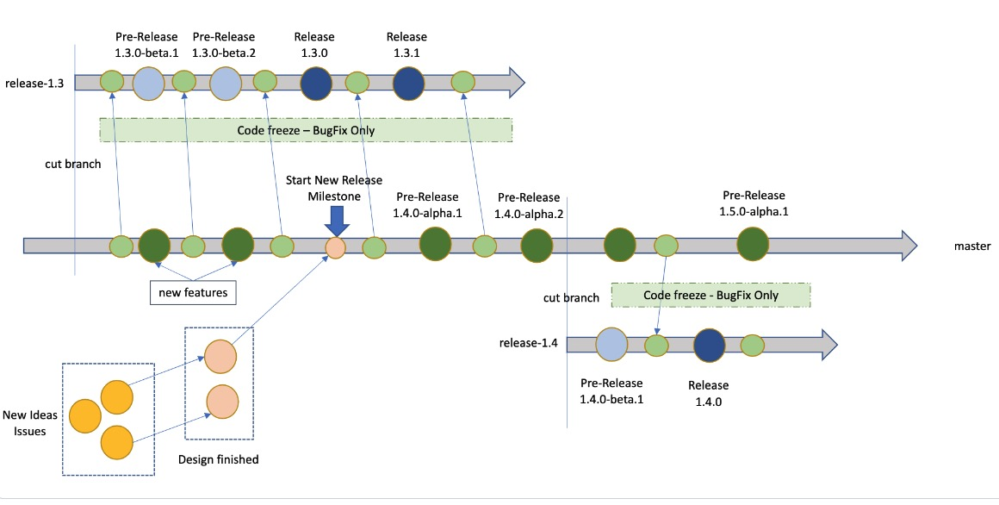

KubeVela 的开发流程遵循以下规范：

* Maintainer 承诺一些要完成的功能和增强，并通过 GitHub 里程碑（milestone）来跟进工作进度。
* 我们会尽可能避免发布的延期，所以在无法按时完成将某个功能时，我们会将其移至下一次发布。
* 每 **2 个月** 做一次新版本发布。
* 重要的错误补丁将会通过 cherry-pick 的方式提交进已经发布的分支，并尽快通过补丁版本的方式发布。我们将会维护最新的 **2 个 release**。

## 发布规划

我们将通过 [GitHub 里程碑](https://github.com/kubevela/kubevela/milestones) 制定发布计划并持续跟进。每个发布里程碑中将会包括两类任务：

* Maintainer 承诺要完成的任务。Maintainers 将根据时间精力确定下一次发布前他们致力于完成的功能。通常来说，任务会经过线下的讨论或者 [社区会议](https://github.com/kubevela/community#community-meetings) 最终决定，然后添加到里程碑中。此类任务将会被分配给计划实现或测试它的 maintainer。
* 社区贡献者主动参与贡献的其他事项，通常是不紧急的功能或优化。Maintainer 不会承诺这些问题一定会在发布周期中完成，但会承诺评审来自社区的提交。

里程碑会清晰地描述最重要的那些功能和预期完成日期。这将明确地告诉终端用户下一次发布的时间及内容。

除下一个里程碑外，我们也将维护未来的发布里程碑草案。

## 社区贡献

我们也收到了大量来自社区的优秀贡献，对此我们非常感激。然而，审查和测试这些代码提交是大量的计划外工作，因此我们不能保证能在一次发布周期内及时地审查全部的社区贡献（特别是那些特别大或复杂的）。Maintainer 将自行决定是否参与评审贡献者的代码提交，因此他们主动审查、合并，并在发布周期内进行验证和测试。

## 放行测试

在 release 分支创建前，我们将有 2 个星期的代码冻结期。在代码冻结期间，我们将不会合并任何功能性 PR 而只会修复错误。

Maintainer 将在每次发布前进行测试并修复这些最后的 issue 。