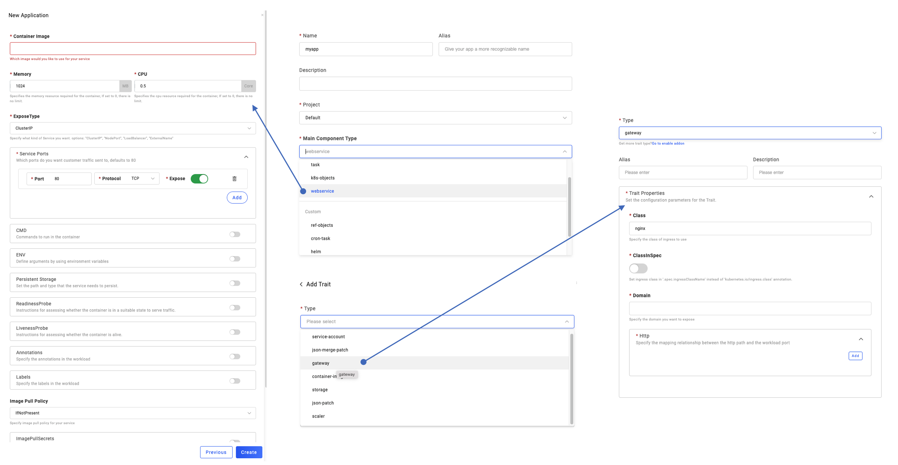
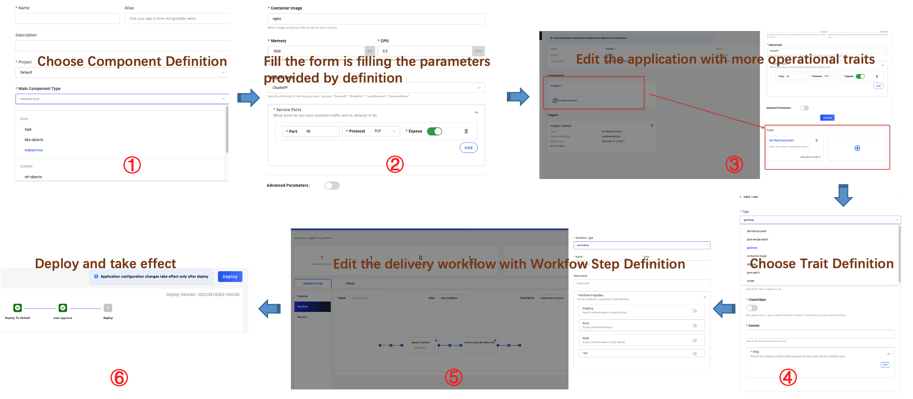

Definition are the basic building block of the KubeVela platform. A definition encapsulates an arbitrarily complex automation as a lego style module that can be used to compose an Application, then safely shared, and repeatably executed by any KubeVela engine.

There're four types of Definition, they're `ComponentDefinition`, `TraitDefinition`, `PolicyDefinition` and `WorkflowStepDefinition`, corresponding to the application concepts.

## Sources of Definitions

There're two sources of definitions:

* Built-in definitions will be installed along with KubeVela helm chart. You can refer to the following links to learn more about built-in definitions.
    - [Component Definition](../end-user/components/references)
    - [Trait Definition](../end-user/traits/references)
    - [Policy Definition](../end-user/policies/references)
    - [Workflow Step Definition](../end-user/workflow/built-in-workflow-defs)
* Installation of addons will install definitions if there're new capabilities contained. You can refer to [the community addon registry](../reference/addons/overview) for more details.

## Lifecycle of a Definition

A definition's lifecycle usually has 3 stages:

### Discovery

When definitions installed in the system, they can be discovered by end user immediately.

* Check the list:

```
$ vela def list
NAME                         	TYPE                  	NAMESPACE  	DESCRIPTION
webservice                   	ComponentDefinition   	vela-system	Describes long-running, scalable, containerized services
                             	                      	           	that have a stable network endpoint to receive external
                             	                      	           	network traffic from customers.
gateway                      	TraitDefinition       	vela-system	Enable public web traffic for the component, the ingress API
                             	                      	           	matches K8s v1.20+.
health                       	PolicyDefinition      	vela-system	Apply periodical health checking to the application.
notification                 	WorkflowStepDefinition	vela-system	Send message to webhook
...snip...
```

* Show the details:
```
$ vela show webservice
# Properties
+------------------+-------------------------------------------------------------------------------------------+-----------------------------------+----------+---------+
|       NAME       |                                        DESCRIPTION                                        |               TYPE                | REQUIRED | DEFAULT |
+------------------+-------------------------------------------------------------------------------------------+-----------------------------------+----------+---------+
| cmd              | Commands to run in the container                                                          | []string                          | false    |         |
| env              | Define arguments by using environment variables                                           | [[]env](#env)                     | false    |         |
| labels           | Specify the labels in the workload                                                        | map[string]string                 | false    |         |
| annotations      | Specify the annotations in the workload                                                   | map[string]string                 | false    |         |
| image            | Which image would you like to use for your service                                        | string                            | true     |         |
| ports            | Which ports do you want customer traffic sent to, defaults to 80                          | [[]ports](#ports)                 | false    |         |
+------------------+-------------------------------------------------------------------------------------------+-----------------------------------+----------+---------+
...snip...
```

You can also view the details with a browser, the following command will launch a server and invoke your browser automatically:

```
vela show webservice --web
```

* Discover in UI console



These definitions can also be discovered by the UI console, the more important thing is they can be displayed very well with [ui schema](../reference/ui-schema) defined.

### Use

If you're a fan of our UI console, the usage of definition is very straight forward, just click along with the creation of the deployment process.



Finally, the UI console will compose the whole deployment plan in the format of OAM like below, then KubeVela controller will take care of the rest things:

```
apiVersion: core.oam.dev/v1beta1
kind: Application
metadata:
  name: first-vela-app
spec:
  components:
    - name: express-server
      type: webservice
      properties:
        image: oamdev/hello-world
        ports:
         - port: 8000
           expose: true
      traits:
        - type: scaler
          properties:
            replicas: 1
  policies:
    - name: target-default
      type: topology
      properties:
        clusters: ["local"]
        namespace: "default"
    - name: target-prod
      type: topology
      properties:
        clusters: ["local"]
        namespace: "prod"
    - name: deploy-ha
      type: override
      properties:
        components:
          - type: webservice
            traits:
              - type: scaler
                properties:
                  replicas: 2
  workflow:
    steps:
      - name: deploy2default
        type: deploy
        properties:
          policies: ["target-default"]
      - name: manual-approval
        type: suspend
      - name: deploy2prod
        type: deploy
        properties:
          policies: ["target-prod", "deploy-ha"]
```

Use the definition in command works the same, you can compose the application yaml manually and use `vela` command line tool to deploy.

```
vela up -f https://kubevela.net/example/applications/first-app.yaml
```

### Customize

> **⚠️ In most cases, you don't need to customize any definitions unless you're going to extend the capability of KubeVela. Before that, you should check the built-in definitions and addons to confirm if they can fit your needs.**

A new definition is built in a declarative template in [CUE configuration language](https://cuelang.org/). If you're not familiar with CUE, you can refer to [CUE Basic](../platform-engineers/cue/basic) for some knowledge. 

A definition describes the module's inputs, outputs, operations, and the wiring between them. Here is an example of a simple component definition:

```
webserver: {
	type: "component"
	attributes: {}
}

template: {
	parameter: {
		name:  string
		image: string
	}
	output: {
		apiVersion: "apps/v1"
		kind:       "Deployment"
		spec: {
			containers: [{
				name:  parameter.name
				image: parameter.image
			}]
		}
	}
}
```

The `type` defines what kind of definition it is, the `parameter` defines the inputs, while the `output` section defines the outputs.
You can refer to detail docs about [how to manage definition](../platform-engineers/cue/definition-edit) or learn the [definition protocol](../platform-engineers/oam/x-definition).

## Next Step

- View [Architecture](./architecture) to learn the overall architecture of KubeVela.
