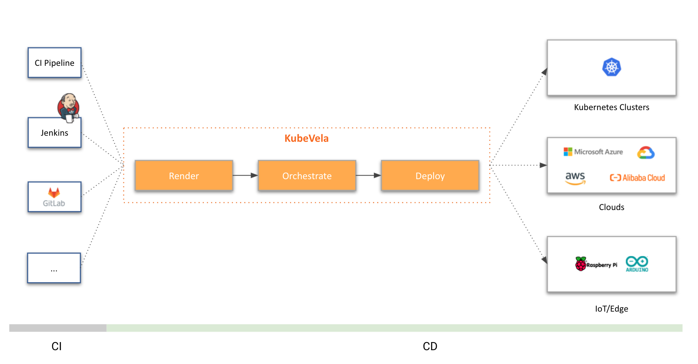

## 什么是 KubeVela？

KubeVela 是一个开箱即用的现代化应用交付与管理平台，它使得应用在面向混合云环境中的交付更简单、快捷。使用 KubeVela 的软件开发团队，可以按需使用云原生能力构建应用，随着团队规模的发展、业务场景的变化扩展其功能，一次构建应用，随处运行。

## 为什么要用 KubeVela？

云原生技术的发展趋势正在朝着利用 Kubernetes 作为公共抽象层来实现高度一致的、跨云、跨环境的应用交付而不断迈进。然而，尽管 Kubernetes 在统一底层基础架构细节方面表现出色，它并没有在混合的分布式部署环境之上提供应用层的软件交付模型和抽象。我们已经看到，这种缺乏统一上层抽象的软件交付过程，不仅降低了生产力、影响了用户体验，甚至还会导致生产中出现错误和故障。

然而，为现代微服务应用的交付过程建模是一个高度碎片化且充满挑战的事情。到目前为止，绝大多数试图解决上述问题的技术方案，要么过于简单以致于无法覆盖实际生产使用中的问题，要么过于复杂难以落地使用。云原生带来的基础设施能力爆发式增长也决定了新一代的应用管理平台不能以硬编码的方式做能力的集成和 UI 的构建，除了满足基础的功能和场景，平台本身的扩展能力成为了新时代应用管理平台的核心诉求。这就意味着平台不仅要简单易用，还要能够随着应用交付和管理的需求复杂度提升能够不断扩张，能够让开发者自助式的接入和使用，充分享受云原生生态的红利。

这也是 KubeVela 出现的核心价值：它既能够简化面向混合环境（多集群/多云/混合云/分布式云）的应用交付过程；同时又足够灵活可以随时满足业务不断高速变化所带来的迭代压力。它本身是一个面向混合交付环境同时又高可扩展的应用交付引擎，满足平台构建者的扩展和自建需求；同时又附加了一系列开箱即用的扩展组件，能够让开发者自助式的开发、交付云原生应用。

## KubeVela 核心功能

- **应用部署即代码（Deployment as Code），完整定义全交付流程**

    KubeVela 创新性的通过 [开放应用模型（OAM）](https://oam.dev/)来作为应用交付的顶层抽象，这种方式使你可以用声明式的方式描述应用交付全流程，自动化的集成 CI/CD 及 GitOps 体系，通过 [CUE](https://cuelang.org/) 轻松扩展或重新编写你的交付过程。再也没有难以维护的脚本和复杂的衔接代码，复用社区丰富的功能模块，且无需关注任何基础设施细节，专注于定义和部署应用，一次编排、随处运行！
    
- **天然支持企业级集成，安全、合规一应俱全** 

    KubeVela 天然支持多集群安全和 RBAC 集成，你还可以从社区的插件中心找到一系列开箱即用的平台扩展，包括多种用户体系（LDAP 等）集成、多租户权限控制、安全校验和扫描、应用可观测性等大量企业级能力。轻松根据需求和场景来设计和定制你的平台扩展能力，满足业务快速增长的需求，同时持续保证生产环境的稳定和安全。

- **面向多云多集群混合环境，丰富的应用交付和管理能力** 

    KubeVela 原生支持丰富的多集群/混合环境持续交付策略，包括金丝雀、蓝绿、多环境差异化配置等，同样也支持跨环境交付。这些交付策略为你的分布式交付流程提供了充足的效率和安全保证。KubeVela 提供的中心化管控能力也减轻了到每一个集群（云）去排查问题的负担，针对不同的平台提供统一的体验，让你享受自动化交付的便利。

## KubeVela 与其他软件形态对比

### KubeVela vs. CI/CD 系统（如 GitHub Actions，GitLab，Jenkins 等）

KubeVela 是一个工作在 CI 流程下游的 CD 控制平面（Continuous Delivery Control Plane）。所以 KubeVela 希望你保持现有的 CI 流程，而在需要开始制品部署时让 KubeVela 接管 CD 流程。KubeVela 会给你的 CD 流程带来大量的现代化应用交付最佳实践，比如：声明式交付工作流、可编程的工作流步骤、Pull 模型、多云/多集群交付流程、统一的云服务部署和绑定等等。

如果你已经在 CD 环节中采纳了 GitOps 实践，KubeVela 会更容易跟你的 CI/CD 系统集成，因为 KubeVela 是完全声明式的。只需要把 KubeVela 的应用部署描述文件放置在你的配置仓库当中，所有的 KubeVela 特性（包括声明式交付工作流、多云/多集群交付流程等）就会立刻在你 的 GitOps 流程中出现。

> 欢迎查阅用户手册来了解更多关于 KubeVela 与[各类 CI/CD 系统](./tutorials/jenkins)以及 [GitOps](./case-studies/gitops) 模式协作的实践.

### KubeVela vs. GitOps ( 如 ArgoCD，FluxCD 等)

KubeVela 可以基于你的 GitOps 流程，并在此之上增加跨云、跨环境的能力：

* KubeVela 具有一个用户友好且可编程的工作流，可以让你集成现有的交付工具，包括通知和审批体系。
* KubeVela 可以为你提供跨环境交付能力，让你在一个应用中描述多集群的差异化配置并统一的查看状态。

### KubeVela vs. PaaS 平台 ( 如 Heroku，Cloud Foundry 等 )

传统 PaaS 提供完整的应用程序部署和管理功能，旨在提高开发人员的体验和效率。在这个场景下，KubeVela 也有着相同的目标。

不过，KubeVela 和它们最大的区别在于其**可扩展性**。

KubeVela 是可编程的。它的交付工作流乃至整个应用交付与管理能力集都是由独立的可插拔模块构成的，这些模块可以随时通过编写 CUE 模板的方式进行增/删/重定义且变更会即时生效。与这种机制相比，传统的 PaaS 系统的限制非常多：它们需要对应用类型和提供的能力进行各种约束来实现更好的用户体验，但随着应用交付需求的增长，用户的诉求就一定会超出 PaaS 系统的能力边界。这种情况在 KubeVela 平台中则永远不会发生。

此外，KubeVela 是一个独立于运行时集群的应用交付控制平面（这是我们认为的下一代 PaaS 系统的合理形态），而现有的 PaaS 则往往选择以插件形式部署在运行时集群当中。

### KubeVela vs. Helm

Helm 是 Kubernetes 的包管理器，它能够以 Chart 为一个单元，提供打包、安装和升级的一组 YAML 文件的能力。

KubeVela 作为一个应用交付系统天然可以部署各种制品类型，Kustomize、Kubernetes Yaml 等，当然也包括 Chart。Helm 可以便捷的把 Chart 交付到一个集群，KubeVela 可以帮你把 Chart 交付到多个集群。

当然，KubeVela 还支持其他制品格式比如 Kustomize。

### KubeVela vs. Kubernetes

KubeVela 是一个基于云原生技术栈构建的现代应用交付系统。它利用了开放应用程序模型（Open Application Model）和 Kubernetes 作为控制平面来解决一个旷日已久的难题——如何让应用交付变得更加轻松愉快。

## 开发状态

KubeVela 的开发者社区非常活跃，你可以在[这里](https://github.com/kubevela/kubevela/releases)看到所有已发布版本。

## 企业采纳

你可以在[这里](https://github.com/kubevela/community/blob/main/ADOPTERS.md)看到正式采纳了 KubeVela 的公司或组织。

## 下一步

接下来，我们推荐你：

- 开始 [安装使用 KubeVela](./install)。
- 了解 [核心概念](./getting-started/core-concept) 及其原理。
