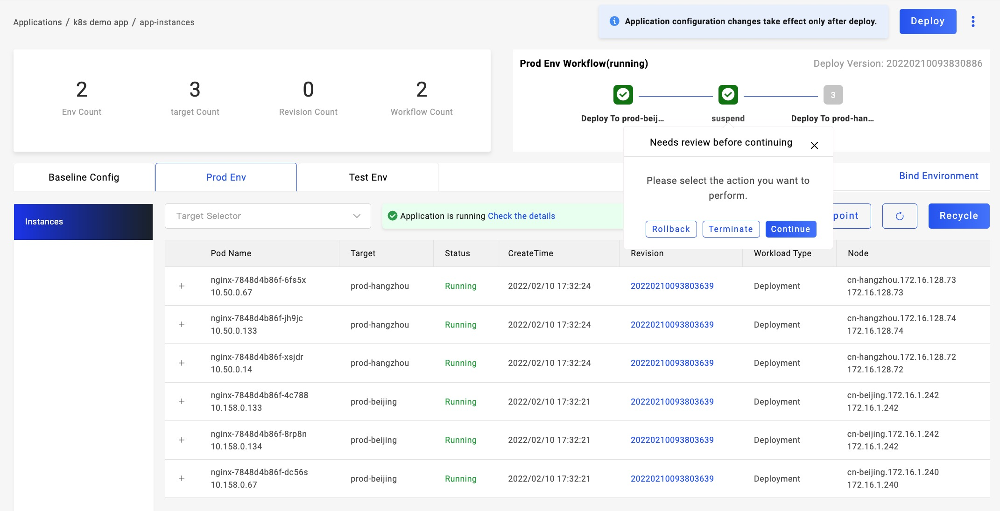
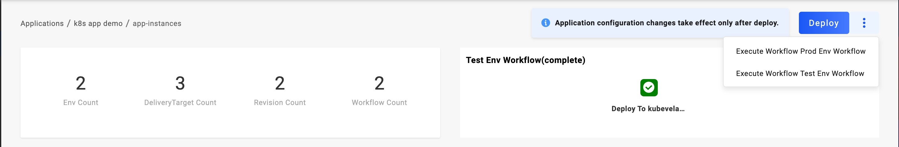
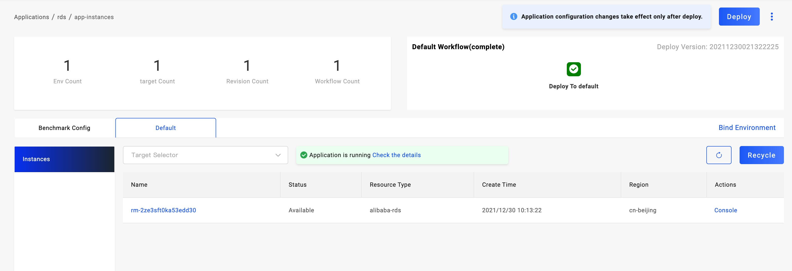
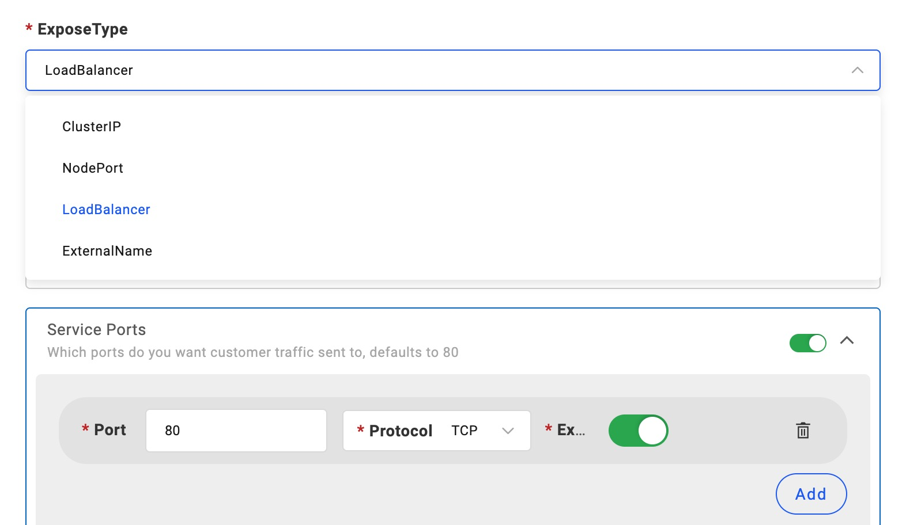

## 创建应用

### 判断你的应用类别

我们大致把应用分为三种类型，普通业务应用、中间件（第三方开源应用）、云服务。对于普通业务应用，我们建议你采用 `webservice` 部署类型或你的自定义类型。对于中间件或第三方复杂应用建议直接采用 `helm` 部署类型，对于比较简单且直接提供了 Docker 镜像的第三方开源应用，比如 wordpress,也可以直接采用 `webservice` 类型。

### 设置应用基础信息

进入 `Applications` 页面，点击 `New Application` 按钮，进入应用基础信息设置页面。设置应用名称等基础信息，根据上一步判断的应用类型选择类型，根据你的实际情况选择部署的环境。设置完成后直接进入下一步。

### 设置应用部署参数

应用部署参数对于不同的类型差异较大，可根据 UI 提示的帮助信息进行信息输入。比如对于 `webservice` 类型的应用，他的输入参数如下图：


### 完成创建

根据提示完成部署参数的设置后，点击提交按钮即可完成应用创建。成功创建后进入应用管理页面，应用处于未部署状态。

## 绑定应用到环境

应用在创建完成后，需要绑定到 1 个或多个环境才能正式发布。

你可以绑定到开发环境做测试，然后在测试完成后绑定到生产环境做发布，不同的环境之间彼此隔离、互不影响。

创建完成应用后，在应用管理页面点击 `Bind Environment`就会出现如下弹窗：


在弹窗中选择需要发布的环境。如果环境还没创建，可点击下方的 `Create new environment` 创建新的环境。

点击确认即完成绑定，`Baseline Config` 右侧环境选项区域出现新的环境，且在工作流管理页面将自动生成新环境的部署工作流。切换到新环境视图下点击 `Deploy` 即可将应用发布到该环境。

## 部署应用

应用创建完成后，需要分别执行环境对应的工作流完成环境的部署，每个环节的对应工作流会自动生成。

### 首次部署

从应用列表点击指定应用进入应用详细页面，在 `Baseline Config` 右侧即为所有已绑定的环境列表。选择你需要部署的环境，点击环境名称进入环境页面。


环境处于未部署状态时将显示部署按钮，点击按钮即可开始执行当前环境的部署工作流。工作流执行状态显示在页面的右上方。如果你设置了审核的步骤，到达该步骤时页面中将弹出审核窗口。



如果部署步骤出现故障，该步骤显示为红色，鼠标移动到该步骤上将显示故障原因。


### 更新

应用详情页面的右上方有一个常驻的 `Deploy` 按钮，点击该按钮执行默认工作流。按钮右边三点按钮为选择不同的环境工作流，鼠标移动到其上方即可显示多个工作流选项。



更新部署可以在任意状态下进行，选择执行某一个流水线后，将使用最新的应用配置进行部署。如果该环境正在执行部署，UI 将提示你是否强制进行新的部署。

## 查看应用实例

查看应用运行实例信息是掌握应用运行状态的直接方式。


如上图所示，应用的运行实例页面处在应用环境视图下。切换不同的环境即可查询不同环境下部署的实例。

默认情况下，实例列表显示该应用在当前环境下的所有实例。通过实例列表上方的交付目标筛选，可以查询不同交付目标的实例列表。在实例列表中显示版本、状态等信息。

对于交付的 Kubernetes 集群的应用，用户可以点击实例行前方的 + 号展开一个实例的详情，即 Pod 详情，包括了容器状态及资源消耗情况，如果实例的拉起故障，可以从事件列表中查看到详细信息。

对于交付的 云服务 应用，用户可通过点击实例名称跳转到云服务商管理页面。



## 查看日志

### 通过 UI 查看应用日志


如上图所示，交付到 Kubernetes 集群的应用支持查询容器运行日志，切换到指定环境视图下，选择日志页面，即可通过组件/实例/容器的筛选查看对应的运行日志。

日志查询页面默认为每 5 秒自动刷新，查看最新的日志。若你的应用日志中没有时间信息，可点击 `Show timestamps` 展示日志记录时间。

### 通过 CLI 查看应用日志

```bash
$ vela logs <app_name> -n <namespace>
```

使用实际的应用名称，命名空间参数执行上述命令，在交互中选择你需要查询的工作负载即可查询应用日志。

## 访问应用

### 设置应用访问方式

交付的 Kubernetes 集群的应用需要设置访问方式即可生成访问地址，常见支持的方式如下：

1. 设置 Service 的暴露类型，比如 `LoadBalancer` 和 `NodePort`。适用于所有应用协议。
2. 设置 Ingress 策略，仅适用于 HTTP/HTTPs 协议。

#### `webservice` 类型的应用

在部署参数中可以修改 `ExposeType` 字段参数来设置其暴露方式，同时在 `Service Ports` 中设置应用的监听端口，并将 `Expose` 设置为 True。



如果你的集群中存在 `Ingress Controller`，在应用 `Baseline Config` 页面中，新增 `gateway` 运维特征来设置访问域名。


如上图所示，在 `Domain` 中配置你的域名，注意请将该域名 DNS 解析到目标集群的网关 IP 之上。在 `Http` 模块下配置路由规则，默认你需要设置 `/`:`80`，根据你的应用监听端口设置。

其他部署类型的应用，一般存在对应的部署参数设置选项，根据部署参数设置即可。

### 获取访问地址

设置完应用访问方式后，执行应用部署，然后切换到环境视图下即可看到 `Service Endpoint` 按钮，鼠标移动到上方即可显示该应用的访问地址。


## 查看应用部署的资源列表

如果你希望查询应用在各集群部署了哪些资源，可通过下述操作方式查询。

## 通过 UI 查询

进入应用部署环境视图，默认进入状态展示页面，在该页面中即可查询到应用实际分发的资源列表，如果应用在更新过程中，资源列表会包括历史和当前版本。


在该页面中同时展示了组件状态和整体的交付状态。

## 通过 CLI 查询

```bash
$ vela status <app_name> -n <namespace> --tree
```

基于如上命令可以查询应用部署的资源清单。

## 查看应用部署版本

应用每执行一次部署即可生成一个版本，通过应用 `Baseline Config` 视图下的 `Revisions` 页面展示应用的历史部署版本。


通过 Webhook Trigger 触发部署的版本，如果携带了代码信息，版本号可与代码 Commit 信息进行关联。

## 回收应用部署的环境

当你需要将应用在某个环境的部署资源回收，即关闭应用时，参考下述操作。


如上图所示，完成部署的环境视图下回出现 `Recycle` 按钮，点击该按钮确认后即可将该环境部署的资源进行回收删除。

> 请注意，回收意味着对应的资源将删除，对于需要有状态存储的应用，该操作会导致数据丢失。纯无状态应用可通过重新部署后恢复。

### 删除应用和环境的绑定关系

应用如果成功从该环境回收后，操作区域将存在 `Delete` 按钮，点击该按钮即可删除应用与环境的绑定关系。

## 删除应用

应用需要完成所有环境的资源回收，完成后即可进行删除操作。


如上图所示，回到应用列表页面，鼠标移动到应用名称右侧的操作图标上，点击 Remove 选项即可完成应用的删除操作。
