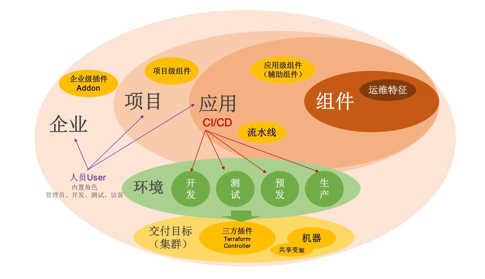

## Install

```shell script
vela addon enable velaux --version=v1.4.3
```

expected output:
```
Addon: velaux enabled Successfully.
```

VelaUX needs authentication. The default username is `admin` and the password is **`VelaUX12345`**. Please must set and remember the new password after the first login.

By default, VelaUX didn't have any exposed port.

## Visit VelaUX by port-forward

Port forward will work as a proxy to allow visiting VelaUX dashboard by local port.

```
vela port-forward addon-velaux -n vela-system
```

Choose `> Cluster: local | Namespace: vela-system | Component: velaux | Kind: Service` for visit.

## Setup with Specified Service Type

There are three service types for VelaUX addon which aligned with Kubernetes service, they're `ClusterIP`, `NodePort` and `LoadBalancer`.
By default the service type is ClusterIP for security.

If you want to expose your VelaUX dashboard for convenience, you can specify the service type.

- `LoadBalancer` type requires your cluster has cloud LoadBalancer available.
    ```shell script
    vela addon enable velaux serviceType=LoadBalancer
    ```
- `NodePort` type requires you can access the Kubernetes Node IP/Port.
    ```shell script
    vela addon enable velaux serviceType=NodePort
    ```

After the service type specified to `LoadBalancer` or `NodePort`, you can obtain the access address through `vela status`:

```
vela status addon-velaux -n vela-system --endpoint
```

The expected output:
```
+----------------------------+----------------------+
|  REF(KIND/NAMESPACE/NAME)  |       ENDPOINT       |
+----------------------------+----------------------+
| Service/vela-system/velaux | http://<IP address> |
+----------------------------+----------------------+
```

## Setup with Ingress domain

If you have ingress and domain available in your cluster, you can also deploy VelaUX by specify a domain like below:

```bash
vela addon enable velaux domain=example.doamin.com
```

The expected output:
```
I0112 15:23:40.428364   34884 apply.go:106] "patching object" name="addon-velaux" resource="core.oam.dev/v1beta1, Kind=Application"
I0112 15:23:40.676894   34884 apply.go:106] "patching object" name="addon-secret-velaux" resource="/v1, Kind=Secret"
Addon: velaux enabled Successfully.
Please access the velaux from the following endpoints:
+----------------------------+---------------------------+
|  REF(KIND/NAMESPACE/NAME)  |         ENDPOINT          |
+----------------------------+---------------------------+
| Ingress/vela-system/velaux | http://example.doamin.com |
+----------------------------+---------------------------+
```

If you enabled the traefik addon, you can set the `gatewayDriver` parameter to use the Gateway API.

```shell script
vela addon enable velaux domain=example.doamin.com gatewayDriver=traefik
```

## Setup with MongoDB database

VelaUX supports the Kubernetes and MongoDB as the database. the default is Kubernetes. We strongly advise using the MongoDB database to power your production environment.

```shell script
vela addon enable velaux dbType=mongodb dbURL=mongodb://<MONGODB_USER>:<MONGODB_PASSWORD>@<MONGODB_URL>
```

## Specify the addon image

By default the image repo is docker hub, you can specify the image repo by the `repo` parameter: 

```shell script
vela addon enable velaux repo=acr.kubevela.net
```

You can try to specify the `acr.kubevela.net` image registry as an alternative, It's maintained by KubeVela team, and we will upload/sync the built-in addon image for convenience.

This feature can also help you to build your private installation, just upload all images to your private image registry.

## VelaUX 概念

VelaUX 是 KubeVela 的插件，它是一个企业可以开箱即用的云原生应用交付和管理平台。与此同时，也加入了一些企业使用中需要的概念。



### 项目（Project）

项目作为在 KubeVela 平台组织人员和资源的业务承载，项目中可以设定成员、权限、应用和分配环境。在项目维度集成外部代码库、制品库，呈现完整 CI/CD Pipeline；集成外部需求管理平台，呈现项目需求管理；集成微服务治理，提供多环境业务联调和统一治理能力。项目提供了业务级的资源隔离能力。

### 环境（Environment）

环境指通常意义的开发、测试、生产的环境业务描述，它可以包括多个交付目标。环境协调上层应用和底层基础设施的匹配关系，不同的环境对应管控集群的不同 Kubernetes Namespace。处在同一个环境中的应用才能具备内部互访和资源共享能力。

- <b>应用环境绑定</b> 应用可绑定多个环境进行发布，对于每一个环境可设置环境级部署差异。


### 交付目标（Target）

交付目标用于描述应用的相关资源实际部署的物理空间，对应 Kubernetes 集群或者云的区域（Region）和专有网络（VPC）。对于普通应用，组件渲染生成的资源会在交付目标指定的 Kubernetes 集群中创建（可以精确到指定集群的 Namespace）；对于云服务，资源创建时会根据交付目标中指定的云厂商的参数创建到对应的区域和专有网络中，然后将生成的云资源信息分发到交付目标指定的 Kubernetes 集群中。单个环境可关联多个交付目标，代表该环境需要多集群交付。单个交付目标只能对应一个环境。

### 应用（Application）

应用是定义了一个微服务业务单元所包括的制品（二进制、Docker 镜像、Helm Chart...）或云服务的交付和管理需求，它由[组件](#组件（component）)、[运维特征](#运维特征（Trait）)、[工作流](#工作流（workflow）)、[应用策略](#应用策略（Policy）)四部分组成，应用的生命周期操作包括：


- <b>创建(Create)</b> 应用是创建元信息，并不会实际部署和运行资源。
- <b>部署(Deploy)</b> 指执行指定的工作流， 将应用在某一个环境中完成实例化。
- <b>回收(Recycle)</b> 删除应用部署到某一个环境的实例，回收其占用的资源。
- <b>删除</b> 应用会删除元数据，前提是应用实例已经完全被回收后才能删除。

VelaUX 应用中其他概念均与 KubeVela 控制器中的概念完全一致。
