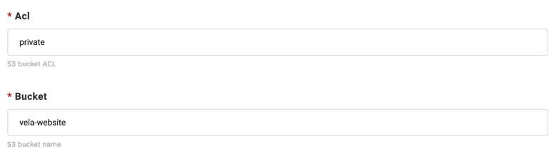
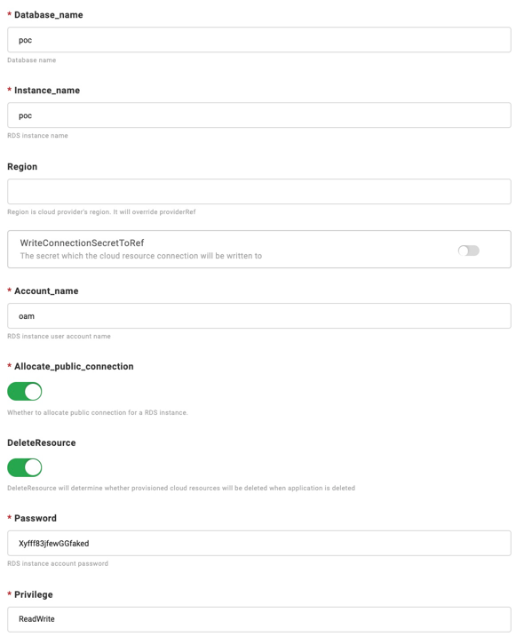

在面向云开发逐渐成为范式的这个时代，我们希望集成来源不同、类型不同云资源的需求非常迫切。不管是最基本的对象存储、云数据库，还是更多的负载均衡等等，
也面临着混合云、多云等复杂环境所带来的挑战，而 KubeVela 都可以很好满足你的需要。

KubeVela 通过云资源组件（Component）和运维特征（Trait）里的资源绑定功能，高效安全地完成不同类型云资源的集成工作。目前你可以直接调用下面这些云资源默认组件。
同时在未来，更多新的云资源也会在社区的支撑下逐渐成为默认选项，让你标准化统一地去使用各种厂商的云资源。

本教程将主要集中在通过 Terraform 命令行工具和 VelaUX 创建云资源的方面。
如果你想使用 [Crossplane](https://crossplane.io/) 来创建云资源，请参考这个教程[Provision cloud resources by Crossplane](../end-user/components/cloud-services/provision-cloud-resources-by-crossplane).。

# 通过 Vela CLI 创建云资源

## 前置条件

请平台工程师启用云资源 Terraform 插件并授权目标云服务商的认证信息。
我们将使用阿里云作为示例。

## 熟悉云资源的使用规范

KubeVela 支持的所有由 Terraform 编排的云资源请见[列表](../end-user/components/cloud-services/cloud-resources-list)，你也可以通过命令 `vela components --label type=terraform` 查看。

你可以使用一下任意方式来检查云资源的使用规范：

- 通过命令 `vela show $RESOURCE_DEFINITION`

```shell
$ vela show alibaba-oss
  ### Properties
  +----------------------------+-------------------------------------------------------------------------+-----------------------------------------------------------+----------+---------+
  |            NAME            |                               DESCRIPTION                               |                           TYPE                            | REQUIRED | DEFAULT |
  +----------------------------+-------------------------------------------------------------------------+-----------------------------------------------------------+----------+---------+
  | acl                        | OSS bucket ACL, supported 'private', 'public-read', 'public-read-write' | string                                                    | false    |         |
  | bucket                     | OSS bucket name                                                         | string                                                    | false    |         |
  | writeConnectionSecretToRef | The secret which the cloud resource connection will be written to       | [writeConnectionSecretToRef](#writeConnectionSecretToRef) | false    |         |
  +----------------------------+-------------------------------------------------------------------------+-----------------------------------------------------------+----------+---------+


  #### writeConnectionSecretToRef
  +-----------+-----------------------------------------------------------------------------+--------+----------+---------+
  |   NAME    |                                 DESCRIPTION                                 |  TYPE  | REQUIRED | DEFAULT |
  +-----------+-----------------------------------------------------------------------------+--------+----------+---------+
  | name      | The secret name which the cloud resource connection will be written to      | string | true     |         |
  | namespace | The secret namespace which the cloud resource connection will be written to | string | false    |         |
  +-----------+-----------------------------------------------------------------------------+--------+----------+---------+
```

你也可以使用 `--web` 参数来在本地浏览器中查看使用说明。

- 通过官网 http://kubevela.net/docs/end-user/components/cloud-services/cloud-resources-list

比如，你可以在 http://kubevela.net/docs/end-user/components/cloud-services/terraform/alibaba-oss 查看阿里云 OSS 的规范。

### 部署云资源

我们以 OSS bucket 为例展示如何部署云资源。

```yaml
apiVersion: core.oam.dev/v1beta1
kind: Application
metadata:
  name: provision-cloud-resource-sample
spec:
  components:
    - name: sample-oss
      type: alibaba-oss
      properties:
        bucket: vela-website-0911
        acl: private
        writeConnectionSecretToRef:
          name: oss-conn
```

`alibaba-oss` 类型的组件的 properties 在上面文档有清晰的描述，包括每一个 property 的名字、类型、描述、是否必填和默认值。

部署应用程序并检查应用程序的状态。

```shell
$ vela ls
APP                            	COMPONENT 	TYPE       	TRAITS	PHASE  	HEALTHY	STATUS                                       	CREATED-TIME
provision-cloud-resource-sample	sample-oss	alibaba-oss	      	running	healthy	Cloud resources are deployed and ready to use	2021-09-11 12:55:57 +0800 CST
```

当应用程序处于 `running` 和 `healthy`状态。我们可以在阿里云控制台或通过 [ossutil](https://partners-intl.aliyun.com/help/doc-detail/50452.htm)
检查OSS bucket 是否被创建。

```shell
$ ossutil ls oss://
CreationTime                                 Region    StorageClass    BucketName
2021-09-11 12:56:17 +0800 CST        oss-cn-beijing        Standard    oss://vela-website-0911
```

# Provision cloud resources by VelaUX

In this section, we introduce an example to show you how to deploy cloud services.

## 开始之前

- 拥有一个能适当权限访问你的目标云资源的云供应商账户

- 确保云账号具有足够的费用。

- 对接一个处在同一个云上的 Kubernetes 集群，用以验证云服务的正常开通与使用。

## 开启对应云服务商的插件

首先，访问 VelaUX，切换到 "Addon" 标签，并点击 addon
`terraform-xxx`。`xxx`代表云提供商的名称。我们支持以下的插件：

- terraform-alibaba
- terraform-aws
- terraform-azure
- terraform-tencent
- terraform-gcp
- terraform-baidu

我们可以分别在阿里云、AWS、Azure、腾讯云、Google Cloud Platform和百度云配置云资源。

选择对应的插件版本并启用该插件。


## 认证云服务商的插件

点击菜单 `Platform` 后再点击 `集成配置`，选择 `Terraform Controller Provider` 来认证一个云服务商的插件。

按照每个云提供商的插件的所有属性上的说明来设置插件并启用它。

例如，对于阿里巴巴云，你需要设置以下属性：
> 注意。KubeVela对所有的密钥进行了加密，因此不必担心它的安全问题。


然后填写你的ALICLOUD_ACCESS_KEY，ALICLOUD_REGION，和ALICLOUD_SECRET_KEY来启用它。

云服务的创建过程会从GitHub中提取配置。如果你的控制平面 运行KubeVela的集群很难连接到GitHub，请在`terraform`插件中打开`GithubBlocked`选项。

KubeVela支持的云资源请见[列表](../end-user/components/cloud-services/cloud-services/cloud-resources-list)。

## 创建你的云服务

首先[创建一个应用程序](../how-to/dashboard/application/create-application)。请选择你的云服务的类型。
其前缀为`aws-`、`azure`、`alibaba-`或 `tencent-`。

对于不同的供应商，这些参数会相应更新。

例如，`aws-s3` 有以下参数。



`azure-database-mariadb` 有以下参数。


`alibaba-rds` 有以下参数。



所有的云资源都有一些共同的参数。

- DeleteResource：当应用程序被删除时，是否要删除相应的云服务
- ProviderRef：被云服务引用的提供者。
- Region：Region是云提供商的区域。它将覆盖`providerRef`。

根据你的需要设置上述参数，完成应用程序的创建，然后[部署应用程序](../how-to/dashboard/application/deploy-application)。

## 查看云资源创建状态

- 查看云实例列表

与其他应用程序一样，云服务应用程序也需要切换到相应的环境页面来查看实例信息。 默认情况下，一个环境中有多个目标，云服务会生成相应数量的实例。


在实例列表中，会显示实例名称、状态、资源类型和位置。在开始时，名称是空的。 因为云服务实例的生成需要一定的时间，当实例正常生成后，名称会出现。

- 在云提供商的控制台中查看云资源

您可以在云提供商的控制台中访问该实例。例如，您可以检查名称或控制台来访问它。


例如，你可以在[https://console.aliyun.com](https://console.aliyun.com)中查看阿里巴巴云RDS实例。


- 检查云实例的细节和状态

点击 "检查细节 "按钮来查看应用程序的细节。


你会发现，每个实例都会生成一个Secret资源，一般来说，它记录了服务的访问地址和密钥信息。秘密资源将被分配到目标所在的集群和命名空间，而
控制集群存在。因此，同一环境中的其他应用程序可以直接使用资源中的环境变量来获取访问地址和密钥。


在最后一节 `Component Status` 中，显示了云服务实例的健康状态和信息。

## 常见错误

- 云服务一直处在 ProvisioningAndChecking 状态，且无名称。

> 云服务的创建一般需要一定时间，请等候或者进入云厂商控制台查看创建进度。

# 更多

更多云资源使用方法，比如如何使用和消费云资源，请参见[云资源管理场景](./cloud-resource-scenarios)。