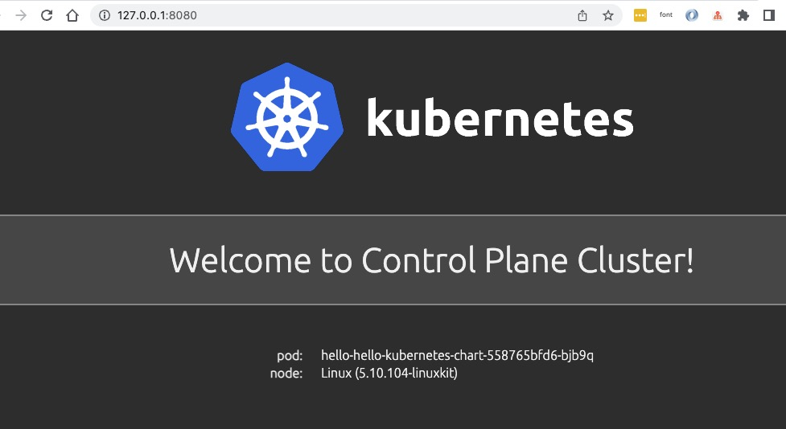
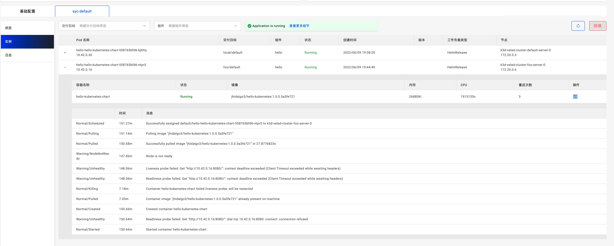
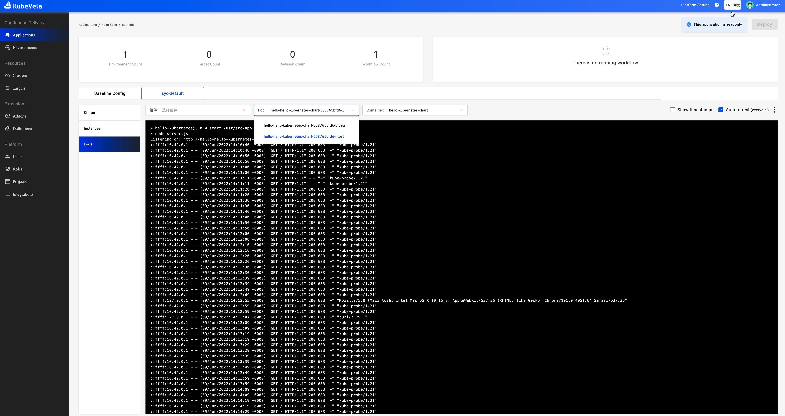
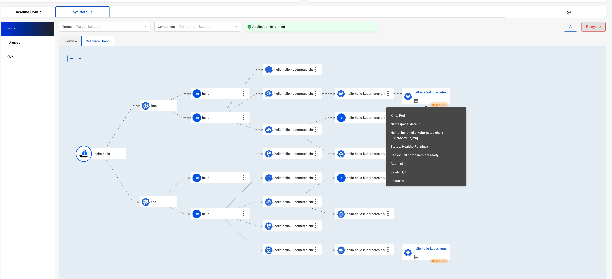
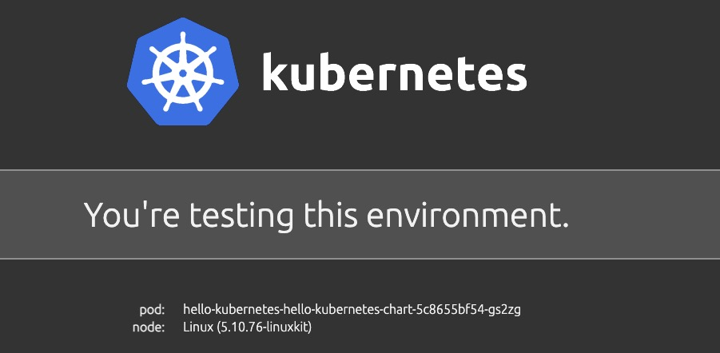
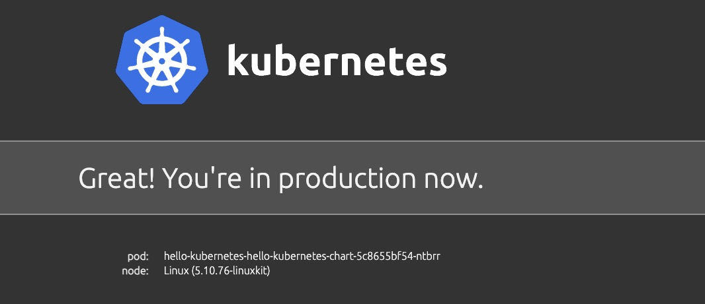

本章节介绍如何将 Helm Chart 部署到多个目标环境和集群。
在开始之前，请确保你已经了解 [Helm Chart 交付](./helm) 以及所有启用的插件。

## 准备集群

> 本节是为多集群做准备，方便起见，我们将从头开始。如果你已经完成 [集群管理](../platform-engineers/system-operation/managing-clusters) ，则可以跳过本节。

1. 使用 [velad](https://github.com/kubevela/velad) 安装 KubeVela 控制平面

```shell
velad install
```

2. 为新创建的集群导出 KubeConfig

```
export KUBECONFIG=$(velad kubeconfig --name default --host)
```

3. 为 UI 控制台启用 velaux 插件

```shell
vela addon enable velaux
```

4. 用 velad 创建一个名为 `foo` 的集群

```shell
velad install --name foo --cluster-only
```

5. 将创建的集群加入控制平面

```shell
vela cluster join $(velad kubeconfig --name foo --internal) --name foo
```

6. 为 helm 组件启用 fluxcd 插件

```shell
vela addon enable fluxcd
```

如果你在加入新集群之前已启用 `fluxcd` 插件，则应该通过以下方式来为新加入的集群启用插件：

```
vela addon enable fluxcd --clusters foo
```

现在我们完成了所有的准备工作，可以查看加入的集群了：

```console
$ vela cluster ls
CLUSTER	ALIAS	TYPE           	ENDPOINT               	ACCEPTED	LABELS
local  	     	Internal       	-                      	true
foo    	     	X509Certificate	https://172.20.0.6:6443	true
```

`local` 是 KubeVela 控制平面的集群，`foo` 则是我们刚刚添加的集群。

## 多集群部署

多集群交付的基本机制与 [容器的多集群应用交付](../case-studies/multi-cluster#deliver-application-to-clusters) 的基本一致。

我们可以使用 `topology` 策略来指定 Helm Chart 交付的环境，指令如下：

```shell
cat <<EOF | vela up -f -
apiVersion: core.oam.dev/v1beta1
kind: Application
metadata:
  name: helm-hello
spec:
  components:
    - name: hello
      type: helm
      properties:
        repoType: "helm"
        url: "https://jhidalgo3.github.io/helm-charts/"
        chart: "hello-kubernetes-chart"
        version: "3.0.0"
  policies:
    - name: foo-cluster-only
      type: topology
      properties:
        clusters: ["foo"]
EOF
```

`clusters` 字段的 topology 策略是一个切片（slice），此处可以指定多个集群的名称。
你还可以使用标签选择器或指定命名空间，详情见 [参考文档](../end-user/policies/references#topology) 。

部署后，你可以通过以下方式检查已部署的应用程序：

```shell
vela status helm-hello
```

部署成功的预期输出应该如下：

```console
About:

  Name:      	helm-hello
  Namespace: 	default
  Created at:	2022-06-09 19:14:57 +0800 CST
  Status:    	running

Workflow:

  mode: DAG
  finished: true
  Suspend: false
  Terminated: false
  Steps
  - id:vtahj5zrz4
    name:deploy-foo-cluster-only
    type:deploy
    phase:succeeded
    message:

Services:

  - Name: hello
    Cluster: foo  Namespace: default
    Type: helm
    Healthy Fetch repository successfully, Create helm release successfully
    No trait applied
```

你可以通过以下方式检查已部署的资源：

```
$ vela status helm-hello --tree
CLUSTER       NAMESPACE     RESOURCE             STATUS
foo       ─── default   ─┬─ HelmRelease/hello    updated
                         └─ HelmRepository/hello updated
```

你也可以通过 VelaUX 检查已部署的资源，这已在 [helm 交付文档](./helm#visualize-the-resources-created-by-helm-release) 中介绍。

## 使用 Override 配置进行部署

在某些情况下，我们会为不同集群的 Helm Chart 设置不同的 Value ，这样我们可以使用 [Override 策略](../end-user/policies/references#override) 。

下面是一个复杂的示例，我们将把一个 Helm Chart 部署到两个集群中，并为每个集群指定不同的 Value 。让我们部署它：

```shell
cat <<EOF | vela up -f -
apiVersion: core.oam.dev/v1beta1
kind: Application
metadata:
  name: helm-hello
spec:
  components:
    - name: hello
      type: helm
      properties:
        repoType: "helm"
        url: "https://jhidalgo3.github.io/helm-charts/"
        chart: "hello-kubernetes-chart"
        version: "3.0.0"
  policies:
    - name: topology-local
      type: topology
      properties:
        clusters: ["local"]
    - name: topology-foo
      type: topology
      properties:
        clusters: ["foo"]
    - name: override-local
      type: override
      properties:
        components:
          - name: hello
            properties:
              values:
                configs:
                  MESSAGE: Welcome to Control Plane Cluster!
    - name: override-foo
      type: override
      properties:
        components:
          - name: hello
            properties:
              values:
                configs:
                  MESSAGE: Welcome to Your New Foo Cluster!
  workflow:
    steps:
      - name: deploy2local
        type: deploy
        properties:
          policies: ["topology-local", "override-local"]
      - name: manual-approval
        type: suspend
      - name: deploy2foo
        type: deploy
        properties:
          policies: ["topology-foo", "override-foo"]
EOF
```

> **注意：如果你觉得策略和工作流程有点复杂，你可以将它们作为一个外部对象并仅引用该对象，用法和 [容器交付](../case-studies/multi-cluster#use-policies-and-workflow-outside-the-application) 是一样的。**

部署过程分为三个步骤：（1）部署到本地集群；（2）等待人工审批；（3）部署到 foo 集群。你会发现它在第一步之后就被暂停了，就像下面这样：

```
$ vela status helm-hello
About:

  Name:      	helm-hello
  Namespace: 	default
  Created at:	2022-06-09 19:38:13 +0800 CST
  Status:    	workflowSuspending

Workflow:

  mode: StepByStep
  finished: false
  Suspend: true
  Terminated: false
  Steps
  - id:ww4cydlvee
    name:deploy2local
    type:deploy
    phase:succeeded
    message:
  - id:xj6hu97e1e
    name:manual-approval
    type:suspend
    phase:succeeded
    message:

Services:

  - Name: hello
    Cluster: local  Namespace: default
    Type: helm
    Healthy Fetch repository successfully, Create helm release successfully
    No trait applied
```

你可以查看并使用 Value 为 “Welcome to Control Plane Cluster!” 的部署在控制平面的 Helm Chart 。

```
vela port-forward helm-hello
```

浏览器会自动提示如下页面：



发现部署成功，让我们继续。

```shell
vela workflow resume helm-hello
```

然后它会部署到 foo 集群，你可以查看这些资源的详细信息。

```console
$ vela status helm-hello --tree --detail
CLUSTER       NAMESPACE     RESOURCE             STATUS    APPLY_TIME          DETAIL
foo       ─── default   ─┬─ HelmRelease/hello    updated   2022-06-09 19:38:13 Ready: True  Status: Release reconciliation succeeded  Age: 64s
                         └─ HelmRepository/hello updated   2022-06-09 19:38:13 URL: https://jhidalgo3.github.io/helm-charts/  Age: 64s  Ready: True
                                                                               Status: stored artifact for revision 'ab876069f02d779cb4b63587af1266464818ba3790c0ccd50337e3cdead44803'
local     ─── default   ─┬─ HelmRelease/hello    updated   2022-06-09 19:38:13 Ready: True  Status: Release reconciliation succeeded  Age: 7m34s
                         └─ HelmRepository/hello updated   2022-06-09 19:38:13 URL: https://jhidalgo3.github.io/helm-charts/  Age: 7m34s  Ready: True
                                                                               Status: stored artifact for revision 'ab876069f02d779cb4b63587af1266464818ba3790c0ccd50337e3cdead44803'
```

再次使用端口转发：

```shell
vela port-forward helm-hello
```

然后它会弹出一些选项：

```
? You have 2 deployed resources in your app. Please choose one:  [Use arrows to move, type to filter]
> Cluster: foo | Namespace: default | Kind: HelmRelease | Name: hello
  Cluster: local | Namespace: default | Kind: HelmRelease | Name: hello
```

选择带有 `foo` 集群的选项，然后你会看到结果已经被新消息覆盖。

```console
$ curl http://127.0.0.1:8080/
...snip...
      <div id="message">
  Welcome to Your New Foo Cluster!
</div>
...snip...
```

## 使用 UI 控制台查看更多信息

如果你使用的是 `velaux` UI 控制台，则可以查看更多的多集群信息，并拥有统一的体验。

* 检查来自不同集群的 Pod 状态和事件：



* 检查来自不同集群的 Pod 日志：



* 检查资源拓扑树的关系和状态：



## 为不同环境指定不同的 Value 文件

你可以为不同环境选择 Helm Chart 中现有的不同 Value 文件。比如：

请确保你的本地集群有两个命名空间 “test” 和 “prod”，它们代表我们示例中的两个环境。

我们以 Chart `hello-kubernetes-chart` 为例。这个 Chart 有两个 Value 文件。你可以拉取此 Chart 并查看其中包含的所有文件：

```yaml
$ tree ./hello-kubernetes-chart
./hello-kubernetes-chart
├── Chart.yaml
├── templates
│ ├── NOTES.txt
│ ├── _helpers.tpl
│ ├── config-map.yaml
│ ├── deployment.yaml
│ ├── hpa.yaml
│ ├── ingress.yaml
│ ├── service.yaml
│ ├── serviceaccount.yaml
│ └── tests
│ └── test-connection.yaml
├── values-production.yaml
└── values.yaml
```

我们可以看到此 Chart 中有 `values.yaml` `values-production.yaml` 这两个 Value 文件。

```yaml
cat <<EOF | vela up -f -
apiVersion: core.oam.dev/v1beta1
kind: Application
metadata:
  name: hello-kubernetes
spec:
  components:
    - name: hello-kubernetes
      type: helm
      properties:
        repoType: "helm"
        url: "https://wangyikewxgm.github.io/my-charts/"
        chart: "hello-kubernetes-chart"
        version: "0.1.0"

  policies:
    - name: topology-test
      type: topology
      properties:
        clusters: ["local"]
        namespace: "test"
    - name: topology-prod
      type: topology
      properties:
        clusters: ["local"]
        namespace: "prod"
    - name: override-prod
      type: override
      properties:
        components:
          - name: hello-kubernetes
            properties:
              valuesFiles:
                - "values-production.yaml"
  workflow:
    steps:
      - name: deploy2test
        type: deploy
        properties:
          policies: ["topology-test"]
      - name: deploy2prod
        type: deploy
        properties:
          policies: ["topology-prod", "override-prod"]  
EOF
```

访问 Application 的 endpoint ：

```yaml
vela port-forward hello-kubernetes
```

如果你选择 ```Cluster: local | Namespace: test | Kind: HelmRelease | Name: hello-kubernetes``` 你会看到：



选择 ```Cluster: local | Namespace: prod | Kind: HelmRelease | Name: hello-kubernetes``` 则会看到



## 清理

如果你使用 velad 进行此演示，则可以通过以下方式便捷地进行清理：

* 清理 foo 集群
```
velad uninstall -n foo
```

* 清理默认集群
```
velad uninstall
```

使用 Helm Chart ，快乐交付一下！
