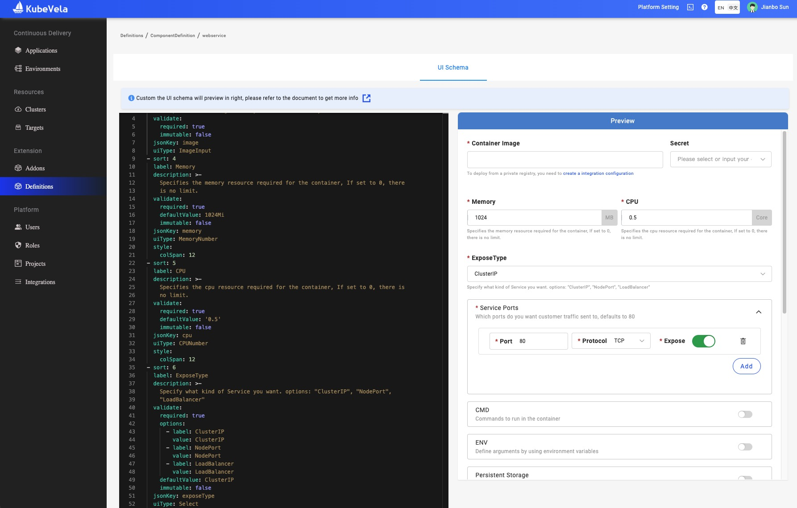

模块定义是组成 KubeVela 平台的基本扩展能力单元，一个模块定义就像乐高积木，它将底层的能力封装成抽象的模块，使得这些能力可以被最终用户快速理解、使用并和其他能力组装、衔接，最终构成一个具有丰富功能的业务应用。模块定义最大的优势是可以被**分发**和**共享**，在不同的业务应用中重复使用，在基于 KubeVela 的不同平台上均能执行。

通过模块定义，平台构建者可以很容易的将云原生生态的基础设施组件扩展为应用层能力，基于最佳实践为上层开发者屏蔽底层细节而不失可扩展性。最重要的是，模块定义为上层应用提供了良好的抽象体系，能力的实现层即使被完全替换也不会影响上层应用，真正做到基础设施无关。


为了更好的理解模块定义，上图给出了以 `helm` 为例的原理示意图。平台构建者可以基于 [FluxCD](https://fluxcd.io/) 或者 [ArgoCD](https://argo-cd.readthedocs.io/) 编写模块定义并注册为 `helm` 模块，最终用户可以自动发现这个模块并在应用中定义 `helm` 模块暴露的参数。模块定义的编写基于 [CUE](https://cuelang.org/) 语言，在本节的最后你也将了解到如何制作自定义模块。

目前 KubeVela 一共有四种不同类型的模块定义，分别是组件定义（ComponentDefinition）、运维特征定义（TraitDefinition）、策略定义（PolicyDefinition）以及工作流步骤定义（WorkflowStepDefinition），对应了构成[应用](./core-concept)的四个基本概念。

## 如何获取现成的模块定义？

除了自己编写模块定义以外，你可以通过以下两大途径获得社区已有的模块定义：

* KubeVela 安装时自动就会安装内置的模块定义，你可以在下面这些参考文档中查看有哪些现成的能力：
    - [组件定义列表](../end-user/components/references)
    - [运维特征定义列表](../end-user/traits/references)
    - [策略定义列表](../end-user/policies/references)
    - [工作流步骤定义列表](../end-user/workflow/built-in-workflow-defs)
* [扩展插件列表](../reference/addons/overview)，作为 KubeVela 的扩展，每一个插件都包含一组模块定义以及支撑其功能的 CRD Controller。
    - 社区有一个[插件注册中心](https://github.com/kubevela/catalog)包含了大量开箱即用的插件，由 KubeVela 核心维护者负责认证和维护。

## 模块定义的生命周期

一个模块定义通常有三个生命周期阶段：

### 发现

当模块定义被安装到 KubeVela 控制平面以后，最终用户就可以立即发现和查看它们。

* 查看模块定义列表

```
vela def list
```

<details>
<summary>期望输出</summary>

```
NAME                         	TYPE                  	NAMESPACE  	DESCRIPTION
webservice                   	ComponentDefinition   	vela-system	Describes long-running, scalable, containerized services
                             	                      	           	that have a stable network endpoint to receive external
                             	                      	           	network traffic from customers.
gateway                      	TraitDefinition       	vela-system	Enable public web traffic for the component, the ingress API
                             	                      	           	matches K8s v1.20+.
health                       	PolicyDefinition      	vela-system	Apply periodical health checking to the application.
notification                 	WorkflowStepDefinition	vela-system	Send message to webhook
...snip...
```
</details>

* 查看模块定义的参数
```
vela show webservice
```

<details>
<summary>期望输出</summary>

```
# Properties
+------------------+-------------------------------------------------------------------------------------------+-----------------------------------+----------+---------+
|       NAME       |                                        DESCRIPTION                                        |               TYPE                | REQUIRED | DEFAULT |
+------------------+-------------------------------------------------------------------------------------------+-----------------------------------+----------+---------+
| cmd              | Commands to run in the container                                                          | []string                          | false    |         |
| env              | Define arguments by using environment variables                                           | [[]env](#env)                     | false    |         |
| labels           | Specify the labels in the workload                                                        | map[string]string                 | false    |         |
| annotations      | Specify the annotations in the workload                                                   | map[string]string                 | false    |         |
| image            | Which image would you like to use for your service                                        | string                            | true     |         |
| ports            | Which ports do you want customer traffic sent to, defaults to 80                          | [[]ports](#ports)                 | false    |         |
+------------------+-------------------------------------------------------------------------------------------+-----------------------------------+----------+---------+
...snip...
```
</details>

你也可以通过命令行打开一个网页查看这些参数：

```
vela show webservice --web
```

* 在 KubeVela 的 UI 控制台（ [velaux 插件](../reference/addons/velaux)）

模块定义在 UI 控制台上可以比较方便的查看和使用，更重要的是，你还可以[自定义 UI 展示](../reference/ui-schema)来优化 UI 控制台上模块定义的参数展示。




### 使用

在 KubeVela 的 UI 控制台上使用模块定义是非常自然的，整个流程紧紧围绕应用部署计划展开，你只要跟着界面操作指引一步步点击即可使用。

分为如下几步：

1. 创建应用选择组件类型，这个过程就是选择使用某个组件定义。
2. 填写组件的参数则会根据组件定义的不同出现不同的待填写参数。
3. 运维特征、策略、工作流步骤的使用也是如此，分别在不同的应用部署计划业务流程中体现。

最终 UI 控制台会组装成一个符合 OAM 模型定义的完整应用部署计划，然后 KubeVela 控制器会自动化处理剩下的事情：

```
apiVersion: core.oam.dev/v1beta1
kind: Application
metadata:
  name: first-vela-app
spec:
  components:
    - name: express-server
      type: webservice
      properties:
        image: oamdev/hello-world
        ports:
         - port: 8000
           expose: true
      traits:
        - type: scaler
          properties:
            replicas: 1
  policies:
    - name: target-default
      type: topology
      properties:
        clusters: ["local"]
        namespace: "default"
    - name: target-prod
      type: topology
      properties:
        clusters: ["local"]
        namespace: "prod"
    - name: deploy-ha
      type: override
      properties:
        components:
          - type: webservice
            traits:
              - type: scaler
                properties:
                  replicas: 2
  workflow:
    steps:
      - name: deploy2default
        type: deploy
        properties:
          policies: ["target-default"]
      - name: manual-approval
        type: suspend
      - name: deploy2prod
        type: deploy
        properties:
          policies: ["target-prod", "deploy-ha"]
```

使用 KubeVela 命令行工具来使用模块定义也是如此，只要编写上述 Application 对象的 YAML 文件即可，可以使用 `vela` 命令如下：

```
vela up -f https://kubevela.net/example/applications/first-app.yaml
```

Application 也是一种 Kubernetes 的 CRD，你可以通过 `kubectl` 工具，或者直接调用 Kubernetes API 集成 KubeVela 功能。

### 自定义

> **⚠️ 请注意，在多数情况下，你不需要编写自定义模块，除非你的目的是扩展 KubeVela 的系统能力。在此之前，我们建议你先查看 KubeVela 内置的模块定义以及扩展插件，可能它们已经足够满足你的需求。**

KubeVela 使用 [CUE 配置语言](https://cuelang.org/)来编写自定义模块，如果你对 CUE 语言还不熟悉也不必担心，可以查看 [CUE 入门指南](../platform-engineers/cue/basic)，花 15 分钟即可了解基本的实用操作。

一个模块定义包含输入、输出、操作以及这三者之间的衔接关系，一个简单的组件模块定义如下所示：

```
webserver: {
	type: "component"
	attributes: {}
}

template: {
	parameter: {
		name:  string
		image: string
	}
	output: {
		apiVersion: "apps/v1"
		kind:       "Deployment"
		spec: {
			containers: [{
				name:  parameter.name
				image: parameter.image
			}]
		}
	}
}
```

`type` 字段定义了这个模块是哪种类型（组件、运维特征、策略或者工作流步骤）， `parameter` 定义了模块的输入，`output` 定义了模块的输出。还有一些高级的操作你可以通过了解[如何管理、编写模块定义](../platform-engineers/cue/definition-edit)以及[模块定义与 Kubernetes 的交互协议](../platform-engineers/oam/x-definition) 等章节文档了解更多细节。
