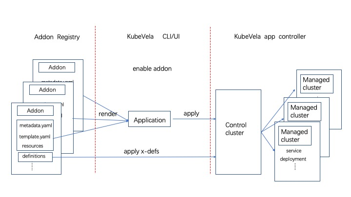

一个 KubeVela 插件就是一个主要包含了以下三类文件的集合:
* 插件的`基本信息文件` 包括元数据文件（metadata.yaml）和插件介绍文档（README.md）。
* 定义 KubeVela 的`OAM 模型文件`。包括[模块化能力](../../getting-started/definition), [UI 扩展](../../reference/ui-schema)，[资源拓扑规则](../../reference/topology-rule)等。
* 描述一个 KubeVela [应用（Application）](../../getting-started/core-concept) 的 `应用描述文件`。通常插件中的模块化能力（Definition）背后需要一个 Kubernetes operator 的支撑，而应用描述文件的作用就是，定义一个包含相应的 Kubernetes 资源的 KubeVela 应用（application），进而由 KubeVela 控制器把 operator 安装到各个集群当中。

后面的章节会分别介绍这三类文件的作用和编写规则。

下图展示了在启用一个插件时，KubeVela 做了哪些事情, 主要包含以下三个步骤。
* 当通过 UX/CLI 启用一个插件时，会从插件仓库把插件的源文件拉取下来。
* 文件中`OAM 模型文件`文件会被直接下发到管控集群。 [应用描述文件](#应用描述文件) 会被用来渲染成一个 KubeVela 应用并创建。
* 接下来运行在管控集群的 KubeVela 控制器完全按照应用（Application）的执行流程交付资源，与 KubeVela 其他的应用执行没有差别。



## 制作插件 (Make an Addon)

接下来将介绍如何制作一个自己的插件。

通常，一个插件目录结构如下所示：

```shell
├── resources/
│   ├── xxx.cue
│   └── xxx.yaml
├── definitions/
├── schemas/
├── README.md
├── metadata.yaml
├── parameter.cue
└── template.yaml
```

你也可以使用命令 `vela addon init <your-addon-name>` 帮你快速创建这个目录框架。

需要注意的是，上面的文件并不都是必须的。接下来将介绍每个文件和目录的详细作用。

### 插件的基本信息文件

> 这类文件在插件中是必须的。

#### 元数据文件 (metadata.yaml)

首先你需要编写一个插件的元数据文件 (metadata.yaml) ，该文件描述了插件的名称、版本、描述等基本描述信息。只有包含这个文件，一个目录才会被识别为一个插件的文件目录, 一个元数据文件的例子如下所示：

```yaml
name: example
version: 1.0.0
description: Example adddon.
icon: xxx
url: xxx

tags:
  - only_example

deployTo:
  runtimeCluster: false

dependencies:
  - name: addon_name

system:
  vela: ">=v1.4.0"
  kubernetes: ">=1.19.0-0"

invisible: false
```

所有的字段及其作用如下：

| Field | Required  | Type | Usage  |
|:----:|:---:|:--:|:------:|
| name    |  yes | string | 名称  |
| version    | yes  | string | 版本，每次变更递增且符合 [SemVer](https://semver.org/) 规范  |
| description     | yes  | string | 描述  |
| icon     | no  | string |  图标，图标将在 VelaUX 的插件页面展示  |
| url     | no  | string |  插件所包含项目的官网地址   |
| tags     | no  | []string | 标签 |
| dependencies     | no  | []{ name: string } | 依赖的其他插件，安装是 KubeVela 会保证依赖插件均已安装 |
| system.vela     | no  | string | 环境中所要求的 KubeVela 的版本，如果不满足，安装将会被拒绝  |
| system.kubernetes     | no  | string | 环境中所要求的 Kubernetes 的版本 |
| deployTo.runtimeCluster     | no  | bool |  插件是否可以安装到子集群，默认不设置该字段插件不会安装在任何子集群中 （只在 YAML 描述插件应用时生效） |

#### 介绍文档 (README.md)

插件的介绍文档用于描述插件的主要功能，并且该文件会在 UX 的插件详情页面呈现给用户。所以介绍文档需要包含以下基本信息：

* 这个插件是什么？
* 为什么要使用该插件？使用案例或场景。
* 如何使用？ `End user` 能够快速理解如何使用该插件。最好能够提供一个端到端的例子。
* 安装了什么？ 插件中包含的模块化能力以及相关的 CRD 和 operator。

[实验阶段的插件](https://github.com/kubevela/catalog/tree/master/experimental/addons) 通常没有这些非常严格的规则，但对于一个想要进阶到 [认证仓库](https://github.com/kubevela/catalog/tree/master/addons) 的插件而言，介绍文档至关重要。

### OAM 模型文件 

> 这类文件在插件中也是可以缺省的.

#### 模块化能力定义文件 (definitions/ 目录) 

这个目录包含了插件所提供的模块化能力（Definition），安装插件之后这些能力就会被用户看到并使用。 该目录中的文件可以是一个 YAML 类型的 ComponentDefinition，TraitDefinitions 或 WorkflowStepDefinitions Kubernetes 资源对象（CustomResource）。也可以是 CUE 格式的 KubeVela [def](../../getting-started/definition) 文件，这类文件在启用时会被渲染成对应的 Kubernetes 资源对象再下发到集群。

> 需要注意的是，这些 Definition 只会被下发到管控集群。

#### 模块化能力参数展示增强文件 (schema/ 目录)

该目录用于存放模块化能力（Definition）所对应的 [UI-schema](../../reference/ui-schema) 文件，用于在 UX 中展示模块化能力（Definition）所需要填写参数时增强显示效果。需要注意的是，和模块化能力定义文件一样，这些文件仅会被下发到管控集群。

### 应用描述文件

> 这类文件在插件中也是可以缺省的

经过上面介绍，我们知道插件中支撑某项模块化能力的 Kubernetes operator 需要通过一个 KubeVela 应用被安装。应用描述文件的作用就是定义这个插件应用。应用描述文件主要包含，应用模版文件（template.cue 或 template.yaml）和 资源文件（`resources/` 目录下的文件 ）。这些文件可以通过 CUE 或 YAML 格式定义。

YAML 格式的应用描述文件的特点是编写简单，你只需要编写一系列包含 Kubernetes 资源对象的 YAML 文件来描述这个插件应用即可。而如果使用 CUE 格式的文件描述插件应用的话，插件将会具备以下能力：

* 利用 CUE 语言灵活简洁的语法、丰富的内置函数及其参数校验能力，根据启动参数和插件元数据渲染和部署插件应用和附属资源。
* 插件中可能包含多个模块化能力（Definition）及其背后支撑的 CRD Operator，他们能够根据启动参数被选择性安装。

文档[使用 YAML 描述插件应用](./addon-yaml) 详细介绍了 YAML 格式的应用描述文件的编写方法。
文档[使用 CUE 描述插件应用](./addon-cue) 详细介绍了 CUE 格式的应用描述文件的编写方法。

## 本地安装（离线安装）

你可以通过本地安装的方式调试你的 addon，命令如下：

```
$ vela addon enable ./your-addon-dir/
```

## 已知局限 (Known Limits)

- 如果插件中包含了一些 [CRD](https://kubernetes.io/docs/concepts/extend-kubernetes/api-extension/custom-resources/), 尚不支持仅在子集群中安装插件。因为 KubeVela 需要在管控平面中渲染出所有类型的资源再将其下发到子集群当中，如果插件不在管控平面安装的话 KubeVela 的控制器会遇到无法找到 CRD 错误。

## 贡献 Addon

除了将插件资源文件上传到自己的插件仓库中，你也可以通过提交 pull request 向 KubeVela [官方插件仓库](https://github.com/kubevela/catalog/tree/master/addons) 和 [试验阶段插件仓库](https://github.com/kubevela/catalog/tree/master/experimental/addons) 添加新的插件，pr 合并之后你的插件就可以被其他 KubeVela 用户发现并使用了。

如果你根据本文档制作了新的插件，非常欢迎贡献到社区。 同时，如果你发现了某个插件的 bug，也欢迎帮助社区修复此 bug。