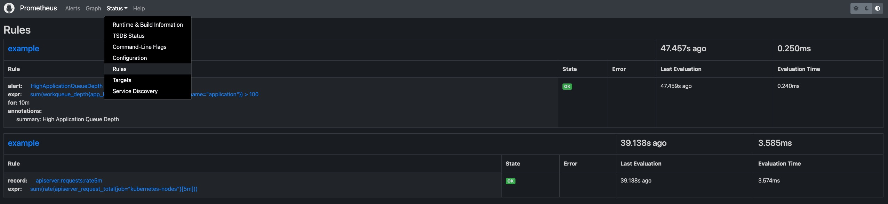
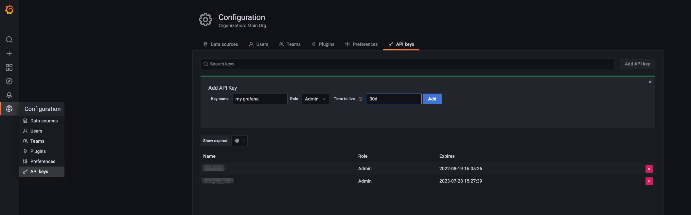

可观测性对于基础架构和应用程序至关重要。 如果没有可观测性系统，就很难确定系统崩溃时发生了什么。 相反，强大的可观测性系统不仅可以为使用者提供信心，还可以帮助开发人员快速定位整个系统内部的性能瓶颈或薄弱环节。

为了帮助用户构建自己的可观测性系统，KubeVela 提供了一些插件，包括：

- prometheus-server: 以时间序列来记录指标的服务，支持灵活的查询。
- kube-state-metrics: Kubernetes 系统的指标收集器。
- node-exporter: Kubernetes 运行中的节点的指标收集器。
- grafana: 提供分析和交互式可视化的 Web 应用程序。

以后的版本中将引入更多用于 logging 和 tracing 的插件。

## 前提条件

1. 可观测性套件包括几个插件，它们需要一些计算资源才能正常工作。 集群的推荐安装资源是 2 核 + 4 Gi 内存。

2. 安装所需的 KubeVela 版本（服务端控制器和客户端 CLI）**不低于** v1.5.0-beta.4。

## 快速开始

要启用插件套件，只需运行 `vela addon enable` 命令，如下所示。

:::tip
如果你的 KubeVela 是多集群场景，请参阅下面的 [多集群安装](#多集群安装) 章节。
:::

1. 安装 kube-state-metrics 插件

```shell
vela addon enable kube-state-metrics
```

2. 安装 node-exporter 插件

```shell
vela addon enable node-exporter
```

3. 安装 prometheus-server

```shell
vela addon enable prometheus-server
```

4. 安装 grafana 插件

```shell
vela addon enable grafana
```

5. 通过端口转发访问 grafana

```shell
kubectl port-forward svc/grafana -n o11y-system 8080:3000
```

现在在浏览器中访问 `http://localhost:8080` 就可以访问你的 grafana。 默认的用户名和密码分别是 `admin` 和 `kubevela`。

## 自动化的 Dashboard

有四个自动化的 Dashboard 可以浏览和查看你的系统。

### KubeVela Application

这个 dashboard 展示了应用的基本信息。

URL: http://localhost:8080/d/application-overview/kubevela-applications


<details>
  KubeVela Application dashboard 显示了应用的元数据概况。 它直接访问 Kubernetes API 来检索运行时应用的信息，你可以将其作为入口。

---

**Basic Information** 部分将关键信息提取到面板中，并提供当前应用最直观的视图。

---

**Related Resource** 部分显示了与应用本身一起工作的那些资源，包括托管资源、记录的 ResourceTracker 和修正。

</details>

### Kubernetes Deployemnt

这个 dashboard 显示原生 deployment 的概况。 你可以查看跨集群的 deployment 的信息。

URL: http://localhost:8080/d/deployment-overview/kubernetes-deployment


<details>
  Kubernetes Deployment dashboard 向你提供 deployment 的详细运行状态。

---

**Pods** 面板显示该 deployment 当前正在管理的 pod。

---

**Replicas** 面板显示副本数量如何变化，用于诊断你的 deployment 何时以及如何转变到不希望的状态。

---

**Pod** 部分包含资源的详细使用情况（包括 CPU / 内存 / 网络 / 存储），可用于识别 pod 是否面临资源压力或产生/接收意想不到的流量。

</details>

### KubeVela 系统

这个 dashboard 显示 KubeVela 系统的概况。 它可以用来查看 KubeVela 控制器是否健康。

URL: http://localhost:8080/d/kubevela-system/kubevela-system


<details>
  KubeVela System dashboard 提供 KubeVela 核心模块的运行详细信息，包括控制器和集群网关。 预计将来会添加其他模块，例如 velaux 或 prism。

---

**Computation Resource** 部分显示了核心模块的使用情况。 它可用于追踪是否存在内存泄漏（如果内存使用量不断增加）或处于高压状态（cpu 使用率总是很高）。 如果内存使用量达到资源限制，则相应的模块将被杀死并重新启动，这表明计算资源不足。你应该为它们添加更多的 CPU/内存。

---

**Controller** 部分包括各种面板，可帮助诊断你的 KubeVela 控制器的瓶颈。

**Controller Queue** 和 **Controller Queue Add Rate** 面板显示控制器工作队列的变化。 如果控制器队列不断增加，说明系统中应用过多或应用的变化过多，控制器已经不能及时处理。 那么这意味着 KubeVela 控制器存在性能问题。 控制器队列的临时增长是可以容忍的，但维持很长时间将会导致内存占用的增加，最终导致内存不足的问题。

**Reconcile Rate** 和 **Average Reconcile Time** 面板显示控制器状态的概况。 如果调和速率稳定且平均调和时间合理（例如低于 500 毫秒，具体取决于你的场景），则你的 KubeVela 控制器是健康的。 如果控制器队列入队速率在增加，但调和速率没有上升，会逐渐导致控制器队列增长并引发问题。 有多种情况表明你的控制器运行状况不佳：

1. Reconcile 是健康的，但是应用太多，你会发现一切都很好，除了控制器队列指标增加。 检查控制器的 CPU/内存使用情况。 你可能需要添加更多的计算资源。
2. 由于错误太多，调和不健康。 你会在 **Reconcile Rate** 面板中发现很多错误。 这意味着你的系统正持续面临应用的处理错误。 这可能是由错误的应用配置或运行工作流时出现的意外错误引起的。 检查应用详细信息并查看哪些应用导致错误。
3. 由于调和时间过长导致的调整不健康。 你需要检查 **ApplicationController Reconcile Time** 面板，看看它是常见情况（平均调和时间高），还是只有部分应用有问题（p95 调和时间高）。 对于前一种情况，通常是由于 CPU 不足（CPU 使用率高）或过多的请求和 kube-apiserver 限制了速率（检查 **ApplicationController Client Request Throughput** 和 **ApplicationController Client Request Average Time** 面板并查看哪些资源请求缓慢或过多）。 对于后一种情况，你需要检查哪个应用很大并且使用大量时间进行调和。

有时你可能需要参考 **ApplicationController Reconcile Stage Time**，看看是否有一些特殊的调和阶段异常。 例如，GCResourceTracker 使用大量时间意味着在 KubeVela 系统中可能存在阻塞回收资源的情况。

---

**Application** 部分显示了整个 KubeVela 系统中应用的概况。 可用于查看应用数量的变化和使用的工作流步骤。 **Workflow Initialize Rate** 是一个辅助面板，可用于查看启动新工作流执行的频率。 **Workflow Average Complete Time** 可以进一步显示完成整个工作流程所需的时间。

</details>

### Kubernetes APIServer

这个 dashboard 展示了所有 Kubernetes apiserver 的运行状态。

URL: http://localhost:8080/d/kubernetes-apiserver/kubernetes-apiserver


<details>
  Kubernetes APIServer dashboard 可帮助你查看 Kubernetes 系统最基本的部分。 如果你的 Kubernetes APIServer 运行不正常，你的 Kubernetes 系统中所有控制器和模块都会出现异常，无法成功处理请求。 因此务必确保此 dashboard 中的一切正常。

---

**Requests** 部分包括一系列面板，用来显示各种请求的 QPS 和延迟。 通常，如果请求过多， APIServer 可能无法响应。 这时候就可以看到是哪种类型的请求出问题了。

---

**WorkQueue** 部分显示 Kubernetes APIServer 的处理状态。 如果 **Queue Size** 很大，则表示请求数超出了你的 Kubernetes APIServer 的处理能力。

---

**Watches** 部分显示 Kubernetes APIServer 中的 watch 数量。 与其他类型的请求相比，WATCH 请求会持续消耗 Kubernetes APIServer 中的计算资源，因此限制 watch 的数量会有所帮助。

</details>

## 自定义

上述安装过程可以通过多种方式进行自定义。

### 多集群安装

如果你想在多集群场景中安装可观测性插件，请确保你的 Kubernetes 集群支持 LoadBalancer 服务并且可以相互访问。

默认情况下，`kube-state-metrics`、`node-exporter` 和 `prometheus-server` 的安装过程原生支持多集群（它们将自动安装到所有集群）。 但是要让控制平面上的 `grafana` 能够访问托管集群中的 prometheus-server，你需要使用以下命令来启用 `prometheus-server`。

```shell
vela addon enable prometheus-server thanos=true serviceType=LoadBalancer
```

这将安装 [thanos](https://github.com/thanos-io/thanos) sidecar 和 prometheus-server。 然后启用 grafana，你将能够看到聚合的 prometheus 指标。

你还可以使用以下命令选择要在哪个集群安装插件：

```shell
vela addon enable kube-state-metrics clusters=\{local,c2\}
```

> 如果在安装插件后将新集群添加到控制平面，则需要重新启用插件才能使其生效。

### 自定义 Prometheus 配置

如果你想自定义安装 prometheus-server ，你可以把配置放到一个单独的 ConfigMap 中，比如在命名空间 o11y-system 中的 `my-prom`。 要将你的自定义配置分发到所有集群，你还可以使用 KubeVela Application 来完成这项工作。

#### 记录规则

例如，如果你想在所有集群中的所有 prometheus 服务配置中添加一些记录规则，你可以首先创建一个 Application 来分发你的记录规则，如下所示。

```yaml
# my-prom.yaml
apiVersion: core.oam.dev/v1beta1
kind: Application
metadata:
  name: my-prom
  namespace: o11y-system
spec:
  components:
    - type: k8s-objects
      name: my-prom
      properties:
        objects:
          - apiVersion: v1
            kind: ConfigMap
            metadata:
              name: my-prom
              namespace: o11y-system
            data:
              my-recording-rules.yml: |
                groups:
                - name: example
                  rules:
                  - record: apiserver:requests:rate5m
                    expr: sum(rate(apiserver_request_total{job="kubernetes-nodes"}[5m]))
  policies:
    - type: topology
      name: topology
      properties:
        clusterLabelSelector: {}
```

然后你需要在 prometheus-server 插件的启用过程中添加 `customConfig` 参数，比如：

```shell
vela addon enable prometheus-server thanos=true serviceType=LoadBalancer storage=1G customConfig=my-prom
```

然后你将看到记录规则配置被分发到到所有 prome。

#### 告警规则和其他配置

要对告警规则等其他配置进行自定义，过程与上面显示的记录规则示例相同。 你只需要在 application 中更改/添加 prometheus 配置。

```yaml
data:
  my-alerting-rules.yml: |
    groups:
    - name: example
      rules:
      - alert: HighApplicationQueueDepth
        expr: sum(workqueue_depth{app_kubernetes_io_name="vela-core",name="application"}) > 100
        for: 10m
        annotations:
          summary: High Application Queue Depth
```



### 自定义 Grafana 凭证

如果要更改 Grafana 的默认用户名和密码，可以运行以下命令：

```shell
vela addon enable grafana adminUser=super-user adminPassword=PASSWORD
```

这会将你的默认管理员用户更改为 `super-user`，并将其密码更改为 `PASSWORD`。

### 自定义存储

如果你希望 prometheus-server 和 grafana 将数据持久化在卷中，可以在安装时指定 `storage` 参数，例如：

```shell
vela addon enable prometheus-server storage=1G
```

这将创建 PersistentVolumeClaims 并让插件使用提供的存储。 即使插件被禁用，存储也不会自动回收。 你需要手动清理存储。

## 集成其他 Prometheus 和 Grafana

有时，你可能已经拥有 Prometheus 和 Grafana 实例。 它们可能由其他工具构建，或者来自云提供商。 按照以下指南与现有系统集成。

### 集成 Prometheus

如果你已经有外部 prometheus 服务，并且希望将其连接到 Grafana（由 vela 插件创建），你可以使用 KubeVela Application 创建一个 GrafanaDatasource 从而注册这个外部的 prometheus 服务。

```yaml
apiVersion: core.oam.dev/v1beta1
kind: Application
metadata:
  name: register-prometheus
spec:
  components:
    - type: grafana-datasource
      name: my-prometheus
      properties:
        access: proxy
        basicAuth: false
        isDefault: false
        name: MyPrometheus
        readOnly: true
        withCredentials: true
        jsonData:
          httpHeaderName1: Authorization
          tlsSkipVerify: true
        secureJsonFields:
          httpHeaderValue1: <token of your prometheus access>
        type: prometheus
        url: <my-prometheus url>
```

例如，如果你在阿里云（ARMS）上使用 Prometheus 服务，你可以进入 Prometheus 设置页面，找到访问的 url 和 token。


> 你需要确定你的 grafana 已经可以访问。你可以执行 `kubectl get grafana default` 查看它是否已经存在。

### 集成 Grafana

如果你已经有 Grafana，与集成 Prometheus 类似，你可以通过 KubeVela Application 注册 Grafana 的访问信息。

```yaml
apiVersion: core.oam.dev/v1beta1
kind: Application
metadata:
  name: register-grafana
spec:
  components:
    - type: grafana-access
      name: my-grafana
      properties:
        name: my-grafana
        endpoint: <my-grafana url>
        token: <access token>
```

要获得 Grafana 访问权限，你可以进入 Grafana 实例并配置 API 密钥。



然后将 token 复制到你的 grafana 注册配置中。


Application 成功派发后，你可以通过运行以下命令检查注册情况。

```shell
> kubectl get grafana
NAME         ENDPOINT                                                      CREDENTIAL_TYPE
default      http://grafana.o11y-system:3000                               BasicAuth
my-grafana   https://grafana-rngwzwnsuvl4s9p66m.grafana.aliyuncs.com:80/   BearerToken
```

现在，你也可以通过原生 Kubernetes API 在 grafana 实例上管理 dashboard 和数据源。

```shell
# 显示你拥有的所有 dashboard
kubectl get grafanadashboard -l grafana=my-grafana
# 显示你拥有的所有数据源
kubectl get grafanadatasource -l grafana=my-grafana
```

更多详情，你可以参考 [vela-prism](https://github.com/kubevela/prism#grafana-related-apis)。

### 集成其他工具和系统

用户可以利用社区的各种工具或生态系统来构建自己的可观测性系统，例如 prometheus-operator 或 DataDog。 到目前为止，针对这些集成，KubeVela 并没有给出最佳实践。 未来我们可能会通过 KubeVela 插件集成那些流行的项目。 我们也欢迎社区贡献更广泛的探索和更多的联系。

## 对比

### 与 Helm 对比

尽管可以通过 Helm 将这些资源安装到你的 Kubernetes 系统中，但使用 KubeVela 插件安装它们的主要好处之一是它原生地支持多集群交付，这意味着，一旦你将托管集群添加到 KubeVela 控制面，你就能够通过一条命令在所有集群中安装、升级或卸载这些插件。

### 与以前的可观测性插件对比

旧的 [KubeVela 可观测性插件](https://github.com/kubevela/catalog/tree/master/experimental/addons/observability) 以一个整体的方式安装 prometheus、grafana 和其他一些组件。 最新的可观测性插件套件（KubeVela v1.5.0 之后）将其分为多个部分，允许用户只安装其中的一部分。

此外，旧的可观测性插件依赖于 Fluxcd 插件以 Helm Release 的方式安装组件。 最新版本使用 KubeVela 中的原生 webservice 组件，可以更灵活的进行自定义。

## 展望

KubeVela 将来会集成更多的可观测性插件，例如 logging 和 tracing 插件。 像 [prometheus-operator](https://github.com/prometheus-operator/prometheus-operator) 这样的社区运营商也提供了管理可观测性应用程序的替代方法，这些方法也打算包含在 KubeVela 插件中。 我们也欢迎通过 KubeVela 插件生态系统进行更多的集成。
