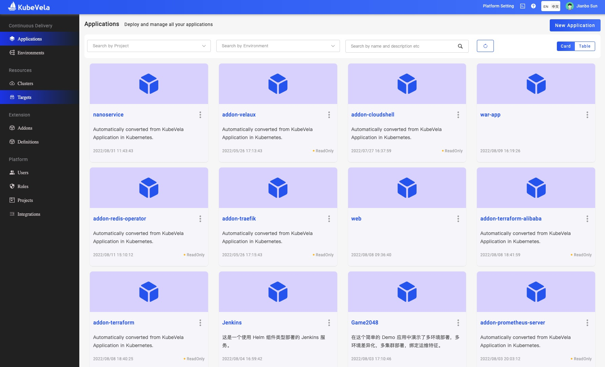

VelaUX 插件为 KubeVela 提供了可视化的 UI 控制台操作能力。



## 安装插件

```shell script
vela addon enable velaux
```

期望得到的输出如下：
```
Addon: velaux enabled Successfully.
```

VelaUX 需要认证访问。默认的用户名是`admin`，默认密码是 **VelaUX12345**。请务必在第一次登录之后重新设置和保管好你的新密码。

默认情况下， VelaUX 没有暴露任何端口。

## 通过端口转发来访问 VelaUX

端口转发会以代理的方式允许你通过本地端口来访问 VelaUX 控制台。

```
vela port-forward addon-velaux -n vela-system
```

选择 `> local | velaux | velaux` 来启用端口转发。

## 配置特定服务访问方式

VelaUX 控制台插件支持三种和 Kubernetes 服务一样的服务访问方式，它们是：`ClusterIP`，`NodePort`以及`LoadBalancer`。

为了安全起见，默认的服务访问方式为 ClusterIP。

如果你想要改变 VelaUX 控制台的访问方式，你需要通过下面的方法来改变：

- `LoadBalancer`方式需要你的集群有可用的 LoadBalancer。
    ```shell script
    vela addon enable velaux serviceType=LoadBalancer
    ```
- `NodePort`方式需要你能够访问 Kubernetes 节点 IP 和 端口。
    ```shell script
    vela addon enable velaux serviceType=NodePort
    ```
一旦服务访问方式指定为`LoadBalancer`或者`NodePort`，你可以通过执行`vela status`来获取访问地址：
```
vela status addon-velaux -n vela-system --endpoint
```

期望得到的输出如下：
```
+----------------------------+----------------------+
|  REF(KIND/NAMESPACE/NAME)  |       ENDPOINT       |
+----------------------------+----------------------+
| Service/vela-system/velaux | http://<IP address> |
+----------------------------+----------------------+
```

## 配置 Ingress 域名访问

如果你集群中拥有可用的 ingress 和域名，那么你可以按照下面的方式给你的 VelaUX 在部署过程中指定一个域名。

```bash
vela addon enable velaux domain=example.doamin.com
```

期望得到的输出如下：
```
I0112 15:23:40.428364   34884 apply.go:106] "patching object" name="addon-velaux" resource="core.oam.dev/v1beta1, Kind=Application"
I0112 15:23:40.676894   34884 apply.go:106] "patching object" name="addon-secret-velaux" resource="/v1, Kind=Secret"
Addon: velaux enabled Successfully.
Please access the velaux from the following endpoints:
+----------------------------+---------------------------+
|  REF(KIND/NAMESPACE/NAME)  |         ENDPOINT          |
+----------------------------+---------------------------+
| Ingress/vela-system/velaux | http://example.doamin.com |
+----------------------------+---------------------------+
```

如果你已经启用了 traefik 插件，那么你可以指定`gatewayDriver`参数来启用网关 API。

```shell script
vela addon enable velaux domain=example.doamin.com gatewayDriver=traefik
```

## 配置 MongoDB

VelaUX 支持 Kubernetes 和 MongoDB 作为其数据库。默认数据库为 Kubernetes。我们强烈建议你通过使用 MongoDB 来增强你的生产环境使用体验。

```shell script
vela addon enable velaux dbType=mongodb dbURL=mongodb://<MONGODB_USER>:<MONGODB_PASSWORD>@<MONGODB_URL>
```

## 指定插件镜像仓库

默认情况下，VelaUX 仓库使用的是 docker hub，你可以通过`repo`参数来改变插件镜像的仓库：

```shell script
vela addon enable velaux repo=acr.kubevela.net
```

你可以尝试指定`acr.kubevela.net` 镜像注册表作为 docker hub 的替换，这个镜像仓库由 KubeVela 团队维护，并且他们会定期上传/同步内建组件到这个仓库。

这个特性也同样可以帮助你使用你的私有仓库来完成安装，你仅仅需要将所有镜像都上传到你的私有镜像仓库即可。

## VelaUX 概念

VelaUX 是 KubeVela 的插件，它是一个企业可以开箱即用的云原生应用交付和管理平台。与此同时，也加入了一些企业使用中需要的概念。


### 项目（Project）

项目作为在 KubeVela 平台组织人员和资源的业务承载，项目中可以设定成员、权限、应用和分配环境。在项目维度集成外部代码库、制品库，呈现完整 CI/CD Pipeline；集成外部需求管理平台，呈现项目需求管理；集成微服务治理，提供多环境业务联调和统一治理能力。项目提供了业务级的资源隔离能力。

### 环境（Environment）

环境指通常意义的开发、测试、生产的环境业务描述，它可以包括多个交付目标。环境协调上层应用和底层基础设施的匹配关系，不同的环境对应管控集群的不同 Kubernetes Namespace。处在同一个环境中的应用才能具备内部互访和资源共享能力。

- <b>应用环境绑定</b> 应用可绑定多个环境进行发布，对于每一个环境可设置环境级部署差异。


### 交付目标（Target）

交付目标用于描述应用的相关资源实际部署的物理空间，对应 Kubernetes 集群或者云的区域（Region）和专有网络（VPC）。对于普通应用，组件渲染生成的资源会在交付目标指定的 Kubernetes 集群中创建（可以精确到指定集群的 Namespace）；对于云服务，资源创建时会根据交付目标中指定的云厂商的参数创建到对应的区域和专有网络中，然后将生成的云资源信息分发到交付目标指定的 Kubernetes 集群中。单个环境可关联多个交付目标，代表该环境需要多集群交付。单个交付目标只能对应一个环境。

### 应用（Application）

应用是定义了一个微服务业务单元所包括的制品（二进制、Docker 镜像、Helm Chart...）或云服务的交付和管理需求，它由[组件](#组件（component）)、[运维特征](#运维特征（Trait）)、[工作流](#工作流（workflow）)、[应用策略](#应用策略（Policy）)四部分组成，应用的生命周期操作包括：


- <b>创建(Create)</b> 应用是创建元信息，并不会实际部署和运行资源。
- <b>部署(Deploy)</b> 指执行指定的工作流， 将应用在某一个环境中完成实例化。
- <b>回收(Recycle)</b> 删除应用部署到某一个环境的实例，回收其占用的资源。
- <b>删除</b> 应用会删除元数据，前提是应用实例已经完全被回收后才能删除。

VelaUX 应用中其他概念均与 KubeVela 控制器中的概念完全一致。
