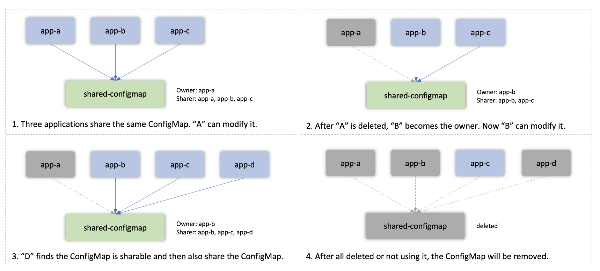
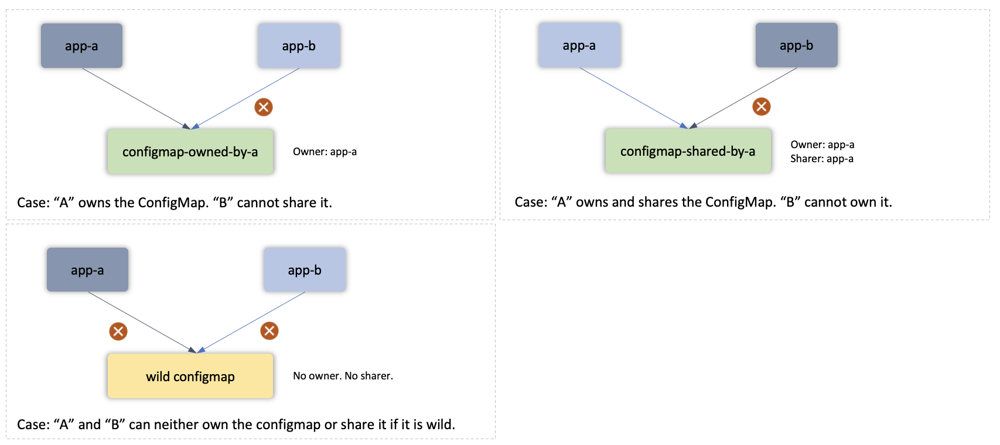

## 背景

在 KubeVela 中，默认情况下，应用拥有资源。
这意味着应用创建的资源只能由创建它的应用控制。

所以应用创建资源基本上有两个要求：

1. 资源在应用创建它之前不能存在。如果存在，会出现资源冲突错误。
2. 资源期望只能通过其创建者进行管理。 *其他人* 不应该修改或编辑它。

调度资源时，应用将

1. 检查资源是否存在。 如果存在，检查它的标签。
如果 `app.oam.dev/name` 和 `app.oam.dev/namespace` 等于应用的 name 和 namespace，则表示该资源之前是由同一个应用创建，现在调度操作将变为更新操作。
这两个标签标识资源的所有者。
2. 如果资源存在，但未找到标签，则该资源是在应用之前创建。 这时候应用会报资源冲突错误。
3. 如果资源存在，并且标签指向另一个应用，则该资源由其他应用管理。 这时候当前应用也会报资源冲突错误。

通过这些检查，不同的应用不能管理相同的资源。

## 使用

但是，也有不满足这两个要求的场景。 其中一种场景是在不同的应用程序之间共享。

例如，每个应用都想创建一个 ConfigMap，但它们的 ConfigMap 是相同的。

为了实现这一点，KubeVela 应用可以利用 `shared-resource` 策略使其成为可能。

### 创建

当一个资源被创建为共享资源时，一个特殊的注解 `app.oam.dev/shared-by` 将被添加到资源中。
它将按时间顺序记录资源的 **sharer**。 首先创建资源的应用会将资源的所有者标签设置为应用自己。

然后它将自己添加到 sharer 注解中。

### 共享
当另一个应用想要共享资源时，它会检查资源是否可共享，即 sharer 注解中至少有一个共享者。

如果它是可共享的，它会将自己添加到 sharer 注解中，但不会修改资源的内容。

### 删除
通过这种机制，只有资源的所有者才能修改资源（包括更新和状态保持）。其他共享者只能看到该资源。

当资源的所有者不在时（应用被删除或不再使用此资源），会把所有者交给下一个共享者。 如果没有其他共享者，它将最终删除该资源。

详细信息，请参见下图。





## 例子

```yaml
apiVersion: core.oam.dev/v1beta1
kind: Application
metadata:
  name: app1
spec:
  components:
    - name: ns1
      type: k8s-objects
      properties:
        objects:
          - apiVersion: v1
            kind: Namespace
            metadata:
              name: example
    - name: cm1
      type: k8s-objects
      properties:
        objects:
          - apiVersion: v1
            kind: ConfigMap
            metadata:
              name: cm1
              namespace: example
            data:
              key: value1
  policies:
    - name: shared-resource
      type: shared-resource
      properties:
        rules:
          - selector:
              resourceTypes: ["Namespace"]
```

```yaml
apiVersion: core.oam.dev/v1beta1
kind: Application
metadata:
  name: app2
spec:
  components:
    - name: ns2
      type: k8s-objects
      properties:
        objects:
          - apiVersion: v1
            kind: Namespace
            metadata:
              name: example
    - name: cm2
      type: k8s-objects
      properties:
        objects:
          - apiVersion: v1
            kind: ConfigMap
            metadata:
              name: cm2
              namespace: example
            data:
              key: value2
  policies:
    - name: shared-resource
      type: shared-resource
      properties:
        rules:
          - selector:
              resourceTypes: ["Namespace"]
```

上述两个应用将分派相同的命名空间“example”。 他们将分别在命名空间“example”内创建两个不同的 ConfigMap。

两个应用使用共享资源策略并将命名空间资源声明为共享。 这样创建同一个命名空间就不会有冲突了。 如果不使用共享资源策略，则第二个应用在发现命名空间“example”由第一个应用管理后会报错。

只有当两个应用都删除时，命名空间才会被回收。

## 注意

1. 当多个应用共享同一个资源时，创建它的第一个应用程序可以更新其内容。 其他应用无法修改。 一旦第一个应用不再使用它（例如，第一个应用被删除），那么第二个应用将成为所有者，这意味着它现在可以修改资源的内容。 **这不会立即生效。** 但是发生 StateKeep 或者应用重新运行其工作流（例如，它被更新）时，它会将资源内容设置为其所需的状态。

2. 尽管共享资源策略允许跨应用共享资源，但并不能保证外部系统可以正确地与共享资源协调，这有时可能会导致意外结果。 例如，如果有两个应用共享同一个命名空间，那么这些应用可以使用这个命名空间。 但是如果你手动在该命名空间中创建其他资源，一旦这两个应用程序消失，**命名空间将自动回收，然后你在该命名空间中手动创建的资源也将被删除**，即使你不打算这样做。
