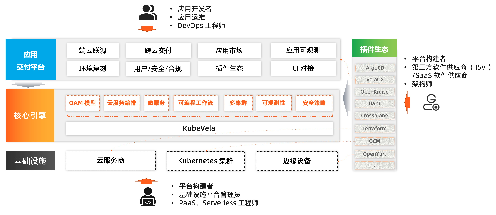
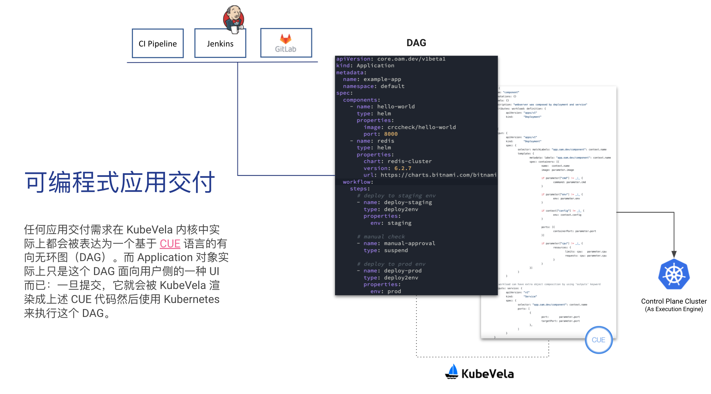

KubeVela 的整体架构如下所示：

## KubeVela 是一个控制平面系统

KubeVela 本身是一个的应用交付与管理控制平面，它架在 Kubernetes 集群、云平台等基础设施之上，通过开放应用模型来对组件、云服务、运维能力、交付工作流进行统一的编排和交付。KubeVela 这种与基础设施本身完全解耦的设计，很容易就能帮助你面向混合云/多云/多集群基础设施进行应用交付与管理。

而为了能够同任何 CI 流水线或者 GitOps 工具无缝集成，KubeVela 的 API（即开放应用模型）被设计为是声明式、完全以应用为中心的，它包括：

- 帮助用户定义应用交付计划的 `Application` 对象
- 帮助平台管理员通过 CUE 语言定义平台能力和抽象的 `X-Definition `对象
  - 比如 `ComponentDefinition`、`TraitDefinition` 等

在具体实现上，KubeVela 依赖一个独立的 Kubernetes 集群来运行。这其实是一个“有意为之”的设计：云原生社区中大量的实践已经证明“构建一个科学的、健壮的控制平面系统”，正是 Kubernetes 项目最擅长的工作。所以，依赖 Kubernetes 作为控制平面集群这个选择，虽然会增加一定的部署难度，却能够让我们以最原生的方式为大规模应用交付带来至关重要的“确定性”、“收敛性”和“自动化能力”。

具体来说，KubeVela 本身主要由如下几个部分组成:

- **核心控制器** 为整个系统提供核心控制逻辑，完成诸如编排应用和工作流、修订版本快照、垃圾回收等等基础逻辑
- **模块化能力控制器** 负责对 X-Definitions 对象进行注册和管理。
- **插件控制器** 负责注册和管理 KubeVela 运行所需要的第三方插件，比如 VelaUX、 Flux、Terraform 组件等等。
- **UI 控制台和 CLI** UI 控制台服务于希望开箱即用的开发者用户，CLI 适用于集成 KubeVela 和终端管理的用户。

### 运行时基础设施

运行时基础设施是应用实际运行的地方。KubeVela 本身是完全与这些基础设施无关的，因此它允许你面向任何环境（包括 Kubernetes 环境，也包括非 Kubernetes 环境比如云平台和边缘设备等）去交付和管理任何类型的应用。

## KubeVela 是可编程的

现实世界中的应用交付，往往是一个比较复杂的过程。哪怕是一个比较通用的交付流程，也会因为场景、环境、用户甚至团队的不同而千差万别。所以 KubeVela 从第一天起就采用了一种“可编程”式的方法来实现它的交付模型，这使得 KubeVela 可以以前所未有的灵活度适配到你的应用交付场景中。

如果要详细学习 KubeVela 的可编程文档，欢迎查看文档网站中 [自定义扩展](../platform-engineers/oam/oam-model) 部分。

## 谁会使用 KubeVela？

- 云原生应用平台的构建者、PaaS、Serverless 平台工程师、基础设施平台管理员：
  - KubeVela 是一个普适的、高可扩展的应用交付引擎与内核，它以极简的架构实现了原生 Kubernetes 多集群控制平面的能力，能够将 OAM 应用引擎直接植入企业已有的 PaaS 平台之中并不破坏已有的能力，从而实现标准化应用交付。
- 第三方软件供应商（ISV）、垂直领域软件开发者、架构师：
  - KubeVela 提供的充分的可扩展和集成能力，可以允许你[自定义插件](../platform-engineers/addon/intro) 完成复杂应用的构建和分发，是一个 Kubernetes 和云平台之上的应用商店（App Store）。
- 云原生时代的应用研发、运维人员、DevOps 工程师：
  - VelaUX 是一个基于 Vela Addon 机制构建的扩展能力集，安装这个插件后，你就拥有了一个开箱即用的现代化持续交付（CD）和应用管理平台。

## 总结

- [OAM(Open Application Model)](https://github.com/oam-dev/spec) 是 KubeVela 背后的模型，它提供了一组平台无关的最佳实践和方法论，能够为不同的公司和厂商构建应用平台提供理论指导，共同提供标准化应用支撑，让应用可以在不同的平台顺畅的运行、平滑的迁移。当前 OAM 模型的演进主要基于 KubeVela 的实践。
- KubeVela 是基于 Kubernetes 的混合云应用交付和管理控制平面，它以 [CRD 控制器](https://kubernetes.io/docs/concepts/extend-kubernetes/api-extension/custom-resources/) 的形式运行，可以很轻量的安装到企业现有的 PaaS 体系中，并带来 OAM 的标准化模型和基于模型高可扩展功能的丰富社区插件。
- VelaUX 是 KubeVela 的众多插件之一，这个插件为应用开发者提供了开箱即用的应用交付和管理能力，包括一组 **restful API** 和 **UI 控制台**。

KubeVela 团队将主要聚焦在核心控制器层面，面向所有用户提供可靠、易用的核心框架和能力。另一方面，我们通过构建 VelaUX 插件为中小型企业提供开箱即用的应用交付和管理功能，不仅可以扩大 OAM 模型的受众，也能吃自己的狗粮打磨 KubeVela 核心框架的可扩展性和插件体系。我们将在打磨核心控制器的同时，持续提供开箱即用的插件能力，并与开源社区的优质项目做更多更好的集成。

## 下一步

- 查看 [用户手册](../tutorials/webservice)，了解更多使用场景和最佳实践。
