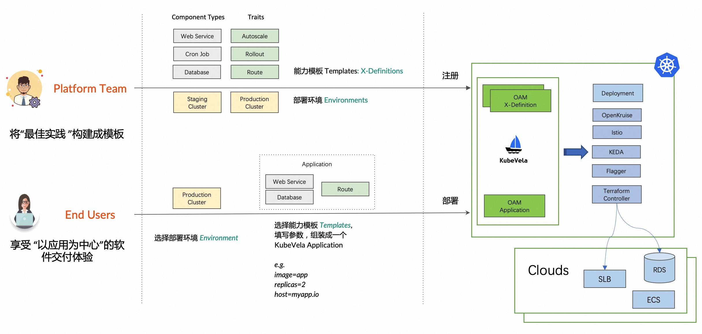

KubeVela 是面向关注点分离设计的系统，所以 KubeVela 的用户天然分为两种角色，由公司的两个团队（或个人）承担。

- **平台团队**
  - 由平台工程师完成，他们需要准备应用部署环境，维护稳定可靠的基础设施功能（如 mysql operator），并将基础设施能力作为 [KubeVela 模块定义](./definition) 注册到集群中。他们需要具备丰富的基础设施经验。
- **最终用户**
  - 最终用户即业务应用的开发者，使用平台的过程中首先选择部署环境，然后挑选能力模块，填写业务参数并组装成 [KubeVela 应用](./core-concept)。他们无需关心基础设施细节。

整个工作流程如下图所示:

## 关注点分离的价值和优势

关注点对最终用户的价值是最大的，他们可以获得以应用为中心的平台使用体验，不再需要了解基础设施细节。具体而言，他们在如下场景直接受益：

- 不再需要关系 Kubernetes 版本变化带来的 API 变化。
- 不再需要关心像 Ingress 这样的对象不同底层实现之间的区别。
- 不再需要了解诸如 CPU Limit 或者 Pod 驱逐策略这类完全是平台底层特性的概念。
- 可以用声明式的方式描述注入高可用、灰度发布这样的运维需求。
- 应用交付更安全、可靠，因为使用的是平台工程师基于最佳实践封装的能力，不会因为权限过大或者直接操作基础设施 API 带来稳定性风险。

对于平台团队而言，好处也非常明显：

- 他们可以专注于面向场景的维护能力，更聚焦的保证应用交付的易用性和安全性，为业务工程师提供最佳实践。
- 他们不会丧失基础设施的灵活性，可以根据不同业务团队的需要按需提供不同的能力模块，服务的效率更高，服务的团队规模也可以变大。
- 他们可以与开源社区共建基础设施功能，复用云原生生态项目，为开源做贡献，并且这一切都是通过标准化的方式完成，减少了与社区分叉的风险。
