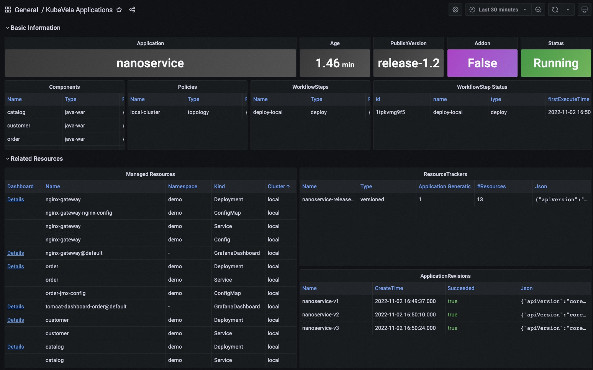
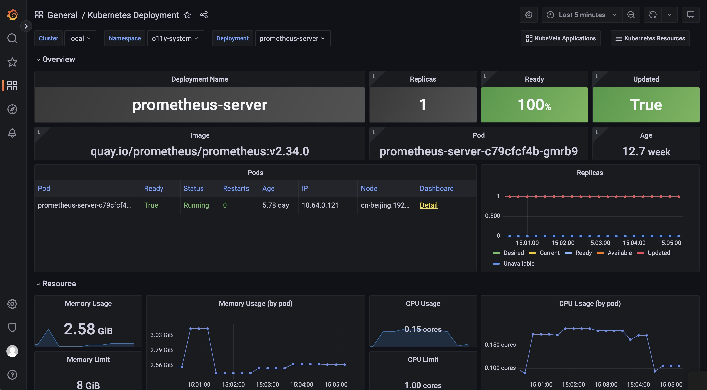
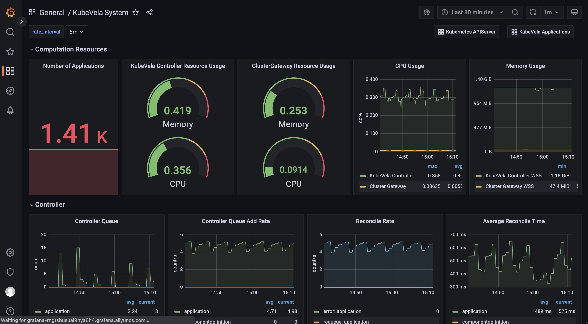

## 监控大盘

有四个自动化的 Dashboard 可以浏览和查看你的系统。

### KubeVela Application

这个 dashboard 展示了应用的基本信息。

URL: http://localhost:8080/d/application-overview/kubevela-applications

:::info
  KubeVela Application dashboard 显示了应用的元数据概况。 它直接访问 Kubernetes API 来检索运行时应用的信息，你可以将其作为入口。

**Basic Information** 部分将关键信息提取到面板中，并提供当前应用最直观的视图。

**Related Resource** 部分显示了与应用本身一起工作的那些资源，包括托管资源、记录的 ResourceTracker 和修正。
:::

### Kubernetes Deployemnt

这个 dashboard 显示原生 deployment 的概况。 你可以查看跨集群的 deployment 的信息。

URL: http://localhost:8080/d/deployment-overview/kubernetes-deployment

:::info
  Kubernetes Deployment dashboard 向你提供 deployment 的详细运行状态。

**Pods** 面板显示该 deployment 当前正在管理的 pod。

**Replicas** 面板显示副本数量如何变化，用于诊断你的 deployment 何时以及如何转变到不希望的状态。

**Pod** 部分包含资源的详细使用情况（包括 CPU / 内存 / 网络 / 存储），可用于识别 pod 是否面临资源压力或产生/接收意想不到的流量。
:::

### KubeVela 系统

这个 dashboard 显示 KubeVela 系统的概况。 它可以用来查看 KubeVela 控制器是否健康。

URL: http://localhost:8080/d/kubevela-system/kubevela-system

:::info
KubeVela System dashboard 提供 KubeVela 核心模块的运行详细信息，包括控制器和集群网关。 预计将来会添加其他模块，例如 velaux 或 prism。

**Computation Resource** 部分显示了核心模块的使用情况。 它可用于追踪是否存在内存泄漏（如果内存使用量不断增加）或处于高压状态（cpu 使用率总是很高）。 如果内存使用量达到资源限制，则相应的模块将被杀死并重新启动，这表明计算资源不足。你应该为它们添加更多的 CPU/内存。

**Controller** 部分包括各种面板，可帮助诊断你的 KubeVela 控制器的瓶颈。

**Controller Queue** 和 **Controller Queue Add Rate** 面板显示控制器工作队列的变化。 如果控制器队列不断增加，说明系统中应用过多或应用的变化过多，控制器已经不能及时处理。 那么这意味着 KubeVela 控制器存在性能问题。 控制器队列的临时增长是可以容忍的，但维持很长时间将会导致内存占用的增加，最终导致内存不足的问题。

**Reconcile Rate** 和 **Average Reconcile Time** 面板显示控制器状态的概况。 如果调和速率稳定且平均调和时间合理（例如低于 500 毫秒，具体取决于你的场景），则你的 KubeVela 控制器是健康的。 如果控制器队列入队速率在增加，但调和速率没有上升，会逐渐导致控制器队列增长并引发问题。 有多种情况表明你的控制器运行状况不佳：

1. Reconcile 是健康的，但是应用太多，你会发现一切都很好，除了控制器队列指标增加。 检查控制器的 CPU/内存使用情况。 你可能需要添加更多的计算资源。
2. 由于错误太多，调和不健康。 你会在 **Reconcile Rate** 面板中发现很多错误。 这意味着你的系统正持续面临应用的处理错误。 这可能是由错误的应用配置或运行工作流时出现的意外错误引起的。 检查应用详细信息并查看哪些应用导致错误。
3. 由于调和时间过长导致的调整不健康。 你需要检查 **ApplicationController Reconcile Time** 面板，看看它是常见情况（平均调和时间高），还是只有部分应用有问题（p95 调和时间高）。 对于前一种情况，通常是由于 CPU 不足（CPU 使用率高）或过多的请求和 kube-apiserver 限制了速率（检查 **ApplicationController Client Request Throughput** 和 **ApplicationController Client Request Average Time** 面板并查看哪些资源请求缓慢或过多）。 对于后一种情况，你需要检查哪个应用很大并且使用大量时间进行调和。

有时你可能需要参考 **ApplicationController Reconcile Stage Time**，看看是否有一些特殊的调和阶段异常。 例如，GCResourceTracker 使用大量时间意味着在 KubeVela 系统中可能存在阻塞回收资源的情况。

**Application** 部分显示了整个 KubeVela 系统中应用的概况。 可用于查看应用数量的变化和使用的工作流步骤。 **Workflow Initialize Rate** 是一个辅助面板，可用于查看启动新工作流执行的频率。 **Workflow Average Complete Time** 可以进一步显示完成整个工作流程所需的时间。
:::

### Kubernetes APIServer

这个 dashboard 展示了所有 Kubernetes apiserver 的运行状态。

URL: http://localhost:8080/d/kubernetes-apiserver/kubernetes-apiserver

:::info
Kubernetes APIServer dashboard 可帮助你查看 Kubernetes 系统最基本的部分。 如果你的 Kubernetes APIServer 运行不正常，你的 Kubernetes 系统中所有控制器和模块都会出现异常，无法成功处理请求。 因此务必确保此 dashboard 中的一切正常。

**Requests** 部分包括一系列面板，用来显示各种请求的 QPS 和延迟。 通常，如果请求过多， APIServer 可能无法响应。 这时候就可以看到是哪种类型的请求出问题了。

**WorkQueue** 部分显示 Kubernetes APIServer 的处理状态。 如果 **Queue Size** 很大，则表示请求数超出了你的 Kubernetes APIServer 的处理能力。

**Watches** 部分显示 Kubernetes APIServer 中的 watch 数量。 与其他类型的请求相比，WATCH 请求会持续消耗 Kubernetes APIServer 中的计算资源，因此限制 watch 的数量会有所帮助。
:::