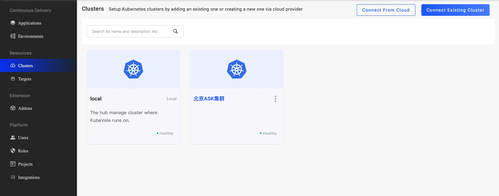

## 通过 UI 管理集群

* 支持添加已存在的 Kubernetes 集群；
* 支持添加阿里云 ACK 集群；

具有集群管理权限的用户可以进入集群管理页面，添加或移除托管的集群。


从 ACK 添加的集群平台会获取并记录集群所在的区域、VPC、Dashboard地址等信息，用户使用该集群创建交付目标时将自动引用，这些信息用以辅助云服务的创建。

## 通过 CLI 管理集群

### vela cluster list

该命令可列出当前 KubeVela 正在管理的所有子集群。

```bash
$ vela cluster list            
CLUSTER    	ALIAS	TYPE           	ENDPOINT                   	ACCEPTED	LABELS
local      	     	Internal       	-                          	true
ask-beijing	     	X509Certificate	https://*.*.*.*:6443	    true
```

### vela cluster join

该命令可将已有的子集群通过 kubeconfig 文件加入到 KubeVela 中，并将其命名为 cluster-prod，供[多环境部署](../../end-user/policies/envbinding.md)使用。

```shell script
$ vela cluster join example-cluster.kubeconfig --name cluster-prod
```

### vela cluster detach

该命令可用来将 KubeVela 正在管理的子集群移除。

```shell script
$ vela cluster detach cluster-prod
```

### vela cluster rename

该命令可用来重命名 KubeVela 正在管理的子集群。

```shell script
$ vela cluster rename cluster-prod cluster-production
```
