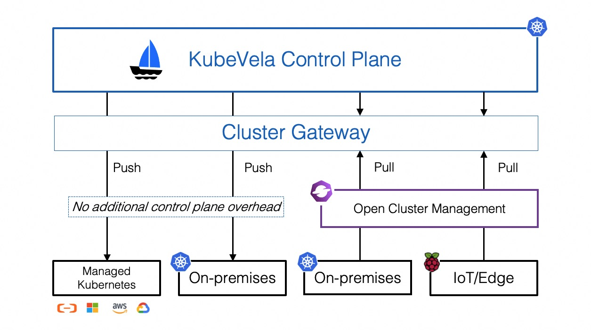

本章节将会介绍如何使用 KubeVela 分发多集群应用。

## 简介

如今，在越来越多的场景下，开发者和系统运维人员开始将应用部署在多个集群中：

* 由于 Kubernetes 集群存在着部署规模的局限性（单一集群最多容纳 5k 节点），需要应用多集群技术来部署、管理海量的应用。
* 考虑到稳定性及高可用性，同一个应用可以部署在多个集群中，以实现容灾、异地多活等需求。
* 应用可能需要部署在不同的区域来满足不同政府对于数据安全性的政策需求。

## 架构



KubeVela 的多集群依赖于 [Cluster-Gateway](https://github.com/oam-dev/cluster-gateway) 组件，在 KubeVela 的 Helm Chart 中自动安装。 默认情况下，KubeVela 管理多集群的方式是通过 `kubeconfig` 直连集群，你也可以使用 [Open Cluster Management](../platform-engineers/system-operation/working-with-ocm.md) 组件来使用拉取（PULL）模式。

下文将会介绍如何在 KubeVela 中进行使用管理多集群应用。

## 准备工作

在使用多集群应用部署之前，你需要将子集群通过 KubeConfig 加入到 KubeVela 的管控中来。Vela CLI 可以帮你实现这一点。

```shell script
vela cluster join <your kubeconfig path>
```

该命令会自动使用 KubeConfig 中的 `context.cluster` 字段作为集群名称，你也可以使用 `--name` 参数来指定，如

```shell
$ vela cluster join beijing.kubeconfig --name beijing
$ vela cluster join hangzhou-1.kubeconfig --name hangzhou-1
$ vela cluster join hangzhou-2.kubeconfig --name hangzhou-2
```

在子集群加入 KubeVela 中后，你同样可以使用 CLI 命令来查看当前正在被 KubeVela 管控的所有集群。

```bash
$ vela cluster list
CLUSTER                 TYPE            ENDPOINT                ACCEPTED        LABELS
local                   Internal        -                       true                  
cluster-beijing         X509Certificate <ENDPOINT_BEIJING>      true                  
cluster-hangzhou-1      X509Certificate <ENDPOINT_HANGZHOU_1>   true                  
cluster-hangzhou-2      X509Certificate <ENDPOINT_HANGZHOU_2>   true                  
```

> 默认情况下，KubeVela 控制面所在的管控集群会被作为 `local` 集群进行注册。你可以通过它将应用资源部署在管控集群中。该 `local` 集群不能被修改或者删除。

如果你不需要某个子集群了，还可以将子集群从 KubeVela 管控中移除。


```shell script
$ vela cluster detach beijing
```

> 移除一个正在使用的集群是危险行为。不过如果你想要对集群的认证信息做修改，比如轮转证书，你可以强行删除它。

你也可以给你的集群打标签，帮助你选择要部署的集群。

```bash
$ vela cluster labels add cluster-hangzhou-1 region=hangzhou
$ vela cluster labels add cluster-hangzhou-2 region=hangzhou
$ vela cluster list
CLUSTER                 TYPE            ENDPOINT                ACCEPTED        LABELS
local                   Internal        -                       true                  
cluster-beijing         X509Certificate <ENDPOINT_BEIJING>      true                  
cluster-hangzhou-1      X509Certificate <ENDPOINT_HANGZHOU_1>   true            region=hangzhou
cluster-hangzhou-2      X509Certificate <ENDPOINT_HANGZHOU_2>   true            region=hangzhou
```

## 部署多集群应用

你只需要使用 `topology` 策略来声明要部署的集群，就可以部署多集群应用了。例如，你可以使用下面这个样例将 nginx webservice 部署在两个杭州集群中，

```bash
$ cat <<EOF | vela up -f -
apiVersion: core.oam.dev/v1beta1
kind: Application
metadata:
  name: basic-topology
  namespace: examples
spec:
  components:
    - name: nginx-basic
      type: webservice
      properties:
        image: nginx
      traits:
        - type: expose
          properties:
            port: [80]
  policies:
    - name: topology-hangzhou-clusters
      type: topology
      properties:
        clusters: ["cluster-hangzhou-1", "cluster-hangzhou-2"]
EOF
```

你可以通过运行 `vela status` 来查看部署状态。

```bash
$ vela status basic-topology -n examples
About:

  Name:         basic-topology               
  Namespace:    examples                     
  Created at:   2022-04-08 14:37:54 +0800 CST
  Status:       workflowFinished             

Workflow:

  mode: DAG
  finished: true
  Suspend: false
  Terminated: false
  Steps
  - id:3mvz5i8elj
    name:deploy-topology-hangzhou-clusters
    type:deploy
    phase:succeeded 
    message:

Services:

  - Name: nginx-basic  
    Cluster: cluster-hangzhou-1  Namespace: examples
    Type: webservice
    Healthy Ready:1/1
    Traits:
      ✅ expose
  - Name: nginx-basic  
    Cluster: cluster-hangzhou-2  Namespace: examples
    Type: webservice
    Healthy Ready:1/1
    Traits:
      ✅ expose
```

### 调试多集群应用

你可以运行以下 CLI 命令调试上述的多集群应用。通过这些 CLI 命令，你可以在管控集群上直接操纵子集群中的资源，而不需要切换 KubeConfig 等集群配置。如果你的应用使用了多个集群，CLI 向你询问你希望操纵的集群。
- `vela status` 如上文所示，为你展示多集群应用的整体部署情况。
- `vela logs` 查询子集群中的 Pod 日志。

```bash
$ vela logs basic-topology -n examples 
? You have 2 deployed resources in your app. Please choose one: Cluster: cluster-hangzhou-1 | Namespace: examples | Kind: Deployment | Name: nginx-basic
+ nginx-basic-dfb6dcf8d-km5vk › nginx-basic
nginx-basic-dfb6dcf8d-km5vk nginx-basic 2022-04-08T06:38:10.540430392Z /docker-entrypoint.sh: /docker-entrypoint.d/ is not empty, will attempt to perform configuration
nginx-basic-dfb6dcf8d-km5vk nginx-basic 2022-04-08T06:38:10.540742240Z /docker-entrypoint.sh: Looking for shell scripts in /docker-entrypoint.d/
```

- `vela exec` 帮助你在子集群的 Pod 里执行命令。

```bash
$ vela exec basic-topology -n examples -it -- ls 
? You have 2 deployed resources in your app. Please choose one: Cluster: cluster-hangzhou-1 | Namespace: examples | Kind: Deployment | Name: nginx-basic
bin   docker-entrypoint.d   home   media  proc  sbin  tmp
boot  docker-entrypoint.sh  lib    mnt    root  srv   usr
dev   etc                   lib64  opt    run   sys   var
```

- `vela port-forward` 将子集群中的 Pod 或者 Service 通过端口映射到本地使其可以在本地被访问。

```bash
$ vela port-forward basic-topology -n examples 8080:80
? You have 4 deployed resources in your app. Please choose one: Cluster: cluster-hangzhou-1 | Namespace: examples | Kind: Deployment | Name: nginx-basic
Forwarding from 127.0.0.1:8080 -> 80
Forwarding from [::1]:8080 -> 80

Forward successfully! Opening browser ...
Handling connection for 8080
```


## 进阶使用


### 理解多集群应用

下图为多集群应用的整体结构图。如图所示，所有的配置信息（包括应用、策略和工作流）都处于管控集群中。只有资源（如 deployment 或者 service）会被下发到子集群之中。

策略主要负责描述资源的位置以及它们应该如何被差异化配置。资源下发真正的执行者是工作流。在工作流中，`deploy` 步骤会根据引用的策略对资源进行差异化配置，然后再将它们分发到对应的集群中。


### 配置部署目标

选择部署目标的最直接的方法就是在 `topology` 策略中声明你想要部署的集群名称。有的时候，使用标签来筛选要部署的集群会更方便，比如下面这个例子通过标签筛选出所有的杭州集群：

```yaml
apiVersion: core.oam.dev/v1beta1
kind: Application
metadata:
  name: label-selector-topology
  namespace: examples
spec:
  components:
    - name: nginx-label-selector
      type: webservice
      properties:
        image: nginx
  policies:
    - name: topology-hangzhou-clusters
      type: topology
      properties:
        clusterLabelSelector:
          region: hangzhou
```

如果你想要在管控集群中部署应用，你也可以使用 `local` 集群。除此之外，你还可以选择希望部署的命名空间，取代应用原有的命名空间。

```yaml
apiVersion: core.oam.dev/v1beta1
kind: Application
metadata:
  name: local-ns-topology
  namespace: examples
spec:
  components:
    - name: nginx-local-ns
      type: webservice
      properties:
        image: nginx
  policies:
    - name: topology-local
      type: topology
      properties:
        clusters: ["local"]
        namespace: examples-alternative
```

> 有时，出于安全考虑，你可能希望限制应用使其只能在自己的命名空间中部署资源。你可以通过在 KubeVela 控制器的启动参数中配置 `--allow-cross-namespace-resource=false` 来禁用跨命名空间部署。


### 控制部署工作流

默认情况下，如果你在应用中声明了多个 `topology` 策略，应用组件将会依次分发到这些目标位置上。

如果你想要控制整个部署流程，比如更改默认的部署顺序，或者是添加人工审核步骤，你可以显式使用 `deploy` 工作流步骤来实现。

```yaml
apiVersion: core.oam.dev/v1beta1
kind: Application
metadata:
  name: deploy-workflowstep
  namespace: examples
spec:
  components:
    - name: nginx-deploy-workflowstep
      type: webservice
      properties:
        image: nginx
  policies:
    - name: topology-hangzhou-clusters
      type: topology
      properties:
        clusterLabelSelector:
          region: hangzhou
    - name: topology-local
      type: topology
      properties:
        clusters: ["local"]
        namespace: examples-alternative
  workflow:
    steps:
      - type: deploy
        name: deploy-local
        properties:
          policies: ["topology-local"]
      - type: deploy
        name: deploy-hangzhou
        properties:
          # require manual approval before running this step
          auto: false
          policies: ["topology-hangzhou-clusters"]
```

如果你希望并行地部署所有集群，你可以在一个 `deploy` 工作流步骤中使用所有的 `topology` 策略。

```yaml
apiVersion: core.oam.dev/v1beta1
kind: Application
metadata:
  name: deploy-concurrently
  namespace: examples
spec:
  components:
    - name: nginx-deploy-concurrently
      type: webservice
      properties:
        image: nginx
  policies:
    - name: topology-hangzhou-clusters
      type: topology
      properties:
        clusterLabelSelector:
          region: hangzhou
    - name: topology-local
      type: topology
      properties:
        clusters: ["local"]
        namespace: examples-alternative
  workflow:
    steps:
      - type: deploy
        name: deploy-all
        properties:
          policies: ["topology-local", "topology-hangzhou-clusters"]
```


### 使用差异化配置

在一些情况下，你可能希望应用在不同的集群中有不一样的配置，而不是全都使用完全相同的默认配置。比如使用不同的镜像或者配置不同的副本数量。

`override` 策略可以帮助你实现差异化配置。你可以在 `deploy` 工作流步骤中，配合 `topology` 策略来使用它。

在下面的样例中，应用会在 `local` 集群中部署一个默认的 nginx webservcie，然后在杭州集群中部署含有 3 副本的高可用 nginx webservice，并且使用 `nginx:1.20` 镜像。

```yaml
apiVersion: core.oam.dev/v1beta1
kind: Application
metadata:
  name: deploy-with-override
  namespace: examples
spec:
  components:
    - name: nginx-with-override
      type: webservice
      properties:
        image: nginx
  policies:
    - name: topology-hangzhou-clusters
      type: topology
      properties:
        clusterLabelSelector:
          region: hangzhou
    - name: topology-local
      type: topology
      properties:
        clusters: ["local"]
        namespace: examples-alternative
    - name: override-nginx-legacy-image
      type: override
      properties:
        components:
          - name: nginx-with-override
            properties:
              image: nginx:1.20
    - name: override-high-availability
      type: override
      properties:
        components:
          - type: webservice
            traits:
              - type: scaler
                properties:
                  replicas: 3
  workflow:
    steps:
      - type: deploy
        name: deploy-local
        properties:
          policies: ["topology-local"]
      - type: deploy
        name: deploy-hangzhou
        properties:
          policies: ["topology-hangzhou-clusters", "override-nginx-legacy-image", "override-high-availability"]
```

> 注意：override 策略是用来修改基础配置的策略，因此**它被设计成必须需要和 topology 策略一同使用**。如果你不想要使用 topology 策略，你可以直接将配置写在组件声明中，而不是使用 override 策略。*如果你错误的在 deploy 工作流步骤中使用了 override 策略，而没有使用 topology 策略，应用不会发生错误，但是也不会下发任何资源。*

差异化配置有一些高级配置能力，比如添加额外的组件，或者选择部分组件。下面的样例中，应用会首先在 `local` 集群中部署一个镜像为 `nginx:1.20` 的 webservice，然后再将 `nginx` 和 `nginx:stable` 两个 webservice 部署到杭州集群中

```yaml
apiVersion: core.oam.dev/v1beta1
kind: Application
metadata:
  name: advance-override
  namespace: examples
spec:
  components:
    - name: nginx-advance-override-legacy
      type: webservice
      properties:
        image: nginx:1.20
    - name: nginx-advance-override-latest
      type: webservice
      properties:
        image: nginx
  policies:
    - name: topology-hangzhou-clusters
      type: topology
      properties:
        clusterLabelSelector:
          region: hangzhou
    - name: topology-local
      type: topology
      properties:
        clusters: ["local"]
        namespace: examples-alternative
    - name: override-nginx-legacy
      type: override
      properties:
        selector: ["nginx-advance-override-legacy"]
    - name: override-nginx-latest
      type: override
      properties:
        selector: ["nginx-advance-override-latest", "nginx-advance-override-stable"]
        components:
          - name: nginx-advance-override-stable
            type: webservice
            properties:
              image: nginx:stable
  workflow:
    steps:
      - type: deploy
        name: deploy-local
        properties:
          policies: ["topology-local", "override-nginx-legacy"]
      - type: deploy
        name: deploy-hangzhou
        properties:
          policies: ["topology-hangzhou-clusters", "override-nginx-latest"]
```


### 使用外置策略和工作流

有时，你可能希望在不同的应用之间使用相同的策略，或者在部署资源的时候复用之前的工作流配置。
为了减少重复的配置，你可以使用外置的策略和工作流，并在应用中引用它们。

> 注意：你只能在应用中引用相同命名空间下的策略和工作流。

```yaml
apiVersion: core.oam.dev/v1alpha1
kind: Policy
metadata:
  name: topology-hangzhou-clusters
  namespace: examples
type: topology
properties:
  clusterLabelSelector:
    region: hangzhou
---
apiVersion: core.oam.dev/v1alpha1
kind: Policy
metadata:
  name: override-high-availability-webservice
  namespace: examples
type: override
properties:
  components:
    - type: webservice
      traits:
        - type: scaler
          properties:
            replicas: 3
---
apiVersion: core.oam.dev/v1alpha1
kind: Workflow
metadata:
  name: make-release-in-hangzhou
  namespace: examples
steps:
  - type: deploy
    name: deploy-hangzhou
    properties:
      auto: false
      policies: ["override-high-availability-webservice", "topology-hangzhou-clusters"]
```

```yaml
apiVersion: core.oam.dev/v1beta1
kind: Application
metadata:
  name: external-policies-and-workflow
  namespace: examples
spec:
  components:
    - name: nginx-external-policies-and-workflow
      type: webservice
      properties:
        image: nginx
  workflow:
    ref: make-release-in-hangzhou
```

> 注意：内置的策略会被优先使用。只有当工作流使用的策略不存在于内置策略中时才会使用外置策略。在下面的样例中，你可以复用 `topology-hangzhou-clusters` 策略以及 `make-release-in-hangzhou` 工作流，但是通过在应用中声明 `override-high-availability-webservice` 策略来覆盖同名的外置策略。

```yaml
apiVersion: core.oam.dev/v1beta1
kind: Application
metadata:
  name: nginx-stable-ultra
  namespace: examples
spec:
  components:
    - name: nginx-stable-ultra
      type: webservice
      properties:
        image: nginx:stable
  policies:
    - name: override-high-availability-webservice
      type: override
      properties:
        components:
          - type: webservice
            traits:
              - type: scaler
                properties:
                  replicas: 5
  workflow:
    ref: make-release-in-hangzhou
```

### 通过自定义工作流步骤实现多集群调度

多集群部署的功能可以结合[自定义工作流步骤](../end-user/workflow/overview.md) 实现功能多样的多集群调度能力.

如下示例所示，我们会部署一个任务到 `local` 集群的 `default` 命名空间，然后通过 `read-object` 步骤检查部署状态，最后根据状态将任务部署到 `prod` 命名空间。

```yaml
apiVersion: core.oam.dev/v1beta1
kind: Application
metadata:
  name: deploy-with-override
spec:
  components:
    - name: mytask
      type: task
      properties:
        image: bash
        count: 1
        cmd: ["echo",  "hello world"]
  policies:
    - name: target-default
      type: topology
      properties:
        clusters: ["local"]
        namespace: "default"
    - name: target-prod
      type: topology
      properties:
        clusters: ["local"]
        namespace: "prod"
    - name: override-annotations-1
      type: override
      properties:
        components:
          - type: task
            traits:
            - type: annotations
              properties:
                "description": "01 cron task - 1"
    - name: override-annotations-2
      type: override
      properties:
        components:
          - type: task          
            traits:
            - type: annotations
              properties:
                "description": "02 cron task - 2"                
  workflow:
    steps:
      - type: deploy
        name: deploy-01
        properties:
          policies: ["target-default", "override-annotations-1"]
      - name: read-object
        type: read-object
        outputs:
          - name: ready
            valueFrom: output.value.status["ready"]
        properties:
          apiVersion: batch/v1
          kind: Job
          name: mytask
          namespace: default
          cluster: local        
      - type: deploy
        name: deploy-02
        inputs:
          - from: ready      
        if: inputs["ready"] == 0
        properties:
          policies: ["target-prod", "override-annotations-2"]
```

## 兼容性

KubeVela 的 v1.3 应用相较于之前的版本使用了不同的策略和工作流步骤来分发、管理多集群应用。

旧版本中的 `env-binding` 策略以及 `deploy2env` 工作流步骤在目前版本中仍保留并兼容，但可能会在未来的版本中逐步废弃。

新的策略和工作流步骤可以完全覆盖旧版本中多集群应用的所有使用场景，而且提供了更强的能力。自动化升级工具将会在废弃旧版本之前提供给用户。

如果你已经在生产环境中使用了旧版本的多集群应用，并且不希望改变他们，KubeVela v1.3 可以完全兼容它们，而不需要对应用进行升级。