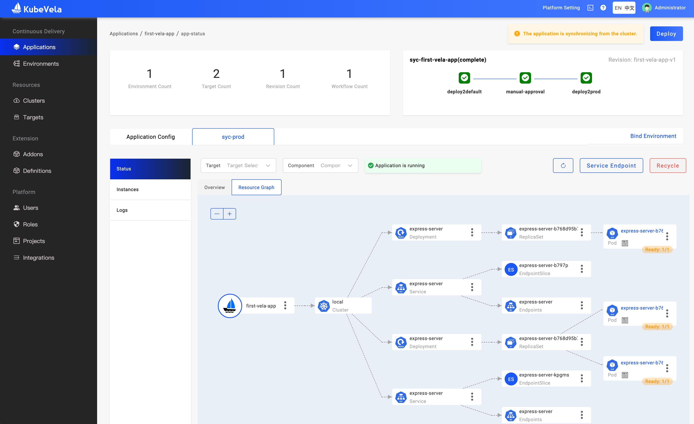

> 开始之前，请确认你已完成 KubeVela 的安装，参考 [安装指导文档](./install.mdx)

欢迎使用 KubeVela, 在该章节中你可以学习到使用 KubeVela 部署一个基础的应用。

## 通过 CLI 部署应用

下面给出了一个经典的 OAM 应用定义，它包括了一个无状态服务组件和运维特征，三个部署策略和工作流步骤。此应用描述的含义是将一个服务部署到两个目标命名空间，并且在第一个目标部署完成后等待人工审核后部署到第二个目标，且在第二个目标时部署2个实例。

```yaml
apiVersion: core.oam.dev/v1beta1
kind: Application
metadata:
  name: first-vela-app
spec:
  components:
    - name: express-server
      type: webservice
      properties:
        image: oamdev/hello-world
        ports:
         - port: 8000
           expose: true
      traits:
        - type: scaler
          properties:
            replicas: 1
  policies:
    - name: target-default
      type: topology
      properties:
        # local 集群即 Kubevela 所在的集群
        clusters: ["local"]
        namespace: "default"
    - name: target-prod
      type: topology
      properties:
        clusters: ["local"]
        # 此命名空间需要在应用部署前完成创建
        namespace: "prod"
    - name: deploy-ha
      type: override
      properties:
        components:
          - type: webservice
            traits:
              - type: scaler
                properties:
                  replicas: 2
  workflow:
    steps:
      - name: deploy2default
        type: deploy
        properties:
          policies: ["target-default"]
      - name: manual-approval
        type: suspend
      - name: deploy2prod
        type: deploy
        properties:
          policies: ["target-prod", "deploy-ha"]
```

* 开始应用部署

```bash
# 此命令用于在管控集群创建命名空间
vela env init prod --namespace prod
```

<details>
<summary>期望输出</summary>

```console
environment prod with namespace prod created
```
</details>

```
vela up -f https://kubevela.net/example/applications/first-app.yaml
```

> 需要注意的是需要你的部署环境可以正常获取 `oamdev/hello-world` 镜像

<details>
<summary>期望输出</summary>

```console
Applying an application in vela K8s object format...
I0516 15:45:18.123356   27156 apply.go:107] "creating object" name="first-vela-app" resource="core.oam.dev/v1beta1, Kind=Application"
✅ App has been deployed 🚀🚀🚀
    Port forward: vela port-forward first-vela-app
             SSH: vela exec first-vela-app
         Logging: vela logs first-vela-app
      App status: vela status first-vela-app
        Endpoint: vela status first-vela-app --endpoint
Application prod/first-vela-app applied.
```
</details>

* 查看部署状态

```bash
vela status first-vela-app
```

<details>
<summary>期望输出</summary>

```console
About:

  Name:      	first-vela-app
  Namespace: 	prod
  Created at:	2022-05-16 15:45:18 +0800 CST
  Status:    	workflowSuspending

Workflow:

  ...

Services:

  - Name: express-server
    Cluster: local  Namespace: default
    Type: webservice
    Healthy Ready:1/1
    Traits:
      ✅ scaler
```
</details>

正常情况下应用完成第一个目标部署后进入暂停状态（`workflowSuspending`）。

* 人工审核，批准应用进入第二个目标部署

```bash
vela workflow resume first-vela-app
```

* 通过下述方式来访问该应用

```bash
$ vela port-forward first-vela-app 8000:8000
```

上述命令将创建本地代理并打开本地浏览器，你可以查看到如下内容：

<details>
<summary>期望输出</summary>

```
<xmp>
Hello KubeVela! Make shipping applications more enjoyable. 

...snip...
```
</details>

恭喜，至此你已经完成了首个 KubeVela 应用的部署流程，下面我们介绍通过 UI 控制台查看和管理应用。


## 基于 UI 管理应用

如果你已完成 [VelaUX 安装](./install.mdx#2-install-velaux)， 你可以通过 UI 来管理和可视化应用。

本地测试模式下通过下述命令即可打开 UI 界面。

```bash
vela port-forward addon-velaux -n vela-system 8080:80
```

UI 控制台需要用户认证，默认的账号是： `admin` 密码是： **`VelaUX12345`**。

首次登录后会进入修改密码和设置邮箱流程，请正确设置你的企业邮箱（后期不可修改）和谨记修改后的密码。

* 查看第一个应用的部署拓扑图

通过 CLI 部署的应用会自动同步到 UI 侧，你可以进入应用页面查看到应用的相关可视化状态，比如：资源拓扑图，实例等。



KubeVela 的 UI 控制台跟底层的控制器使用了不同的元数据存储，它的架构类似企业的 PaaS 模式，UI 控制台（velaux）在上层使用数据库作为元数据存储而非依赖底层集群的 etcd。

默认情况下，CLI 操作的应用会自动同步到 UI 控制台的元数据中，但是一旦你通过 UI 界面做应用部署的操作，应用元数据的自动同步就会停止。接下来你依旧可以用 CLI 去管理应用，并且修改的差异可以在 UI 控制台上查看。但是我们不建议你同时通过 CLI 和 UI 去管理应用。

:::tip
如果 CLI 操作的应用的命名空间已经在 UI 中指向了对应的环境，那么该应用被会自动同步到 UI 中环境关联的项目中。否则，应用会被同步到默认项目中。
如果你希望指定应用被同步到 UI 控制台的哪个项目中，请参考 [创建项目关联的环境](how-to/dashboard/user/project.md#创建项目关联的环境)。
:::

总体而言，如果你的场景更倾向于使用 CLI/YAML/GitOps，那么我们建议你直接管理 application CRD，将 UI 控制台当成看板使用。如果你喜欢通过 UI 控制台管理，那就保持行为的一致，基于 UI 提供的方式：界面、API 和 Webhook 来执行部署。

## 清理

```bash
vela delete first-vela-app
```

<details>
<summary>期望输出</summary>

```console
Deleting Application "first-vela-app"
app "first-vela-app" deleted from namespace "prod"
```
</details>

处于同步状态的应用，如果通过 CLI 删除后，UI 侧的应用同步删除。

## 下一步

- 阅读 [核心概念](./getting-started/core-concept.md) 文档获取核心概念解读。
- 阅读 [用户手册](./tutorials/webservice.mdx) 获取更多特性玩法。
