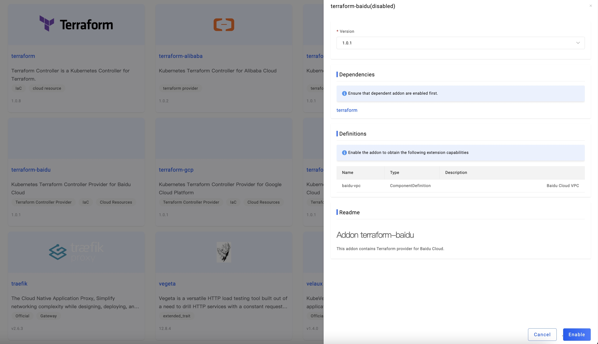
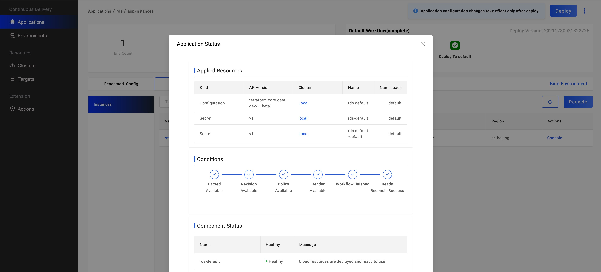

KubeVela 可以帮助开发者集成、编排不同类型的云资源，涵盖混合多云环境，让你用统一地方式去使用不同厂商的云资源。

本教程将主要集中在通过 Terraform 插件创建云资源，KubeVela 也支持使用 [Crossplane](https://crossplane.io/)，你可以参考[这个教程](../end-user/components/cloud-services/provision-cloud-resources-by-crossplane.md)。

## 通过 Vela CLI 创建云资源

请平台工程师启用云资源 Terraform 插件并授权目标云服务商的认证信息。
我们将使用阿里云作为示例。

### 熟悉云资源的使用参数

KubeVela 支持的所有由 Terraform 编排的云资源请见[列表](../end-user/components/cloud-services/cloud-resources-list.md)，你也可以通过命令 `vela components --label type=terraform` 查看。

你可以使用一下任意方式来检查云资源的使用参数：

- 通过命令 `vela show <component type name>`。

```console
$ vela show alibaba-oss
### Properties
+----------------------------+-------------------------------------------------------------------------+-----------------------------------------------------------+----------+---------+
|            NAME            |                               DESCRIPTION                               |                           TYPE                            | REQUIRED | DEFAULT |
+----------------------------+-------------------------------------------------------------------------+-----------------------------------------------------------+----------+---------+
| acl                        | OSS bucket ACL, supported 'private', 'public-read', 'public-read-write' | string                                                    | false    |         |
| bucket                     | OSS bucket name                                                         | string                                                    | false    |         |
| writeConnectionSecretToRef | The secret which the cloud resource connection will be written to       | [writeConnectionSecretToRef](#writeConnectionSecretToRef) | false    |         |
+----------------------------+-------------------------------------------------------------------------+-----------------------------------------------------------+----------+---------+

...snip...
```

你也可以使用 `--web` 参数来在本地浏览器中查看使用说明。

- 阅读 [官网文档](https://kubevela.net/docs/end-user/components/cloud-services/cloud-resources-list).

比如，你可以在[这里](https://kubevela.net/docs/end-user/components/cloud-services/terraform/alibaba-oss)查看阿里云 OSS 的使用参数。


对于不同的提供商，这些参数会有所不同。所有的云资源都有以下共同的参数：
- `writeConnectionSecretToRef`: `struct` 类型，表示 Terraform 的输出将以 key/values 格式写入指定名称的 secret。
  - `name`, secret 名称
  - `namespace`, secret 命名空间
- `providerRef`: `struct` 类型，代表引用的云提供商。
  - `name`, 提供商名字
- `deleteResource`: `bool` 类型,指定删除应用时是否删除云资源，默认为 `true`。
- `customRegion`: `string` 类型,指定资源所在区域，它会覆盖 `providerRef` 中的默认区域。

### 部署云资源

首先，我们需要准备一个可用的提供商配置，通过下述命令可以查询是否存在，如果已有则忽略该步骤。

```bash
vela config list -t terraform-alibaba
```

如果不存在，可以参考下述命令创建一个默认的可以提供商配置，在这之前你需要获取云厂商的 Access Key 和 Secret Key。

```bash
vela config create default -t terraform-alibaba name=default ALICLOUD_REGION=<Region> ALICLOUD_SECRET_KEY=<Secret> ALICLOUD_ACCESS_KEY=<AccessKey>
```

你可以使用以下命令来获取所有可用的提供商配置模板列表：

```bash
$ vela config-template list
NAME             	ALIAS                               	SCOPE  	SENSITIVE	CREATED-TIME
helm-repository  	Helm Repository                     	project	false    	2023-08-24 19:21:03 +0800 CST
terraform-alibaba	Terraform Provider for Alibaba Cloud	system 	true     	2023-08-24 19:32:19 +0800 CST
```
然后使用以下命令来查看指定提供商配置的详细信息：

```bash
$ vela config-template show terraform-alibaba

+---------------------+--------+--------------------------------------------------------+----------+---------+---------+
|        NAME         |  TYPE  |                      DESCRIPTION                       | REQUIRED | OPTIONS | DEFAULT |
+---------------------+--------+--------------------------------------------------------+----------+---------+---------+
| ALICLOUD_ACCESS_KEY | string | Get ALICLOUD_ACCESS_KEY per this guide                 | true     |         |         |
|                     |        | https://help.aliyun.com/knowledge_detail/38738.html    |          |         |         |
| ALICLOUD_REGION     | string | Get ALICLOUD_REGION by picking one                     | true     |         |         |
|                     |        | RegionId from Alibaba Cloud region list                |          |         |         |
|                     |        | https://www.alibabacloud.com/help/doc-detail/72379.htm |          |         |         |
| ALICLOUD_SECRET_KEY | string | Get ALICLOUD_SECRET_KEY per this guide                 | true     |         |         |
|                     |        | https://help.aliyun.com/knowledge_detail/38738.html    |          |         |         |
| name                | string | The name of Terraform Provider                         | true     |         |         |
|                     |        | for Alibaba Cloud                                      |          |         |         |
+---------------------+--------+--------------------------------------------------------+----------+---------+---------+
```

接下来，我们以 OSS bucket 为例展示如何部署云资源。

```yaml
apiVersion: core.oam.dev/v1beta1
kind: Application
metadata:
  name: provision-cloud-resource-sample
spec:
  components:
    - name: sample-oss
      type: alibaba-oss
      properties:
        bucket: vela-website-0911
        acl: private
        writeConnectionSecretToRef:
          name: oss-conn
```

`alibaba-oss` 类型的组件的参数在上面文档有清晰的描述，包括每一个 property 的名字、类型、描述、是否必填和默认值。

部署应用程序并检查应用程序的状态。

```shell
$ vela ls
APP                            	COMPONENT 	TYPE       	TRAITS	PHASE  	HEALTHY	STATUS                                       	CREATED-TIME
provision-cloud-resource-sample	sample-oss	alibaba-oss	      	running	healthy	Cloud resources are deployed and ready to use	2021-09-11 12:55:57 +0800 CST
```

当应用程序处于 `running` 和 `healthy`状态。你也可以在阿里云控制台查看。

## 通过 UI 控制台查看

除了命令行以外，使用 UI 控制台也可以很方便的创建云资源。

### 开始之前

- 启用 [VelaUX](../reference/addons/velaux.md) 插件.

- 启用 [Terraform](../reference/addons/terraform.md) 插件, 就像上面 CLI 部分的先决条件一样。不过启用 VelaUX 后还可以在 UI 控制台中启用这些插件。



### 创建你的云资源

UI 界面的操作是一样的，你可以参考 [操作指南](../how-to/dashboard/application/create-application.md)。

首先，创建一个应用程序并选择云服务的类型，它们的前缀一般是厂商的名字，比如 `aws-`, `azure` 或者 `alibaba-`。

根据您的需要设置以上参数即可完成应用的创建，然后部署应用。 对应的资源会在应用程序就绪之后自动创建。

### 查看资源状态

- 查看云实例列表

与其他应用程序一样，云服务应用程序也需要切换到相应的环境页面来查看实例信息。默认情况下，一个环境中有多个目标，云服务会生成相应数量的实例。


在实例列表中，会显示实例名称、状态、资源类型和位置。在开始时，名称是空的。 因为云服务实例的生成需要一定的时间，当实例正常生成后，名称会出现。

- 在云提供商的控制台中查看云资源

您可以在云提供商的控制台中访问该实例。例如，您可以检查名称或控制台来访问它。


创建出的云资源也会自动跳转到云资源的官方网站控制台，例如，这里的云资源会自动跳转到阿里云官网的 RDS 实例控制台。

- 检查云实例的细节和状态

点击 "检查细节 "按钮来查看应用程序的细节。



你会发现，每个实例都会生成一个Secret资源，一般来说，它记录了服务的访问地址和密钥信息。秘密资源将被分配到目标所在的集群和命名空间，而
控制集群存在。因此，同一环境中的其他应用程序可以直接使用资源中的环境变量来获取访问地址和密钥。


在最后一节 `Component Status` 中，显示了云服务实例的健康状态和信息。

## 常见错误

- 云服务一直处在 ProvisioningAndChecking 状态，且无名称。

> 云服务的创建一般需要一定时间，请等候或者进入云厂商控制台查看创建进度。

# 更多

更多云资源使用方法，比如如何使用和消费云资源，请参见[云资源管理场景](../end-user/components/cloud-services/cloud-resource-scenarios.md)。