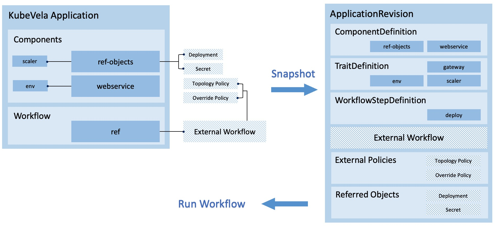

## 简介



在 KubeVela 中，ApplicationRevision 保持了应用在发布时刻的快照，包括所有 Application 的配置以及依赖的外部项（如组件定义、外置策略或是引用对象）。
这个版本可以用来比对应用的变化，并在应用的发布出故障时进行回滚。

在 KubeVela v1.3 中，对于使用 `PublishVersion` 特性的应用，支持浏览历史版本、跨版本配置比对、版本回滚以及版本重新发布。

对于带有 `app.oam.dev/publishVersion` annotation 的应用，工作流的运行会被严格限制在版本快照的范围内。
这个 annotation（在下文中简称为 *publishVersion*），可被用来代表应用的一个静态版本快照。

当这个 annotation 被更新时，应用会为当前的配置和依赖项生成一个静态版本，然后针对这个静态版本触发相应的工作流从头开始运行，已有的工作流会被中止。

在工作流运行的过程中，所有相关数据都会从版本快照中取出，这代表着直到应用的 `publishVersion` 被更新为止，应用配置或依赖项的变化都不会生效。

## 使用指南

我们以一个带有外置工作流和策略的应用为例，该应用将会将 podinfo 服务部署在子集群中。

> 对于外置工作流和策略，请参考 [多集群应用交付](../case-studies/multi-cluster.md) 以获取更多信息。


```yaml
apiVersion: core.oam.dev/v1beta1
kind: Application
metadata:
  name: podinfo
  namespace: examples
  annotations:
    app.oam.dev/publishVersion: alpha1
spec:
  components:
    - name: podinfo
      type: webservice
      properties:
        image: stefanprodan/podinfo:6.0.1
  workflow:
    ref: make-release-in-hangzhou
---
apiVersion: core.oam.dev/v1alpha1
kind: Policy
metadata:
  name: override-high-availability
  namespace: examples
type: override
properties:
  components:
    - type: webservice
      traits:
        - type: scaler
          properties:
            replicas: 3
---
apiVersion: core.oam.dev/v1alpha1
kind: Policy
metadata:
  name: topology-hangzhou-clusters
  namespace: examples
type: topology
properties:
  clusterLabelSelector:
    region: hangzhou
---
apiVersion: core.oam.dev/v1alpha1
kind: Workflow
metadata:
  name: make-release-in-hangzhou
  namespace: examples
steps:
  - name: deploy-hangzhou
    type: deploy
    properties:
      policies: ["topology-hangzhou-clusters", "override-high-availability"]
```

你可以运行 `vela status podinfo -n examples` 来查看应用的部署状态，也可以运行 `vela status podinfo -n examples --tree --detail` 来查看所有相关资源的实时状态。

```shell
$ vela status podinfo -n examples
vela status podinfo -n examples               
About:

  Name:         podinfo                      
  Namespace:    examples                     
  Created at:   2022-04-13 19:32:02 +0800 CST
  Status:       runningWorkflow              

Workflow:

  mode: DAG
  finished: false
  Suspend: false
  Terminated: false
  Steps
  - id:auqaxnbix2
    name:deploy-hangzhou
    type:deploy
    phase:running 
    message:wait healthy

Services:

  - Name: podinfo  
    Cluster: velad-003  Namespace: examples
    Type: webservice
    Unhealthy Ready:0/3
    Traits:
      ✅ scaler
  - Name: podinfo  
    Cluster: velad-002  Namespace: examples
    Type: webservice
    Unhealthy Ready:0/3
    Traits:
      ✅ scaler

$ vela status podinfo -n examples --tree --detail
CLUSTER       NAMESPACE     RESOURCE           STATUS    APPLY_TIME          DETAIL
hangzhou1 ─── examples  ─── Deployment/podinfo updated   2022-04-13 19:32:03 Ready: 3/3  Up-to-date: 3  Available: 3  Age: 4m16s
hangzhou2 ─── examples  ─── Deployment/podinfo updated   2022-04-13 19:32:03 Ready: 3/3  Up-to-date: 3  Available: 3  Age: 4m16s
```

这个应用会在一段时间后进入正常运行的状态。
现在我们修改组件的镜像，并把它设置成一个不合法的镜像，如 `stefanprodan/podinfo:6.0.xxx`。
因为 `publishVersion` 的存在，这个应用不会自动地重新运行工作流。
但由于应用的配置发生了变化，这意味着下一次工作流的运行会更新部署的 Deployment 的镜像。

### 查看版本变化

现在，应用正在运行的版本和当前环境中应用的配置（也就是下一次要运行的配置）产生了差异，我们可以运行 `vela live-diff podinfo -n examples` 来查看这一变化。

```bash
$ vela live-diff podinfo -n examples
* Application (podinfo) has been modified(*)
  apiVersion: core.oam.dev/v1beta1
  kind: Application
  metadata:
    annotations:
      app.oam.dev/publishVersion: alpha1
    name: podinfo
    namespace: examples
  spec:
    components:
    - name: podinfo
      properties:
-       image: stefanprodan/podinfo:6.0.1
+       image: stefanprodan/podinfo:6.0.xxx
      type: webservice
    workflow:
      ref: make-release-in-hangzhou
  status: {}
  
* External Policy (topology-hangzhou-clusters) has no change
* External Policy (override-high-availability) has no change
* External Workflow (make-release-in-hangzhou) has no change
```

我们可以看到所有关于应用配置以及依赖项的变化。
现在我们来更新一下应用的版本。
有两种方式可以更新应用版本，你可以任选其一。
1. 更新应用中的 `publishVersion` annotation 到 `alpha2` 来触发工作流的重新运行。
2. 运行 `vela up podinfo -n examples --publish-version alpha2` 来发布新版本。

我们会发现，由于 Deployment 的镜像不合法，应用卡在了 `runningWorkflow` 状态。

现在我们可以运行 `vela revision list podinfo -n examples` 来列出所有可用的版本。
```bash
$ vela revision list podinfo -n examples
NAME            PUBLISH_VERSION SUCCEEDED       HASH                    BEGIN_TIME              STATUS          SIZE    
podinfo-v1      alpha1          true            65844934c2d07288        2022-04-13 19:32:02     Succeeded       23.7 KiB
podinfo-v2      alpha2          false           44124fb1a5146a4d        2022-04-13 19:46:50     Executing       23.7 KiB
```

### 回滚到最近成功的版本

在回滚应用之前，我们需要先停下应用工作流。运行 `vela workflow suspend podinfo -n examples`。
在应用的工作流被暂停后，运行 `vela workflow rollback podinfo -n examples`，工作流会被撤销，同时应用会恢复到最近一次的成功状态。
```shell
$ vela workflow suspend podinfo -n examples
Successfully suspend workflow: podinfo
$ vela workflow rollback podinfo -n examples
Find succeeded application revision podinfo-v1 (PublishVersion: alpha1) to rollback.
Application spec rollback successfully.
Application status rollback successfully.
Application rollback completed.
Application outdated revision cleaned up.
```

现在我们可以看到所有的资源都已经被恢复到了原有的镜像状态。
```shell
$ vela status podinfo -n examples --tree --detail --detail-format wide
CLUSTER       NAMESPACE     RESOURCE           STATUS    APPLY_TIME          DETAIL
hangzhou1 ─── examples  ─── Deployment/podinfo updated   2022-04-13 19:32:03 Ready: 3/3  Up-to-date: 3  Available: 3  Age: 17m  Containers: podinfo  Images: stefanprodan/podinfo:6.0.1  Selector: app.oam.dev/component=podinfo
hangzhou2 ─── examples  ─── Deployment/podinfo updated   2022-04-13 19:32:03 Ready: 3/3  Up-to-date: 3  Available: 3  Age: 17m  Containers: podinfo  Images: stefanprodan/podinfo:6.0.1  Selector: app.oam.dev/component=podinfo
```

### 重新发布历史版本

:::note
这个功能在 KubeVela v1.3.1+ 版本生效。
:::

版本回滚可以让你直接回退到上一次成功的状态。另一种方式是重新发布一个旧版本，这种方式的区别在于它可以回退到任一可用的历史版本中（不只是最近成功的），但是会触发工作流的重新运行。

例如，你可能保存了多个历史版本可供恢复
```shell
$ vela revision list podinfo -n examples
NAME            PUBLISH_VERSION SUCCEEDED       HASH                    BEGIN_TIME              STATUS          SIZE
podinfo-v1      alpha1          true            65844934c2d07288        2022-04-13 20:45:19     Succeeded       23.7 KiB
podinfo-v2      alpha2          true            4acae1a66013283         2022-04-13 20:45:45     Succeeded       23.7 KiB
podinfo-v3      alpha3          false           44124fb1a5146a4d        2022-04-13 20:46:28     Executing       23.7 KiB
```

这种情况下，你可以使用 `vela up podinfo -n examples --revision podinfo-v1 --publish-version beta1` 来重新发布最早的版本。这个过程会让应用使用过去的历史版本来重跑整个工作流。新的版本会和声明使用的历史版本完全一致。

```shell
NAME            PUBLISH_VERSION SUCCEEDED       HASH                    BEGIN_TIME              STATUS          SIZE
podinfo-v1      alpha1          true            65844934c2d07288        2022-04-13 20:45:19     Succeeded       23.7 KiB
podinfo-v2      alpha2          true            4acae1a66013283         2022-04-13 20:45:45     Succeeded       23.7 KiB
podinfo-v3      alpha3          false           44124fb1a5146a4d        2022-04-13 20:46:28     Failed          23.7 KiB
podinfo-v4      beta1           true            65844934c2d07288        2022-04-13 20:46:49     Succeeded       23.7 KiB
```

你会发现 *beta1* 版本和 *alpha1* 版本的哈希值完全一致。

:::caution
默认情况下，应用最多能持有 10 个历史版本。如果你想要修改这个数字，可以在控制器启动参数中设置 `--application-revision-limit`。
:::