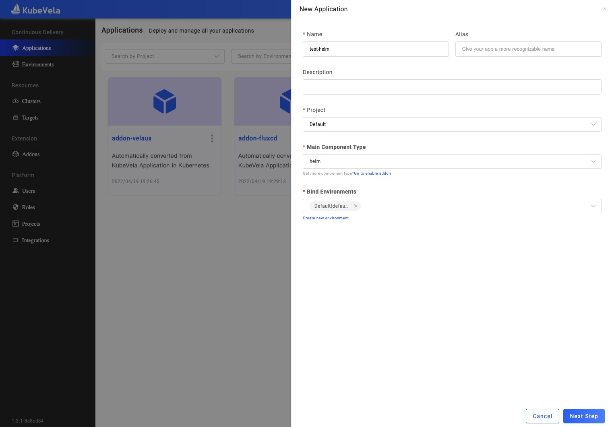

本文介绍如何配置 Helm 仓库，以帮助用户从私服仓库创建 Helm 类型的应用。

:::info
你应该先启用 [fluxcd](../../../reference/addons/fluxcd.md) 插件。
:::

通过下述命令可以检查 Helm 仓库的 [配置模版](./config-template.md) 是否存在：

```bash
vela config-template list | grep helm-repository
```

## 创建 Helm 仓库配置

在 UI 中有两个地方可以创建配置。在配置管理页面中，可以创建平台级别的配置，对于 Helm 仓库配置来说，系统级别创建意味着该配置可以在任何项目中使用。如果希望创建一个只在单个项目下可用的仓库，则在项目概要页面中创建配置。

Helm 仓库配置主要有三个参数，你可以设置 `URL` 参数提供仓库地址，如果仓库开启了用户认证，你可以设置用户名和密码字段。

同时说一句，如果你的仓库使用了自签名的证书，你想要将 CA 证书填写到 `CaFile` 字段中，点击提交即可完成配置创建。


另外你也可以通过 CLI 来创建配置:

```bash
vela config create <Config Name> -t helm-repository url=<Repo URL> username=<Username> password=<password>
```

查询所有已配置的 Helm 仓库:

```bash
vela config list -t helm-repository
```

## 分发仓库配置

配置创建后，它仅以 Secret 存在于管控集群的系统命名空间中。但是部署 Helm 应用时会生成 HelmRepository 资源依赖该 Secret。因此我们需要将其分发到我们会使用的命名空间，包括其他集群。KubeVela 同时提供的配置分发能力可以完成该需求。

我们需要进入到需要创建应用的项目概览页面。


点击配置列表中的分发按钮并选择会使用的目标集合，即可将配置分发到这些交付目标对应的命名空间中。

同样，你可以通过 CLI 来分发配置，此时需要显示指定集群和命名空间。

```bash
vela config distribute <Config Name> --target <cluster/namespace>
```

## 使用 Helm 仓库创建应用

你可以参考 [创建应用](../application/create-application.md) 创建一个 Helm 类型的应用:



在 UI 窗口中，选择仓库后会自动列举出 Chart 列表，如果未正常列出考虑是否是仓库信息设置错误。


同时选择 Chart 后会列举出版本列表，选择版本后可以列举出可以配置的 Value 选项。帮助用户便捷填写相关配置。
