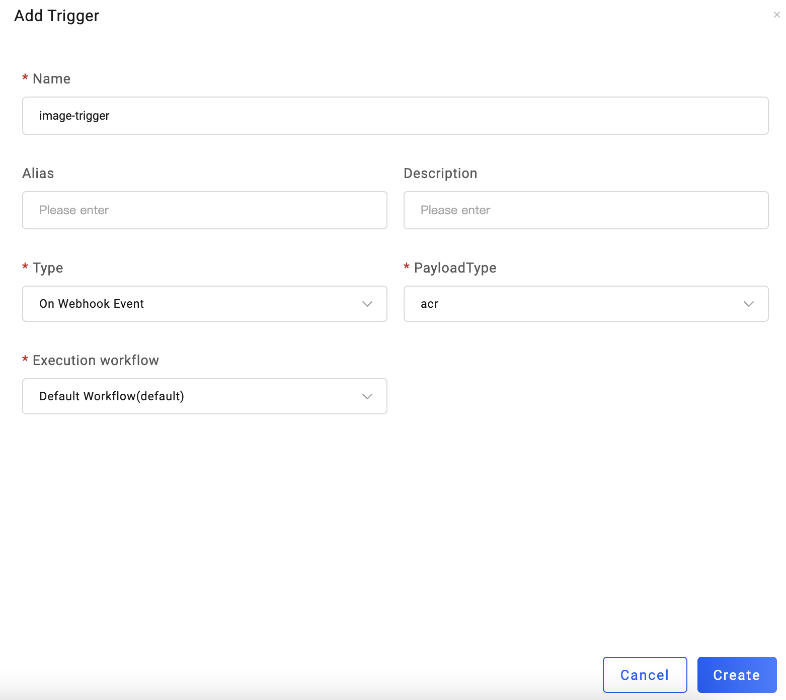

在 KubeVela 中，你可以选择使用声明式工作流直接对接 CI 步骤，如：代码构建，镜像推送等。或者，你可以选择使用触发器对接外部的 CI 系统，如：对接 Jenkins，镜像仓库等。

## 使用声明式工作流对接 CI 步骤

KubeVela v1.7+ 中默认提供了构建镜像的内置步骤，具体请参考 [镜像构建集成](../../../tutorials/s2i.md)

## 使用触发器对接 CI 系统

你可以使用 [VelaUX addon](../../../reference/addons/velaux.md) 的触发器来和不同 CI 系统进行集成，在 ValueUX 中，每个应用在创建完成后，都会自动创建一个默认触发器，你可以删除或者创建新的不同类型的触发器。下图描述了架构体系和支持对接的平台：

- [自定义触发器](#custom-trigger), 你可以参考 [Jenkins CI 对接](../../../tutorials/jenkins.md) 作为自定义触发器的实际案例。
- [ACR 镜像仓库](#ACR-trigger)
- [Harbor 镜像仓库](#Harbor-trigger), 你可以参考 [Harbor 镜像仓库](../../../tutorials/trigger.md) 获得更详细的用例。
- [DockerHub 镜像仓库](#DockerHub-trigger)
- [JFrog 镜像仓库](#JFrog-trigger)


### Custom 触发器

Custom 为自定义类型的触发器，它提供一个 Webhook URL 以及指定的请求体格式，你可以用它来对接任意 CI 系统。

默认触发器是一个 Custom 类型的触发器，点击 `Manual Trigger`，可以查看触发器的详细信息：


Webhook URL 是这个触发器的触发地址，在 `Curl Command` 里，还提供了手动 Curl 该触发器的请求示例。我们来详细解析一下请求体：

```json
  {
    // 必填，此次触发的更新信息
    "upgrade": {
      // Key 为应用的名称
      "<application-name>": {
        // 需要更新的值，这里的内容会被 Patch 更新到应用上
        "image": "<image-name>"
      }
    },
    // 可选，此次触发携带的代码信息
    "codeInfo": {
      "commit": "<commit-id>",
      "branch": "<branch>",
      "user": "<user>",
    }
  }
```

`upgrade` 下是本次触发要携带的更新信息，在应用名下，是需要被 Patch 更新的值。默认推荐的是更新镜像 `image`，也可以扩展这里的字段来更新应用的其他属性。

`codeInfo` 中是代码信息，可以选择性地携带，比如提交 ID、分支、提交者等，一般这些值可以通过在 CI 系统中使用变量替换来指定。

下面是一个在 GitLab CI 中使用触发器的例子，里面所有的值都使用了变量替换：

```shell
webhook-request:
  stage: request
  before_script:
    - apk add --update curl && rm -rf /var/cache/apk/*
  script:
    - |
      curl -X POST -H "Content-Type: application/json" -d '{"upgrade":{"'"$APP_NAME"'":{"image":"'"$BUILD_IMAGE"'"}},"codeInfo":{"user":"'"$CI_COMMIT_AUTHOR"'","commit":"'"$CI_COMMIT_SHA"'","branch":"'"$CI_COMMIT_BRANCH"'"}}' $WEBHOOK_URL
```

配置完成后，当 CI 中执行了该步骤，则能在 VelaUX 中看到应用已被成功部署，且能看到本次部署相关的代码信息。


你还可以参考 [Jenkins CI 对接](../../../tutorials/jenkins.md) 作为自定义触发器的实际案例。

### Harbor 触发器

请参考 [Harbor 镜像仓库](../../../tutorials/trigger.md)。

### ACR 触发器

ACR 触发器可以对接 ACR 镜像仓库。

首先来创建一个 ACR 触发器，Payload Type 选择 ACR，Execution Workflow 选择触发器需要触发的工作流：



新建完毕后，在 ACR 中配置该触发器：


配置完成后，当 ACR 中被推送了新镜像时，VelaUX 中会收到对应的触发请求，从而完成自动部署。


### DockerHub 触发器

DockerHub 触发器可以对接 DockerHub 仓库。

首先来创建一个 DockerHub 触发器，Payload Type 选择 dockerhub，Execution Workflow 选择触发器要触发的工作流：


新建完毕后，在 DockerHub 中配置该触发器：


配置完成后，当 DockerHub 中被推送了镜像时，VelaUX 中会收到对应的触发请求，从而完成自动部署。


### JFrog 触发器

JFrog 触发器可以对接 JFrog Artifactory。

首先来创建一个 JFrog 触发器，Payload Type 选择 jfrog， Workflow 选择触发器要触发的工作流：


新建完毕后，在 JFrog 中配置该触发器：


配置完成后，当 JFrog 中被推送了镜像时，VelaUX 中会收到对应的触发请求，从而完成自动部署。

注意：由于 jFrog 的回调请求中不包含 jFrog 本身的地址，KubeVela 将识别在 jFrog Webhook 中配置的 `X-jFrogURL` 地址，将其写入到应用的 `image` 字段中。