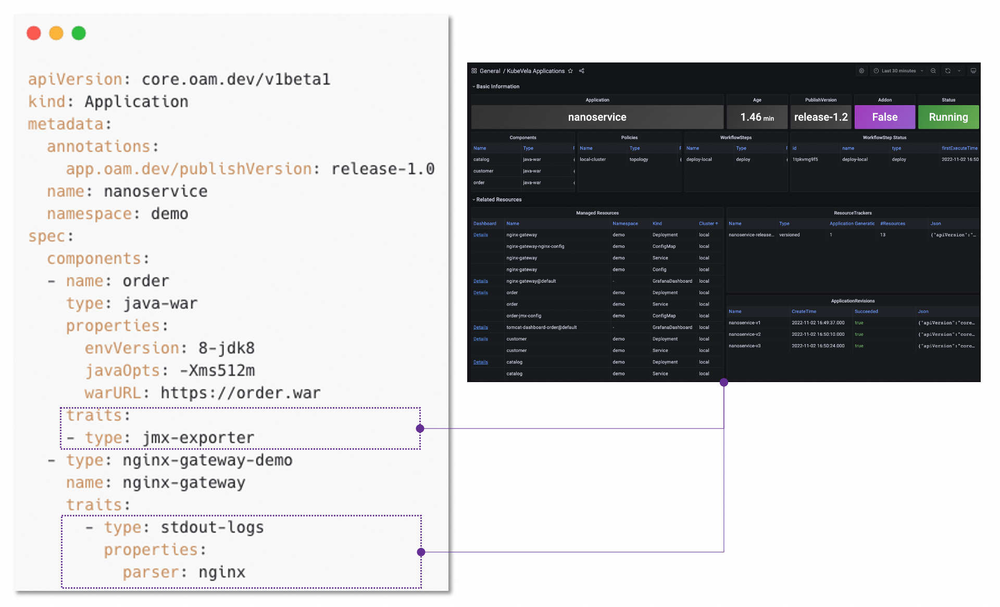

可观测性对于基础架构和应用程序至关重要。 如果没有可观测性系统，就很难确定系统崩溃时发生了什么。 相反，强大的可观测性系统不仅可以为使用者提供信心，还可以帮助开发人员快速定位整个系统内部的性能瓶颈或薄弱环节。

可观测性是 KubeVela 体系的一等公民，它包括如下三个方面。

## 自动化构建可观测性基础设施

为了帮助用户构建自己的可观测性系统，KubeVela 提供了开箱即用可观测性插件，包括：

**指标**
- `prometheus-server`: 以时间序列来记录指标的服务，支持灵活的查询。
- `kube-state-metrics`: Kubernetes 系统的指标收集器。
- `node-exporter`: Kubernetes 运行中的节点的指标收集器。

**日志**
- `loki`: 用于存储采集日志并提供查询服务的日志服务器。

**监控大盘**
- `grafana`: 提供分析和交互式可视化的 Web 应用程序。

当这些插件启动后，就会出现开箱即用的可观测性大盘，展示实时的系统状态。

> 以后的版本中将引入更多用于 alerting 和 tracing 的插件。

## 应用级可观测

KubeVela 的一大特点就是通过一个顶层应用描述（YAML）来驱动完整的应用交付，可观测性能力自然也不例外。对于应用而言，其使用体验就是选用日志或者指标对应的运维特征，KubeVela 控制器便会自动为其生成对应的监控大盘。

不仅如此，基于 KubeVela 的扩展体系，你也可以为你的平台自定义可观测运维特征。

## 可观测性即代码

KubeVela 支撑应用可观测底层的能力全部通过 IaC （Infrastructure as Code）的方式完成，这也意味着 **KubeVela 打通了从指标（含日志）采集、解析、富化、存储、数据源注册，一直到大盘可视化全链路的 IaC 化**。

KubeVela 已经基于这一套 IaC 体系封装了创建数据源、创建大盘、导入大盘等通用的功能，你无需学习其中的细节便可以直接使用。如果你想要做一些自定义，也完全可以类似的通过 IaC 的方式编排你的流程，为你的平台自定义可观测能力。

接下来的文档中，我们将逐一详细展开上述功能。

## 进阶指南

- [**安装可观测性基础设施**](./o11y/installation.md): 关于如何在 KubeVela 系统中部署可观测性基础设施。

- [**开箱即用的可观测大盘**](./o11y/out-of-the-box.md): 关于 KubeVela 可观测性基础设施中默认可用的系统及应用监控能力。

- [**自定义指标采集**](./o11y/metrics.md): 关于如何为你的应用自定义指标采集过程的指南。

- [**自定义日志采集**](./o11y/logging.md): 关于如何为你的应用定制日志采集规则的指南。

- [**自定义监控大盘**](./o11y/dashboard.md): 关于如何为你的应用配置自定义监控大盘的指南。

- [**集成外部的可观测性服务**](./o11y/integration.md): 关于如何将已有的监控体系集成进 KubeVela 的指南，如果你的系统中已经存在了 Prometheus 或者 Grafana 服务（如自建或云厂商提供），可以阅读该文档了解集成方法。