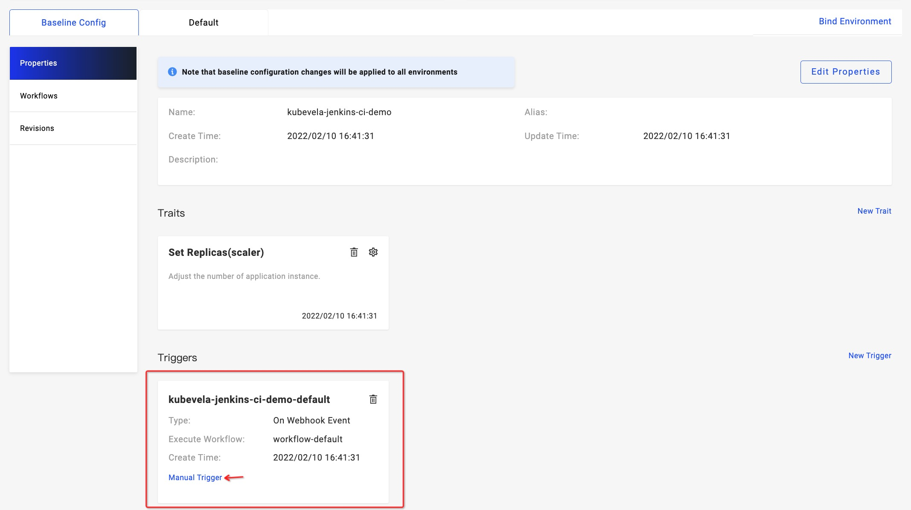
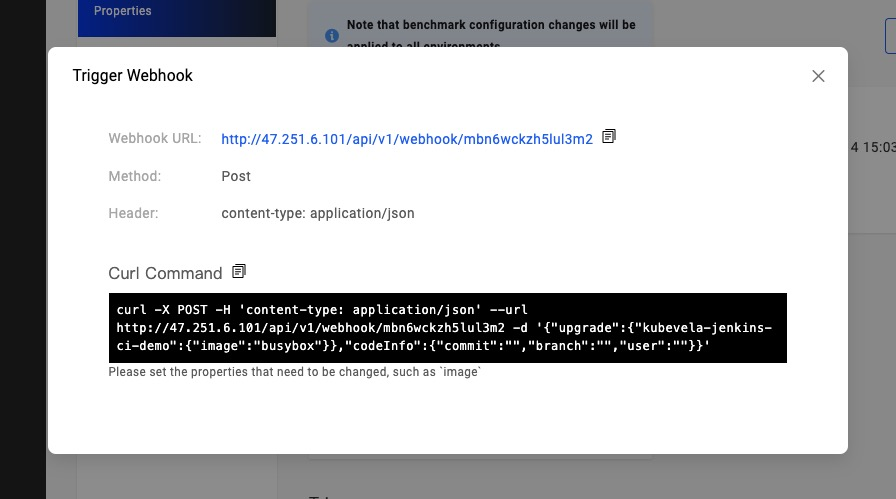

### 简介

KubeVela 应用的工作流可以通过 Webhook 触发器触发。这使得诸如 Jenkins 或是 Gitlab 之类的持续集成系统对接 KubeVela 非常简单。

在 KubeVela 1.2 中，[VelaUX](../install.mdx#2-install-velaux) 提供了便捷的应用触发器。只需要在 Jenkins 的流水线中添加一条简单的 Curl 命令就可以对接 CI 和 CD 系统。

本文将详细介绍如何对接 KubeVela 与 Jenkins。

> 该教程仅适用于 UI 用户。

### 准备

在开始本文教程之前，需要先确认一下的事项
- 安装了 KubeVela v1.2.0+ 版本，并开启了 VelaUX 插件。
- 安装了 Jenkins。
- VelaUX 需要能够被 Jenkins 访问到。（如果 KubeVela 被安装在了离线环境中，需要额外确认这一条件）

### 创建应用

为了使用应用触发器，我们首先需要在 VelaUX 上创建一个新的应用。比如我们选择一个 WebService 类型的应用并使用 LoadBalancer 来暴露它的 80 端口。


### 设置 Webhook 触发器

在应用面板上，我们可以找到一个默认的触发器，如下图所示



点击 **Manual Trigger**，我们可以看到 Webhook URL 和 Curl Command。我们可以在 Jenkins 的流水线中使用任意一个。



### 在 Jenkins 中使用 Webhook

为了在 Jenkins 中使用 Webhook，我们可以将上文得到的 Curl Command 复制到 Jenkins 的 *Freestyle* 项目或是 *Pipeline* 项目中。
- 在 *Freestyle* 项目中，点击 **Add Build Step** 并选择 **Execute Shell**。将上文的 Curl Command 复制到其中。
- 在 *Pipeline* 项目中，类似地复制 Curl Command 并用 `sh` 命令将其按下图所示方式包装。
```groovy
stage('Deploy') {
    steps {
        sh '''#!/bin/bash
            set -ex
            curl -X POST -H 'content-type: application/json' --url http://47.251.6.101/api/v1/webhook/mbn6wckzh5lul3m2 -d '{"upgrade":{"kubevela-jenkins-ci-demo":{"image":"busybox"}},"codeInfo":{"commit":"","branch":"","user":""}}'
        '''
    }
}
```
现在当 Jenkins 执行构建步骤的时候，它便会通知 KubeVela 来自动的执行应用工作流，完成部署。


### 进阶：安全存储 Webhook URL

KubeVela 的 Webhook URL 可以通过 Jenkins credential 安全地存储，并在 Jenkins 项目中引用。