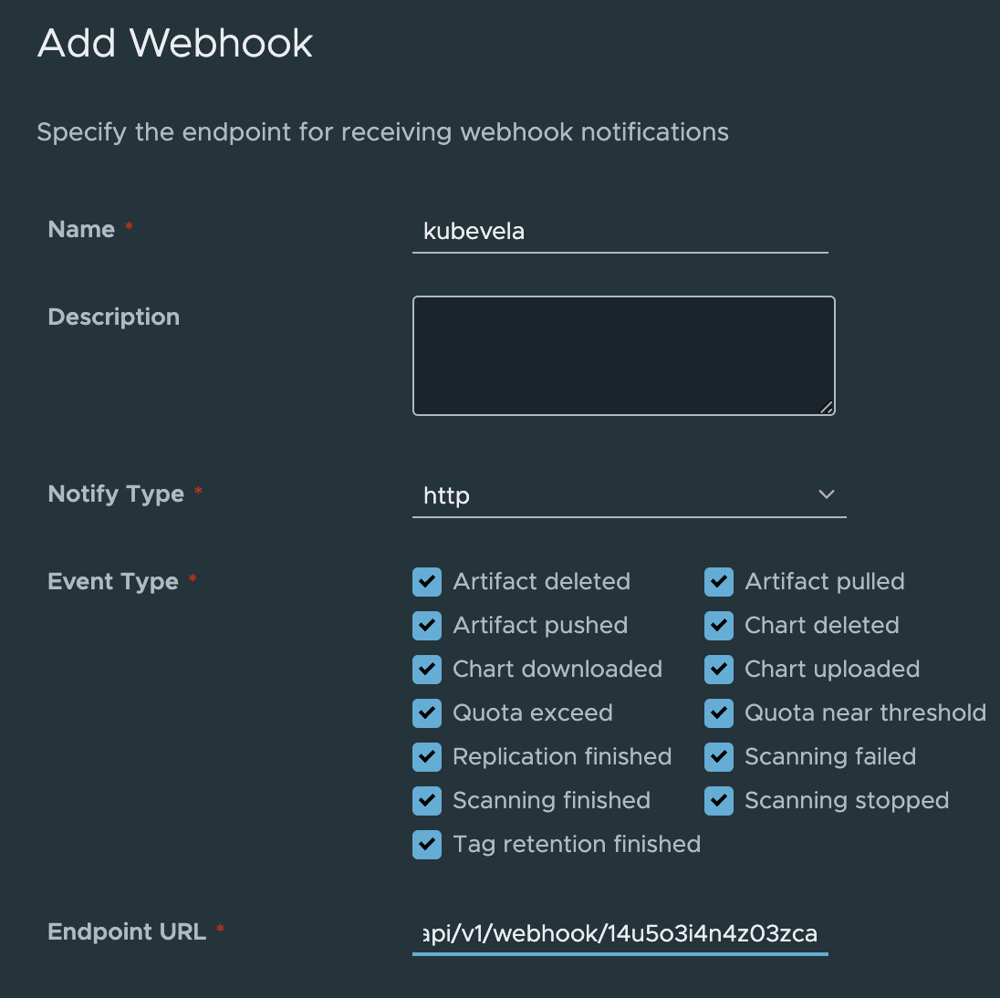
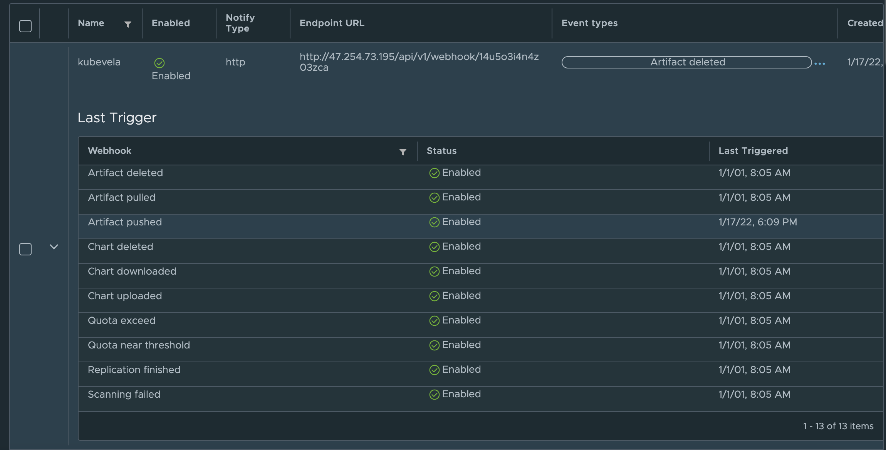

## 简介

在日常研发的过程中，当项目中的镜像版本发生变化时，通常我们需要将最新版本更新到各个环境中。在这个更新部署的过程中，手动部署不仅繁琐，且容易出错。因此，我们需要一个工具来完成基于镜像版本的自动化部署。

在 KubeVela 1.2 版本中，[VelaUX](../install.mdx#3-安装-velaux) 自带的应用触发器提供了一个很好的入口。我们可以使用这个触发器，来帮助我们完成这些自动部署的工作。

本文将详细介绍如何使用 KubeVela 触发器来完成基于镜像版本的自动化部署，在本文的例子当中，我们将使用 GitLab 作为代码仓库，Harbor 作为镜像仓库来完成演示。

> 该教程仅适用于 UI 用户。

## 创建应用

要使用触发器，首先我们需要在 VelaUX 上新建一个应用。在这里，我们可以新建一个 WebService 类型的应用，并使用 LoadBalancer 为其暴露 80 端口以便访问。


## 为应用新建触发器

在新建完应用后，使用 `New Trigger` 来创建新的触发器，这里我们选择 `Harbor` 格式的触发器，使该触发器支持来自 `Harbor` 镜像仓库的请求。


查看这个触发器的详细信息，可以看到具体的 Webhook URL 以及手动触发的命令。


## 配置 Harbor 触发器

Harbor 格式触发器需要配合 Harbor 镜像仓库使用。当创建完 Harbor 类型的触发器后，我们可以复制该触发器的 Webhook URL，并在 Harbor 镜像仓库中进行配置。



## 测试部署

完成这些触发器的配置之后，我们可以进行一个简单的测试来查看自动部署效果。

首先我们来查看一下当前应用的页面，通过应用的 `Service Endpoint`，可以直接跳转到应用的 LoadBalancer 地址。


可以看到，当前的 Demo 应用显示版本为 `v1.0.0`。


这个 Demo 应用的源码放在了 [GitLab](https://gitlab.com/FogDong/KubeVela-GitOps-Demo-Code) 上。仓库里除了源码，还有一份 CI 文件，里面的步骤也十分简单，每次代码被更新时，都将自动构建镜像推送到镜像仓库中。

我们将代码的版本修改为 `v2.0.0`：

```javascript
data(){
    return {
      v: 'v2.0.0',
    }
  },
```

修改完成后，GitLab CI 将自动构建并推送最新镜像。

在 Harbor 触发器的访问记录中，我们可以看到，当镜像仓库中有了最新镜像时，Harbor 会往我们配置的 Webhook URL 中发送一个请求。



查看 VelaUX 的应用部署版本列表，可以看到，最近一次部署是来自 `webhook` 的部署。


重新查看应用页面，可以看到，应用的版本已经变更成了 `v2.0.0`，同时页面的背景也随版本发生了变化。


## 总结

KubeVela 触发器与制品仓库的对接是十分顺滑且无缝的，除了 Harbor 之外，KubeVela 还支持 ACR 镜像仓库以及自定义触发的格式。

通过使用 KubeVela 触发器，我们可以轻松地根据镜像版本实现自动部署，从而完成应用版本的迭代。
