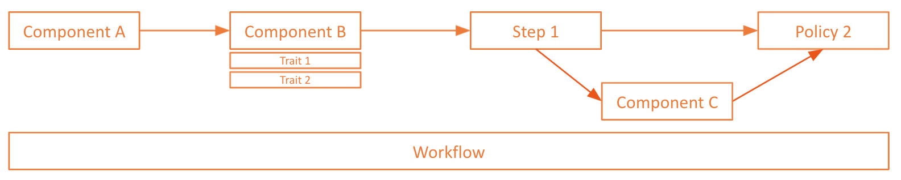

KubeVela introduces Open Application Model (OAM) to capture a full deployment of micro-services application across hybrid environments.

## The Application Deployment Plan

With this model, a typical deployment plan in KubeVela looks as below:

```yaml
# sample.yaml
apiVersion: core.oam.dev/v1beta1
kind: Application
metadata:
  name: website
spec:
  components:
    - name: frontend              # e.g. we want to deploy a frontend component and serves as web service
      type: webservice
      properties:
        image: nginx
      traits:
        - type: cpuscaler         # e.g. we add a CPU based auto scaler to this component
          properties:
            min: 1
            max: 10
            cpuPercent: 60
        - type: sidecar           # add a sidecar container into this component
          properties:
            name: "sidecar-test"
            image: "fluentd"
    - name: backend
      type: worker
      properties:
        image: busybox
        cmd:
          - sleep
          - '1000'
  policies:
    - name: demo-policy
      type: env-binding
      properties:
        envs:
          - name: test
            placement:
              clusterSelector:
                name: cluster-test
          - name: prod
            placement:
              clusterSelector:
                name: cluster-prod
  workflow:
    steps:
      #workflow step name
      - name: deploy-test-env
        type: deploy2env
        properties:
          # Specify the policy name
          policy: demo-policy
          # Specify the env name in the policy
          env: test    
      - name: manual-approval
        # use suspend can stop workflow and wait here until condition changed
        type: suspend
      - name: deploy-prod-env
        type: deploy2env
        properties:
          # Specify the policy name
          policy: demo-policy
          # Specify the env name in the policy
          env: prod    
```

The building blocks in this entity are explained as below.

### Components

An application could be composed by multiple components. KubeVela already built-in with several widely used components definitions to help you model an application deployment, you can list them by using [KubeVela CLI](../install#3-get-kubevela-cli):

```
vela components 
```

The output shows:

```
NAME          NAMESPACE   WORKLOAD                              DESCRIPTION
helm          vela-system autodetects.core.oam.dev              helm release is a group of K8s resources from either git
                                                                repository or helm repo
kustomize     vela-system autodetects.core.oam.dev              kustomize can fetching, building, updating and applying
                                                                Kustomize manifests from git repo.
task          vela-system jobs.batch                            Describes jobs that run code or a script to completion.
webservice    vela-system deployments.apps                      Describes long-running, scalable, containerized services
                                                                that have a stable network endpoint to receive external
                                                                network traffic from customers.
worker        vela-system deployments.apps                      Describes long-running, scalable, containerized services
                                                                that running at backend. They do NOT have network endpoint
                                                                to receive external network traffic.                    
alibaba-ack   vela-system configurations.terraform.core.oam.dev Terraform configuration for Alibaba Cloud ACK cluster
alibaba-oss   vela-system configurations.terraform.core.oam.dev Terraform configuration for Alibaba Cloud OSS object
alibaba-rds   vela-system configurations.terraform.core.oam.dev Terraform configuration for Alibaba Cloud RDS object
```

### Traits

Traits are operational behaviors that you can attach to component. KubeVela also has built-in traits installed, search them by using [KubeVela CLI](../install#3-get-kubevela-cli):

```
vela traits 
```

The result can be:

```
NAME        NAMESPACE   APPLIES-TO        CONFLICTS-WITH  POD-DISRUPTIVE  DESCRIPTION                                          
annotations vela-system deployments.apps                  true            Add annotations for your Workload.                   
cpuscaler   vela-system webservice,worker                 false           Automatically scale the component based on CPU usage.
ingress     vela-system webservice,worker                 false           Enable public web traffic for the component.         
labels      vela-system deployments.apps                  true            Add labels for your Workload.                        
scaler      vela-system webservice,worker                 false           Manually scale the component.                        
sidecar     vela-system deployments.apps                  true            Inject a sidecar container to the component.   
```

### Policy

Policy enforces deployment process of the application, such as quality gates, security groups, placement strategy, fire walls, SLO targets and so on.

### Workflow

Workflow allows you to assemble components, operation and task steps into a DAG, and it is process-oriented. Typical workflow steps includes pause, manual verification, waiting state, data flow transmission, multi-environment rollout, and A/B testing, etc.



Each policy and workflow step is a independent capability entity that is fully plugable, KubeVela allows you to create your own step through CUE.


## What's Next

Here are some recommended next steps:

- Start using KubeVela from deploying [Helm component](../end-user/components/helm).
