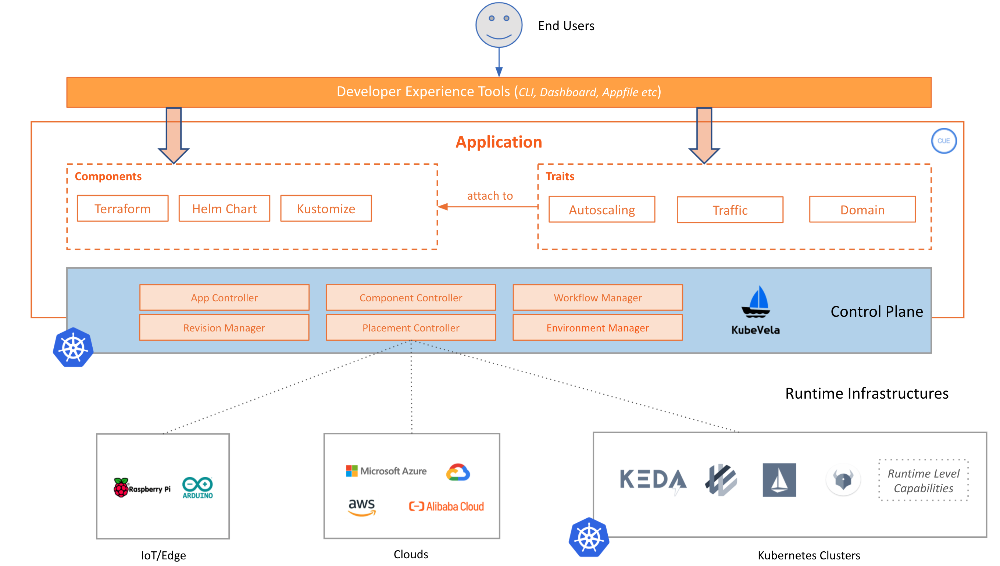

The overall architecture of KubeVela is shown as below:

### Control Plane

Control plane is where KubeVela itself lives in. As the project's name implies, KubeVela by design leverages Kubernetes as control plane. This is the key of how KubeVela guarantees full *automation* and strong *determinism* to application delivery at scale. Users will interact with KubeVela via the  application centric API to model the application deployment, and KubeVela will deliver the application to target *runtime infrastructure* per policies and workflow declared by users and ensure the success.

### Runtime Infrastructures

Runtime infrastructures are where the applications are actually running on. KubeVela allows you to deploy and manage applications on both Kubernetes based infrastructures (local, managed offerings, or IoT/Edge/On-Premise ones) and non-Kubernetes environments such as public/private clouds in a consistent workflow. KubeVela itself does not run on the runtime infrastructures, they two are fully decoupled.
