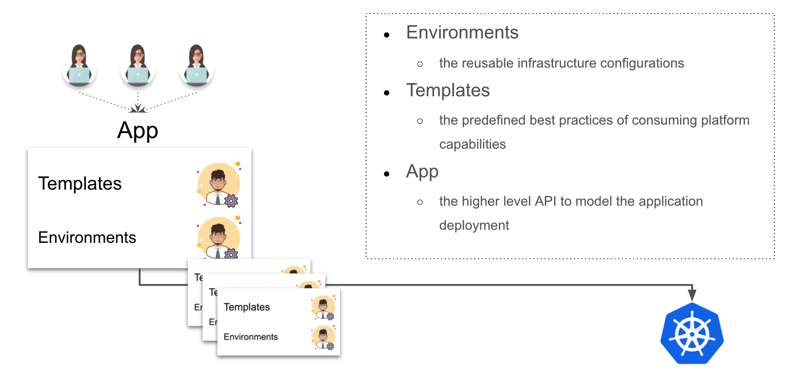

## Motivation

The trend of cloud-native technology is moving towards pursuing consistent experience of application delivery across clouds and on-prem clusters. Kubernetes is becoming the standard layer which is excellent in abstracting away low-level infrastructure details. But it does not provide abstractions to model application deployment on top of hybrid and distributed environments. The lack of application level context have impacted user experience, slowed down productivity, led to unexpected errors due to misconfigurations in production.

Meanwhile, modeling the deployment of a microservice application is a highly fragmented and challenging process. Thus, many solutions that tried to solve the problem so far are either over simplified and could not fix the real issue, or too complicated to use at all. On the other hand, though many solutions provided friendly UI layer, the platform themselves are not customizable. This means as the needs of your platform grow, it is inevitable for the feature requirements to outgrow the capabilities of such systems.

Today the application teams are eager to find a platform that can simplify the application delivery experience across hybrid environments (e.g. multi-cluster/multi-cloud/hybrid-cloud/distributed-cloud), while also be flexible enough to satisfy the fast growth of businesses requirements. The platform-engineers have similar empathy but the effort of building such system is out of their scope.

## What is KubeVela?

KubeVela is a modern application platform that makes it easier and faster to deliver and manage applications across hybrid, multi-cloud environments. At the mean time, it is highly extensible and programmable, which can adapt to your needs as they grow. 

## Who should use KubeVela?

- Application developers, operators, DevOps engineers
	- think about a modern Continuous Delivery (CD) platform.
- Platform builders for PaaS, Serverless, application management/delivery systems
	- think about an application delivery engine that you could build your advanced platform with.
- ISV, SaaS owners, and application architects who need to distribute software to anywhere
	- think about an App Store but on Kubernetes and clouds.

## Comparisons

### KubeVela vs. Platform-as-a-Service (PaaS) 

The typical examples are Heroku and Cloud Foundry. They provide full application deployment and management capabilities and aim to improve developer experience and efficiency. In this context, KubeVela shares the same goal.

Though the biggest difference lies in **flexibility**.

KubeVela is fully programmable. All of its deployment workflow and component feature set are LEGO-style CUE modules and can be extended or removed in-place when your needs change. Comparatively, traditional PaaS systems are highly restricted, i.e. they have to enforce constraints in the supported types of applications and capabilities -- That means as the platform grows, you always outgrow the capabilities of the PaaS system. Growing and extending is so much easier to do in the KubeVela platform.

### KubeVela vs. Serverless  

Serverless platform such as AWS Lambda provides extraordinary user experience and agility to deploy serverless applications. However, those platforms impose even more constraints in extensibility. They are arguably "hard-coded" PaaS, so KubeVela differ from them in similar way.

On the other hand, KubeVela can easily deploy both Kubernetes based serverless workloads such as Knative/OpenFaaS, or cloud based functions such as AWS Lambda.

### KubeVela vs. Platform agnostic developer tools

The typical example is Hashicorp's Waypoint. Waypoint is a developer facing tool which introduces a consistent workflow (i.e., build, deploy, release) to ship applications on top of different platforms.

KubeVela can be integrated with such tools seamlessly. In this case, developers would use the Waypoint workflow as the UI to deploy and release applications with KubeVela as the underlying deployment platform.

### KubeVela vs. Helm 

Helm is a package manager for Kubernetes that provides package, install, and upgrade a set of YAML files for Kubernetes as a unit. 

KubeVela as a modern deployment system can naturally deploy Helm charts. For example, you could use KubeVela to define an application that is composed by a WordPress chart and a AWS RDS Terraform module, orchestrate the components' topology, and then deploy them to multiple environments following certain strategy.

Of course, KubeVela also supports other encapsulation formats including Kustomize etc.

### KubeVela vs. Kubernetes

KubeVela is a modern application deployment system built with cloud native stack. It leverages [Open Application Model](https://github.com/oam-dev/spec) and Kubernetes as control plane to resolve a hard problem - making shipping applications enjoyable.

Welcome onboard and sail Vela!

## What's Next

Here are some recommended next steps:

- Start to [install KubeVela](./install).
- Learn KubeVela's [core concepts](core-concepts/application).
- Learn KubeVela's [architecture](core-concepts/architecture).

