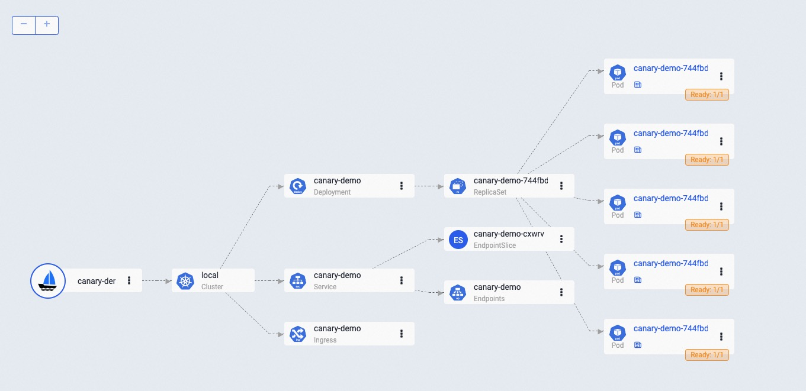
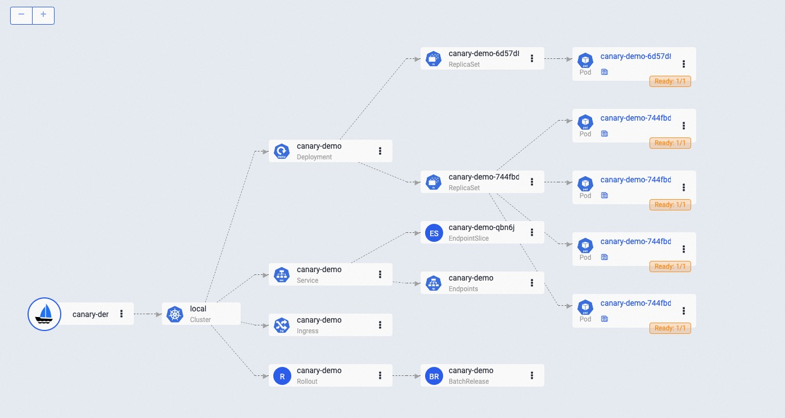
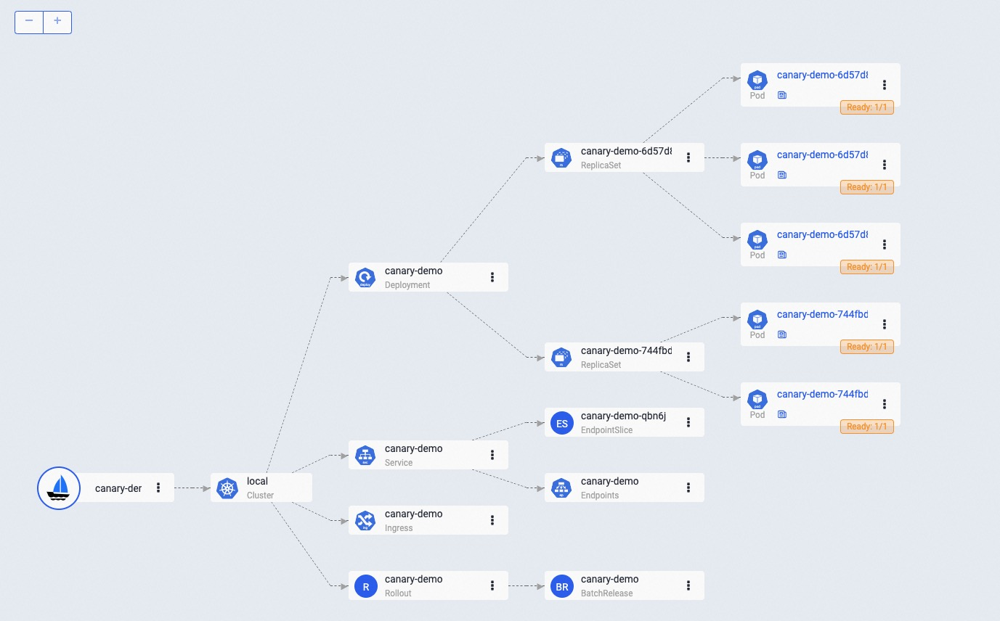
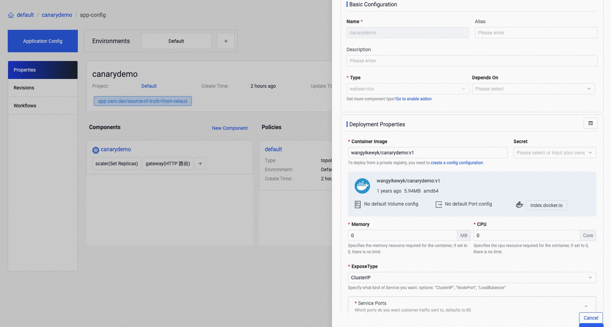
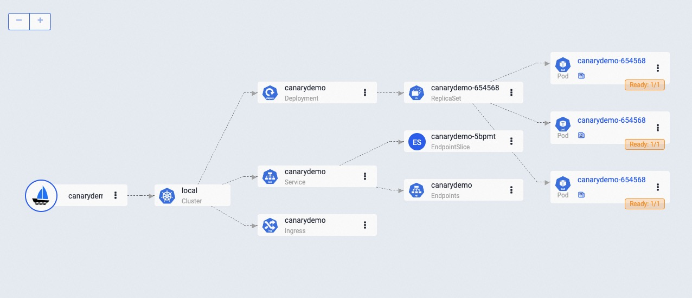
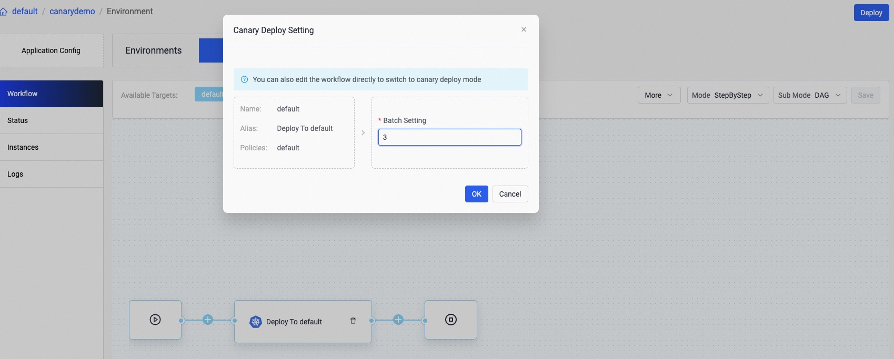
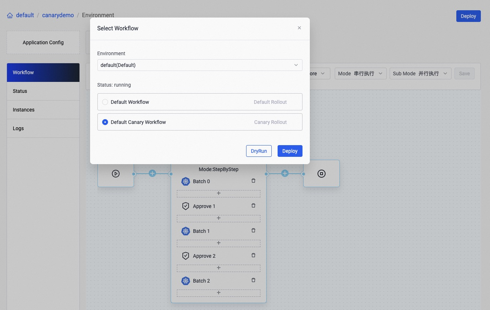
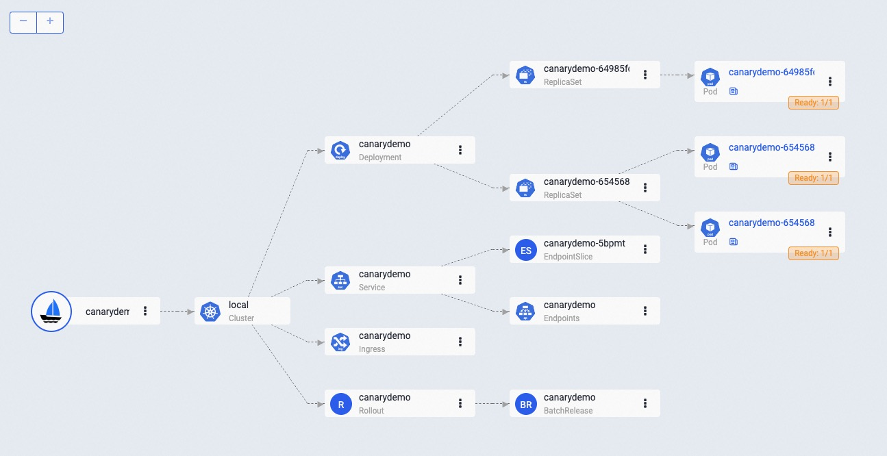
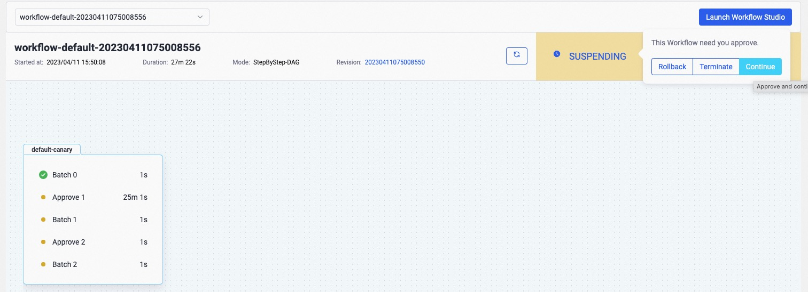
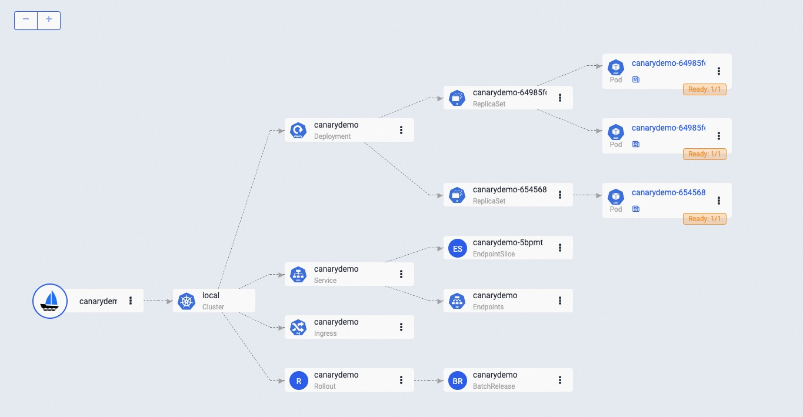

In this section, we will introduce how to canary rollout a container service.

## Before starting

Enable [`kruise-rollout`](../../reference/addons/kruise-rollout.md) addon, our canary rollout capability relies on the [rollouts from OpenKruise](https://github.com/openkruise/rollouts).
```shell
vela addon enable kruise-rollout
 ```

## First Time Deploy

Deploy the application as shown below:

```yaml
cat <<EOF | vela up -f -
apiVersion: core.oam.dev/v1beta1
kind: Application
metadata:
   name: canary-demo
   annotations:
      app.oam.dev/publishVersion: v1
spec:
   components:
      - name: canary-demo
        type: webservice
        properties:
           image: wangyikewyk/canarydemo:v1
           ports:
              - port: 8090
        traits:
           - type: scaler
             properties:
                replicas: 5
           - type: gateway
             properties:
                domain: canary-demo.com
                http:
                   "/version": 8090
EOF
```

The first deployment is a default way to deploy an application. You can check the status of the application to ensure it's running before proceeding to the next step.

```shell
$ vela status canary-demo
```

The expected output:

```shell
About:

  Name:         canary-demo                  
  Namespace:    default                      
  Created at:   2023-04-10 14:27:58 +0800 CST
  Status:       running                      

Workflow:

  mode: DAG-DAG
  finished: true
  Suspend: false
  Terminated: false
  Steps
  - id: c1cqamr5w6
    name: canary-demo
    type: apply-component
    phase: succeeded 

Services:

  - Name: canary-demo  
    Cluster: local  Namespace: default
    Type: webservice
    Healthy Ready:5/5
    Traits:
      ✅ scaler      ✅ gateway: No loadBalancer found, visiting by using 'vela port-forward canary-demo'
```

If you have enabled [velaux](../../reference/addons/velaux.md) addon, you can view the application topology graph that all `v1` pods are ready now by navigating to canary-demo->Workflows->Status. 



If you have already installed an ingress controller (or you can install one by enable the [ingress-nginx](../../reference/addons/nginx-ingress-controller.md) addon), you can access the gateway endpoint with the specific host by:

```shell
$ curl -H "Host: canary-demo.com" <ingress-controller-address>/version
Demo: V1
``` 

The host `canary-demo.com` is aligned with the `gateway` trait in your application, you can also configure it in your `/etc/hosts` to use the host url for visiting.

## Day-2 Canary Release

Let's modify the image tag of the component, from `v1` to `v2` as follows:

```yaml
cat <<EOF | vela up -f -
apiVersion: core.oam.dev/v1beta1
kind: Application
metadata:
   name: canary-demo
   annotations:
      app.oam.dev/publishVersion: v2
spec:
   components:
      - name: canary-demo
        type: webservice
        properties:
           image: wangyikewyk/canarydemo:v2
           ports:
              - port: 8090
        traits:
           - type: scaler
             properties:
                replicas: 5
           - type: gateway
             properties:
                domain: canary-demo.com
                http:
                   "/version": 8090
   workflow:
      steps:
         - type: canary-deploy
           name: rollout-20
           properties:
              weight: 20
         - name: suspend-1st
           type: suspend
         - type: canary-deploy
           name: rollout-50
           properties:
              weight: 50
         - name: suspend-2nd
           type: suspend
         - type: canary-deploy
           name: rollout-100
           properties:
              weight: 100
EOF
```

As we can see, in this update, we have also configured a canary-deploy workflow. This workflow includes 5 steps and splits the entire process into 3 stages.
Here's an **overview about what will happen** of the three stages:

1. In the first stage, the deployment will be updated with 20% of the total replicas. In our example, since we have a total of 5 replicas, 1 replica will be updated to the new version and serve 20% of the traffic. The upgrade process will then wait for a manual approval before moving on to the next stage.
2. Once the first stage has been approved, the second stage will begin. During this stage, 50% of the total replicas will be updated to the new version. In our example, this means that 2.5 replicas will be updated, which is rounded up to 3. These 3 replicas will serve 50% of the traffic, and the upgrade process will once again wait for a manual approval before moving on to the final stage.
3. In the final stage, all replicas will be updated to the new version and serve 100% of the traffic


Check the status of the application:

```shell
$ vela status canary-demo
About:

  Name:         canary-demo                  
  Namespace:    default                      
  Created at:   2023-04-10 15:10:56 +0800 CST
  Status:       workflowSuspending           

Workflow:

  mode: StepByStep-DAG
  finished: false
  Suspend: true
  Terminated: false
  Steps
  - id: hqhtsm949f
    name: rollout-20
    type: canary-deploy
    phase: succeeded 
  - id: umzd2xain9
    name: suspend-1st
    type: suspend
    phase: suspending 
    message: Suspended by field suspend

Services:

  - Name: canary-demo  
    Cluster: local  Namespace: default
    Type: webservice
    Healthy Ready:5/5
    Traits:
      ✅ rolling-release: workload deployment is completed      ✅ scaler      ✅ gateway: Visiting URL: canary-demo.com, IP: 192.168.9.103
  - Name: canary-demo  
    Cluster: local  Namespace: default
    Type: webservice
    Healthy Ready:5/5
    Traits:
      ✅ scaler      ✅ gateway: No loadBalancer found, visiting by using 'vela port-forward canary-demo'
```

The application's status is currently set to workflowSuspending, which means that the first step has been completed and the workflow is now waiting for manual approval.

View the topology graph again to confirm that a new v2 pod has been created to serve canary traffic. Meanwhile, the remaining 4 v1 pods are still running and serving non-canary traffic.


Access the gateway endpoint again. You will find that there is approximately a 20% chance of seeing the Demo: v2 result.

```shell
$ curl -H "Host: canary-demo.com" <ingress-controller-address>/version
Demo: V2
```

## Continue Canary Process

After verify the success of the canary version through business-related metrics, such as logs, metrics, and other means, you can `resume` the workflow to continue the process of rollout.

```shell
vela workflow resume canary-demo
```

Access the gateway endpoint again multi times. You will find out the chance (`50%`) to meet result `Demo: v2` is highly increased.

```shell
$ curl -H "Host: canary-demo.com" <ingress-controller-address>/version
Demo: V2
```

View topology graph again, you will see the workload updated 3 replicas to `v2`, and this pod will serve the canary traffic. Meanwhile, 2 pods of `v1` are still running and server non-canary traffic.



## Canary validation succeed, finished the release

In the end, you can resume again to finish the rollout process.

```shell
vela workflow resume canary-demo
```

Access the gateway endpoint again multi times. You will find out the result always is `Demo: v2`.

```shell
$ curl -H "Host: canary-demo.com" <ingress-controller-address>/version
Demo: V2
```

## Canary verification failed, rollback the release

If you want to cancel the rollout process and rollback the application to the latest version, after manually check. You can rollback the rollout workflow:

```shell
$ vela workflow rollback canary-demo
Application spec rollback successfully.
Application status rollback successfully.
Successfully rollback rolloutApplication outdated revision cleaned up.
```

Access the gateway endpoint again. You can see the result is always `Demo: V1`.

```shell
$ curl -H "Host: canary-demo.com" <ingress-controller-address>/version
Demo: V1
```

Any rollback operation in middle of a runningWorkflow will rollback to the latest succeeded revision of this application. So, if you deploy a successful `v1` and upgrade to `v2`, but this version didn't succeed while you continue to upgrade to `v3`. The rollback of `v3` will automatically to `v1`, because release `v2` is not a succeeded one.

## Perform canary rollout process on VelaUX

You can also execute a Canary Rollout process on VelaUX.

### First deployment

To begin, create an application with a `webservice` component and set its image to `wangyikewyk/canarydemo:v1`, as shown in the image below:



Next, add a `scaler` trait for this component and set the replica number to 3, as shown below:


Finally, configure a gateway for the component and set the hostname and traffic route, as illustrated in the image:


After clicking the deploy button, the application will be deployed, and you can check its status on the `resource topology` page, as shown below:



### Day-2 Canary Release

To update the component, change the image to `wangyikewyk/canarydemo:v2`:


Next, click the `deploy` button then click `Enable Canary Rollout` button to create a new canary rollout workflow, as shown below:


Set the batches to 3 to perform a Canary Rollout of the application with 3 batches:



You will see the new created workflow is as shown below, click the `save` button to save it.


The rollout process is divided into three steps, with each step releasing 1/3 replicas and traffic to the new version. A manual approval step is between two `canary-deploy` steps. You can also modify the weight of every Canary Rollout step.

Click deploy again and choose the `Default Canary Workflow` to begin the rollout process as shown: 



After the first step is complete, 1 replica will be updated to v2, as shown below:



You can try to access the gateway using the following command, and you will have a 1/3 chance of getting the `Demo: V1`.

```shell
$ curl -H "Host: canary-demo.com" <ingress-controller-address>/version
Demo: V1
```

### Continue rollout

To continue the rollout process, click the `continue` button on the workflow page:



You will find that 2 replicas have been updated to the new version:



### Rollback

To terminate the rolling process and rollback the application to version v1, click the `rollback` button:


You will find that all replicas have been rolled back to v1:


