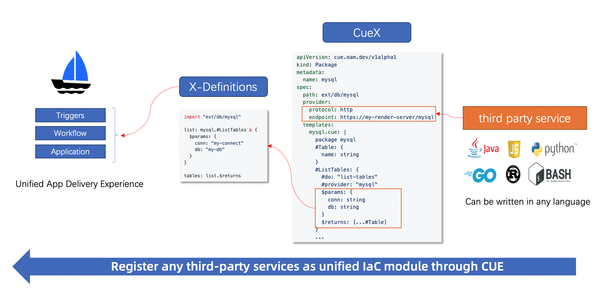

# Extending CUE with External Packages

CueX extends the CUE templating system by allowing users to define and execute custom functions as external packages. This enables integration with external services, dynamic function execution and reusability within workflow steps.

With CueX external packages, you can:
- Define reusable functions for workflow steps.
- Dynamically fetch data from APIs, databases, or external services.
- Avoid redundant logic by centralizing function definitions into reusable packages.
- Implement function providers in any language, as long as they expose endpoints that conform to CueX requirements.

> **Note:** External packages are available for use only within `WorkflowStepDefinitions`.

---

## Structure of a Package
A `Package` in CueX is a Kubernetes CustomResource (CRD) that defines an external function provider and the functions it exposes. The key attributes of `Packages` are:

#### metadata.name
- The name of the `Package`, used to reference it in the `#provider` field.
- This must match the `#provider` value within function templates.

#### spec.path
- Defines the import path of the package within CUE definitions.
- In the below example, `ext/example` means functions from this package can be referenced as:

   ```cue
   import "ext/utils"
  
   result: utils.#ExampleFunctionName & {
        $params: { example_parameter: "value" }
   }
   ```

#### spec.provider
Specifies where CueX should send function calls.
- `spec.provider.protocol`: Defines the communication method (currently only `"http"`).
- `spec.provider.endpoint`: The root endpoint of the function provider (e.g. http://my-cuex-server:8443/api/v1)
    >   e.g. If `#do: "api/example-fn-name"` is defined in a function, CueX will send `POST {provider_endpoint}/api/example-fn-name`.

#### spec.templates
- Defines CUE function templates that describe available functions.
- Each function includes:
   - `#do`: The function path that CueX will call (appended to `spec.provider.endpoint` at execution time).
   - `#provider`: The name of the package (must match `metadata.name`).
   - `$params`: The expected input format.
   - `$returns`: The expected output format.

### Example
```
apiVersion: cue.oam.dev/v1alpha1
kind: Package
metadata:
  name: external-package                  # Unique package name
spec:
  path: ext/example                       # Import path for CueX to reference
  provider:
    protocol: http                        # Currently, only `http` is supported
    endpoint: http://my-cuex-server:8443  # Root endpoint of the provider service
  templates:
    utils.cue: |                          # The filename inside the package
      package example                     // Recommended to match the final segment of the {spec.path} value

      #ExampleFunctionName: {             // Available in Cue as example.#ExampleFunctionName
        #do: "api/example-fn-name"        // CueX will call `{spec.provider.endpoint}/api/example-fn-name`
        #provider: "external-package"     // Must match metadata.name
        $params: {
          example_param: string           // Structure should match the parameters of the Fn
        }
        $returns: {
          example_result: number          // Structure should match the return structure of the Fn
        }
      }
```

---

## How CueX Resolves Calls
For the above package, when CueX encounters:
```cue
import "ext/example"

result: example.#ExampleFunctionName & {
  $params: { example_param: "A string value.."  }
}
```

It will:
1. Look up the `#provider` (_"external-package"_).
2. Identify that `#do: "api/example-fn-name"` maps to the provider’s POST _{endpoint}/api/example-fn-name_.
3. Send a POST _http://my-cuex-server:8443/api/example-fn-name_ request with this payload:
   ```json
   { "example_param":  "A string value.." }
   ```
4. Expect a response like:
   ```json
   { "example_result": "A returned string value.."}
   ```
5. Populate `$returns` in the CUE template with the received result.

---

## Implementing a Provider

External function providers can be written in any programming language, as long as they expose HTTP POST endpoints that match CueX’s expected request/response format.

### Provider Requirements
1. **Expose an HTTP API with matching paths**: Each function must be available at an HTTP POST endpoint, and the value specified in **#do** within the CUE Package must match the request path on the provider’s service. 

   For example, if `#do: "example"` is specified in the CUE package, the provider must expose a corresponding `/example` HTTP endpoint that handles the request.

2. **Accept JSON input**: The request payload should be a JSON object with a structure matching `$params`.

3. **Return JSON output**: The response should be a JSON object with a structure matching `$returns`.



---

## Example: Simple CUE Provider & Package
Lets define a very simple function `"sum"` which accepts two inputs and returns the sum. 
The function definition will look this:
```cue
#Sum: {                          
  #do: "sum"                     
  #provider: "external-cuex-package"
  $params: {
    x: number                    
    y: number
  }
  $returns: {
    result: number               
  }
}
```

### Implementing the Provider
#### Implementing the Provider in Go
Here’s an example of a very simple external CueX Provider written as a Go service. 

It implements the logic for the `"sum"` function and exposes it at `/sum`.

```go
package main

import (
	"encoding/json"
	"net/http"
)

type input struct {
	X int `json:"x"`                            // Matches the $params structure
	Y int `json:"y"`
}

type output struct {
	Result int `json:"result"`                  // Matches the $returns structure
}

func sumHandler(w http.ResponseWriter, r *http.Request) {
	var in input
	json.NewDecoder(r.Body).Decode(&in)

	out := output{Result: in.X + in.Y}
	w.Header().Set("Content-Type", "application/json")
	json.NewEncoder(w).Encode(out)
}

func main() {
	http.HandleFunc("/sum", sumHandler)         // Path must match `#do: "sum"`
	http.ListenAndServe(":8443", nil)
}
```

> **Note**: KubeVela provides a [simple server package](https://github.com/kubevela/pkg/blob/main/cue/cuex/externalserver/server.go) that can be utilised. 

#### Implementing the Provider in Python
For comparison, here’s the same CueX Provider implemented as a simple Python service:

```python
from flask import Flask, request, jsonify

app = Flask(__name__)

@app.route("/sum", methods=["POST"])            # Path must match `#do: "sum"`
def sum_numbers():
    data = request.json
    x = data.get("x", 0)                        # Extract values specified in $params
    y = data.get("y", 0)
    return jsonify({"result": x + y})           # Return JSON response as structure matching $returns

if __name__ == "__main__":
    app.run(host="0.0.0.0", port=8443) 
```

### Registering the Provider as a Package
Once the provider is running, it can be registered in Kubernetes as a `Package`:

```
apiVersion: cue.oam.dev/v1alpha1
kind: Package
metadata:
  name: external-cuex-package 
spec:
  path: ext/utils                               # Import path for CueX to reference
  provider:
    protocol: http
    endpoint: http://my-cuex-server:8443        # URL of the running provider service
  templates:
    utils.cue: |
      package utils

      #Sum: {                                   // Function name exposed to templates
        #do: "sum"                              // Function path to the provider services endpoint
        #provider: "external-cuex-package"      // The function provider (should match `metadata.name`)
        $params: {
          x: number
          y: number
        }
        $returns: {
          result: number
        }
      }

```

### Using the Package
With the Package registered, the `utils.#Sum` function is now available for use with WorkflowStepDefinition templates by importing the `ext/utils` provider. 

```cue
ˇimport (
	"ext/utils"                                             // The external provider
	"vela/op"
)

"example-workflow-step": {
	type: "workflow-step"
	description: "Workflow Step using external package"
}

template: {
	parameter: {}

	sum: utils.#Sum & {                                     // The exposed package & function                              
		$params: {
			"x": 2,
			"y": 5
		}
	} @step(1)

	msg: op.#Message & {
	    message: "The result is \(sum.$returns.result)"     // sum.$returns = { "result": 7 }
	} @step(2)
}
```

---

## Configuration Flags
The following KubeVela flags control the behavior of external Package handling in CueX:

| Flag                                                  | Type | Default  | Description                                                                   |
|-------------------------------------------------------|------|----------|-------------------------------------------------------------------------------|
| `enable-external-package-for-default-compiler`        | bool | `true`   | Enables the use of external packages.                                         |
| `enable-external-package-watch-for-default-compiler`  | bool | `false`  | Allows automatic reloading of external packages without restarting KubeVela.  |

---

## Summary

CueX external packages provide a **powerful, reusable, and modular** way to extend workflow templating in KubeVela. By defining external functions as Kubernetes resources, you can:

- Extend CueX with custom logic, like API calls or database queries.
- Reuse functions across multiple workflow steps, reducing duplication.
- Dynamically update functions without modifying individual workflow definitions.
- Maintain consistency across teams by centralizing function logic.
- Implement function providers in any language, as long as they expose HTTP endpoints matching CueX’s requirements.

With external packages, CueX makes it easier to build scalable, maintainable, and extensible workflow steps in KubeVela.