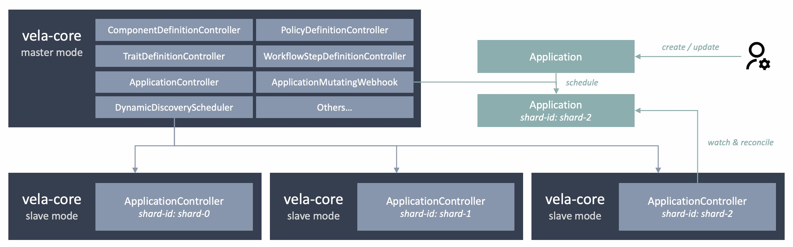

## Background

As many adopters start to choose KubeVela to manage large scale applications in their production, we have more and more scenarios and experiences on performance issue.

The typical Kubernetes controller usually run one controller to manage all related custom resources. The operator reconciliation is designed to be relatively lightweight. In KubeVela, to support customized delivery process and manage lifecycles of tens of resources in one application makes the reconciliation process heavier compared to typical controllers.

Although multiple replicas of KubeVela controller could provide high availability, in avoid of multiple concurrent reconciliation for the same application (which could lead to conflict problems), only one replica could work and this is achieved by acquiring the same leader-election lock.

So usually, users add more resources to KubeVela controller (more CPUs, Memory...) and set up more threads and larger rate limiter to support more applications in the system. This can lead to potential problems in different cases:
1. There are limitations for the growth of resources for a single KubeVela controller. If the Kubernetes cluster of the control plane uses lots of small machines, a single KubeVela controller can only run one of them, instead of spreading out.
2. The failure of the single KubeVela controller could block all the delivery process of applications. The failure could be caused by various reasons and some frequently seen reasons (like OOM or Crash due to some weird application input) are not recoverable by restarting controller.
3. In multi-tenancy scenario, there is no fairness that could be guaranteed if some users have a huge number of applications. They could make the controller run slow and users with a small number of applications could also be affected, due to the sharing of the single KubeVela controller.

Therefore, KubeVela core controller supports sharding since v1.8 which allows horizontal scaling and provides solutions to the above challenges.

## Architecture



When KuebVela controller is running in sharding mode, multiple core controllers can work concurrently. Each one will focus on a specific subset of the applications, identified by `shard-id`. There will be one master controller and multiple slave controllers.

**Master controller**: The master controller will enable all the components, such as ComponentDefinitionController, TraitDefinitionController, ApplicationController, Webhooks, etc.

The application controller will only handle applications with the label `controller.core.oam.dev/scheduled-shard-id: master`, and only the applications, applicationrevisions and resourcetrackers that carries this label will be watched and cached.

By default, it will watch the pods within the same namespace as it runs. The pods with labels `app.kubernetes.io/name: vela-core` and carries `controller.core.oam.dev/shard-id` label key will be selected and their health status will be recorded. The selected ready pods will be registered as schedulable shards. The mutating Webhook will automatically assign shard-id for non-assigned applications when requests come in.

**Slave controller**: The slave mode controller will only start the ApplicationController and will not enable others like Webhook or ComponentDefinitionController. It is dedicated to applications that carries the matched labels `controller.core.oam.dev/scheduled-shard-id=<shard-id>`.

## Use Guide

### Installation

1. First, install KubeVela with sharding enabled. This will let the KubeVela core controller deployed in master mode.

```shell
helm install kubevela kubevela/vela-core -n vela-system --set sharding.enabled=true
```

2. Second, deploy slave mode application controller.

```shell
vela addon enable vela-core-shard-manager nShards=3
```

This will start 3 slave controllers that runs with the same configuration as the master controller. For example, if the master one use the flag `max-workflow-wait-backoff-time=60`, all slave controllers will use the same.

You can customize the resource usage by

```shell
vela addon enable vela-core-shard-manager nShards=3 cpu=1 memory=2Gi
```

:::tip
There are different ways to do it.
1. Use kubectl to copy the deployment of master and modify it. Like
```shell
kubectl get deploy kubevela-vela-core -oyaml -n vela-system | \
    sed 's/schedulable-shards=/shard-id=shard-0/g' | \
    sed 's/instance: kubevela/instance: kubevela-shard/g' | \
    sed 's/shard-id: master/shard-id: shard-0/g' | \
    sed 's/name: kubevela/name: kubevela-shard/g' | \
    kubectl apply -f -
```
This will create a copy of the master vela-core and run a slave replica with shard-id as *shard-0*.
2. Just create a new deployment and set the labels to match the above mentioned requirements.

KubeVela's controller sharding does not require every shard to have the same configuration. You can let different shards to have different resource usage or rate limitations, or even different image versions.

> In the case you do not want dynamic discovery for available application controller, you can specify what shards are schedulable by add arg `--set sharding.schedulableShards=shard-0,shard-1` to the installation of KubeVela.
:::

### CLI

By default, the webhook in the master controller will automatically assign shard-id to applications. It will looks for available shards and set the `controller.core.oam.dev/scheduled-shard-id: <shard-id>` to the application. But there are cases it cannot handle.

1. If the application is created and no shard is available, the webhook will leave it unscheduled. Even if later shards joined, the webhook will not automatically schedule it unless the application is updated manually.
2. If an application is assigned to a shard which is later down, the webhook will not automatically reschedule it, unless the application is recreated.
3. For performance issue, user disable the usage of webhook.

For these cases, you can use the following command to reschedule the application manually.
```shell
vela up <app-name> -n <app-namespace> --shard-id <shard-id>
```

> Notice that not only applications are attached with the shard-id label, related system resources including ResourceTracker and ApplicationRevision are attached with the shard-id label as well. So when you call `vela up --shard-id` command, it will relabel all these system resources as well.

### Extension

Once you have understood the working mechanism of KubeVela's controller sharding, you will find that if you want to implement your own application scheduler, you only need to attach correct labels to applications and their related system resources (ResourceTracker and ApplicationRevision). Therefore, it is possible to design your own scheduler and let it run in the background to schedule applications with your customized strategies, like schedule applications by its owner or by the CPU usage of different shards.

## FAQ

Q: What will happen when the master one is down?
A: If the webhook is not enabled, then only applications scheduled to master shard will be affected. Users can still create or change applications in this case. If the webhook is enabled, the webhook will be down if the master one is down. Then the mutating webhook and validating webhook will fail so no new application creation or change will be accepted. Old applications that are scheduled to master will not be processed anymore. Others that are scheduled to other shards will not be affected.

Q: What will happen when a slave mode controller is down?
A: For applications that are not scheduled to that shard, nothing will happen. For applications that are scheduled to the broken shard, succeeded applications will not run state-keep or gc but the delivered resources will not be touched. For applications that are still running workflow, they will not be handled but can be recovered instantly when the controller is restarted.

Q: What will happen if one user delete the sharding label while the application is already in running state?
A: If the webhook is enabled, this behaviour will be prevented. The sharding label will inherit the original one. If the webhook is not enabled, the application will not be handled anymore (no state-keep, no gc and no update).

### Reference

1. Design doc. https://github.com/kubevela/kubevela/blob/master/design/vela-core/sharding.md
2. Implementation. https://github.com/kubevela/kubevela/pull/5360
