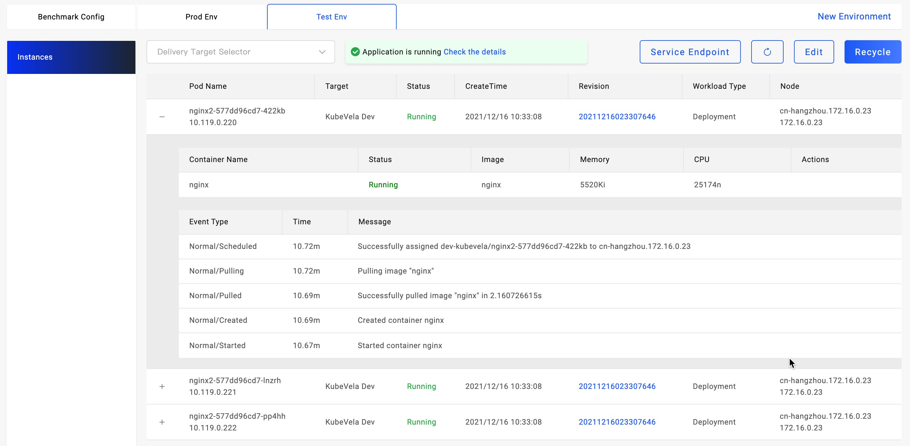

Different tabs of environment will show different application instances inside.

By default, it will display all instances deployed in the environment, you can filter the status by select targets.

As the picture shows, check the application pod details by click the expand button("+") on the left. You can view the pod status including the events and error message about it.

For cloud resources, there will be a link to the cloud console for management.

### Next Step

* [View Application Logs](./get-application-log)