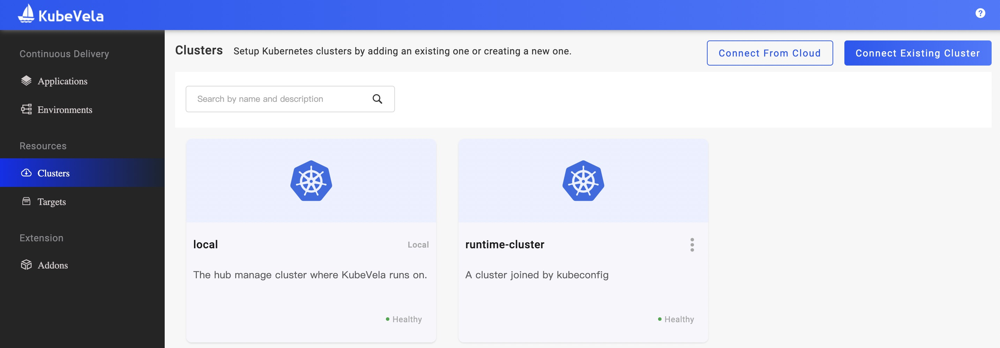
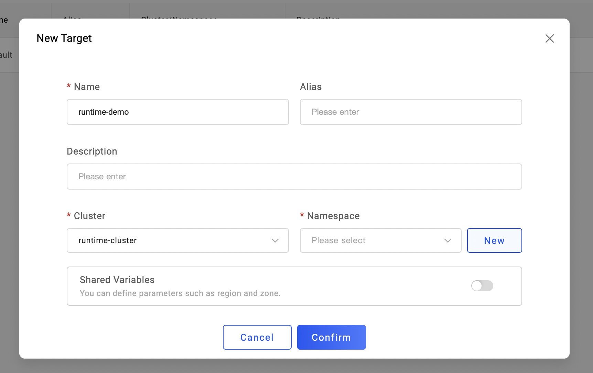
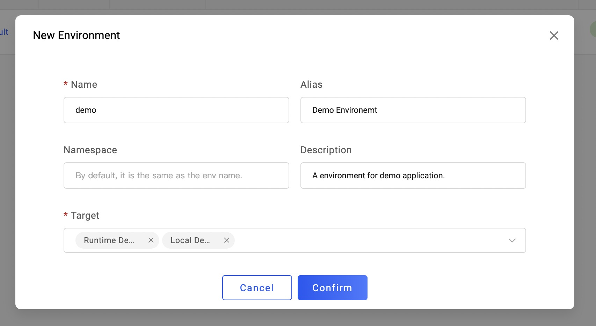

To deploy application components into different places, VelaUX provides **Target** for user to manage their deploy destinations like clusters or namespaces.

## Cluster

First, before configuring Target, you need to ensure your clusters have been joined. You can check your clusters in the Cluster page. The **local** cluster represents the cluster that KubeVela control plane is running on. If you have other clusters, you can either connect those clusters directly to KubeVela by providing their KubeConfig, or join clusters from your cloud provider such as Alibaba Cloud.

After adding clusters in KubeVela, you can edit their descriptions or disconnect them when there is no Application running on them.

## Create Target

Now you can creating Target for deploying your applications. A target identifies a specific namespace in one cluster. If the namespace does not exist in the cluster, you can also create the namespace by clicking the **New** button.

If you want to use the cloud resource (such as RDS from alibaba cloud), you can also set the *Shared Variables* and fill the provider name and region name in it. Make sure you have related terraform addon installed already.

## Bind Targets in Environment

Go to **Environment** page and now you can bind your created targets in a environment.

## Create Application with Environment

Now you can use the environent which was bound to the targets just created.

In the newly created application, you will see two targets contained in the workflow, which means when you deploy this application, the component will be dispatch to both targets.

