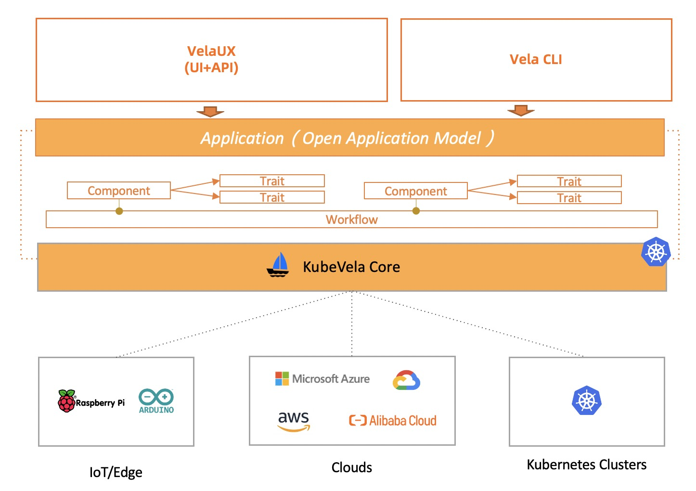

The overall architecture of KubeVela is shown as below:

## KubeVela is a Control Plane System

KubeVela orchestrates application components, cloud resources and pipeline over multiple clusters and hybrid environments. It is designed to be an application delivery and operation control plane instead of a runtime plugin.

For easy integration with upstream CI pipelines and GitOps tools, KubeVela API (i.e. Open Application Model) are designed as declarative and application-centric, including:

`Application` for designing application deployment plan.

`Definitions` for managing the abstraction and capabilities of KubeVela with CUE.

- e.g. `ComponentDefinition`, `TraitDefinition`, etc.

In implementation, KubeVela relies on a dedicated Kubernetes cluster to achieve above goals. We chose to rely on Kubernetes as the control plane implementation because this approach is battle tested and brings determinism, convergence and automation to application management at scale. In detail, KubeVela is composed by several parts:

- _KubeVela Core Controller_ that provides the core control logic of the entire system. For example, handling KubeVela API resources, orchestrating workflow, storing revisions, parsing and executing CUE code, garbage collecting, etc.
- _Addons_ that register and manage definitions along with extended CRD controllers that KubeVela needed to work. For example, Flux and Terraform addons.

This control plane Kubernetes cluster will be referenced as the "control plane cluster" in the following documentation.

### Runtime Infrastructure

The runtime infrastructure is where the applications are actually running on.
KubeVela itself is fully runtime infrastructure agnostic and hence allows you to deploy application to both Kubernetes based infrastructure and non-Kubernetes environments such as cloud platforms and edge devices.

## KubeVela is Programmable

In real world, application deployment tends to be complex and varies from teams, environments and scenarios. Hence, KubeVela introduced the [Definition Mechanism](./definition) which is a fully programmable approach to implement its deployment model so it can adapt to every need of your application delivery use case in-place.

## Who should use KubeVela?

- Platform builders for PaaS, Serverless, Application Management/Delivery systems
	- KubeVela works as an application delivery engine that you could build your advanced platform with.
- ISV, SaaS owners, and Application Architects who need to distribute software to anywhere
	- KubeVela has full extension and integration capabilities to allow users to distribute applications with [customized addons](../platform-engineers/addon/intro) easily. Think about an App Store but on Kubernetes and clouds.
- Application Developers, Operators, DevOps Engineers
	- VelaUX is an addon of KubeVela, with this addon enabled, it provides an out-of-box modern application Continuous Delivery (CD) and Management platform with an easy-to-use UI console.

## What's the relationship between OAM, KubeVela and VelaUX?

- [OAM(Open Application Model)](https://github.com/oam-dev/spec) is the model behind KubeVela, it provides a platform-agnostic application model including the best practices and methodology for different vendors to follow. The evolution of the model depends primarily on the practices of KubeVela currently.
- KubeVela is the core engine running on Kubernetes, it works as a [CRD controller](https://kubernetes.io/docs/concepts/extend-kubernetes/api-extension/custom-resources/) and brings OAM model into your Cloud Native PaaS along with lots of addon capabilities.
- VelaUX is one of the KubeVela addons, it provides out-of-box application delivery and management platform with **restful API** and **UI console**.

The KubeVela team will mainly focus on the core controller. By building VelaUX, we aim to provide out-of-box solutions for small and medium sized companies, and also eat our own dog food and make the extension, integration and the addon system capabilities of KubeVela better. 

## Next Step

- View [User Guide](../tutorials/webservice) to look on more of what you can achieve with KubeVela.
