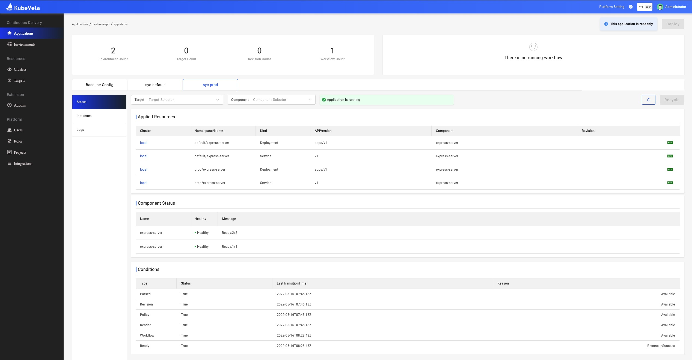

> Before starting, please confirm that you've installed KubeVela and enabled the VelaUX addon according to [the installation guide](./install.mdx).

Welcome to KubeVela! This section will guide you to deliver your first app.

## Deploy a classic application

Below is a classic KubeVela application which contains one component with one operational trait, basically, it means to deploy a container image as webservice with one replica. Additionally, there are three policies and workflow steps, it means to deploy the application into two different environments with a bit different configurations.

```yaml
apiVersion: core.oam.dev/v1beta1
kind: Application
metadata:
  name: first-vela-app
spec:
  components:
    - name: express-server
      type: webservice
      properties:
        image: oamdev/hello-world
        ports:
         - port: 8000
           expose: true
      traits:
        - type: scaler
          properties:
            replicas: 1
  policies:
    - name: target-default
      type: topology
      properties:
        # The cluster with name local is installed the KubeVela.
        clusters: ["local"]
        namespace: "default"
    - name: target-prod
      type: topology
      properties:
        clusters: ["local"]
        # This namespace must be created before deploying.
        namespace: "prod"
    - name: deploy-ha
      type: override
      properties:
        components:
          - type: webservice
            traits:
              - type: scaler
                properties:
                  replicas: 2
  workflow:
    steps:
      - name: deploy2default
        type: deploy
        properties:
          policies: ["target-default"]
      - name: manual-approval
        type: suspend
      - name: deploy2prod
        type: deploy
        properties:
          policies: ["target-prod", "deploy-ha"]
```

* Create an environment for your first app.

```bash
# This command will create a namespace in the local cluster
$ vela env init prod --namespace prod
environment prod with namespace prod created
```

* Starting deploy the application

```
$ vela up -f https://kubevela.net/example/applications/first-app.yaml
Applying an application in vela K8s object format...
I0516 15:45:18.123356   27156 apply.go:107] "creating object" name="first-vela-app" resource="core.oam.dev/v1beta1, Kind=Application"
✅ App has been deployed 🚀🚀🚀
    Port forward: vela port-forward first-vela-app
             SSH: vela exec first-vela-app
         Logging: vela logs first-vela-app
      App status: vela status first-vela-app
        Endpoint: vela status first-vela-app --endpoint
Application prod/first-vela-app applied.
```

* View the process and status of the application deploy

```bash
$ vela status first-vela-app
About:

  Name:      	first-vela-app
  Namespace: 	prod
  Created at:	2022-05-16 15:45:18 +0800 CST
  Status:    	workflowSuspending

Workflow:

  ...

Services:

  - Name: express-server
    Cluster: local  Namespace: default
    Type: webservice
    Healthy Ready:1/1
    Traits:
      ✅ scaler
```

The application will become a `workflowSuspending` status, it means the workflow has finished the first two steps and waiting for manuel approval as the step specified.

* Access the application

We can check the application by:

```bash
vela port-forward first-vela-app 8000:8000
```

It will invoke your browser and your can see the website:

```
<xmp>
Hello KubeVela! Make shipping applications more enjoyable. 

...snip...
```

* Resume the workflow

After we finished check the application, we can approve the workflow to continue:

```bash
$ vela workflow resume first-vela-app
Successfully resume workflow: first-vela-app
```

Then the rest part will be delivered in `prod` namespace:

```
$ vela status first-vela-app
About:

  Name:      	first-vela-app
  Namespace: 	prod
  Created at:	2022-05-16 15:45:18 +0800 CST
  Status:    	running

Workflow:

  ...snipt...

Services:

  - Name: express-server
    Cluster: local  Namespace: prod
    Type: webservice
    Healthy Ready:2/2
    Traits:
      ✅ scaler
  - Name: express-server
    Cluster: local  Namespace: default
    Type: webservice
    Healthy Ready:1/1
    Traits:
      ✅ scaler
```

Great! You have finished deploying your first KubeVela application, you can also view and manage it in UI.

## Manage application with UI Console

> Currently, the application created by CLI is readonly in your dashboard.

After finished [the installation of VelaUX](./install#4-install-velaux), you can view and manage the application created.

* Port forward the UI if you don't have endpoint for access:

```
vela port-forward addon-velaux -n vela-system 8080:80
```

* Check the password by:

```
vela logs -n vela-system --name apiserver addon-velaux | grep "initialized admin username"
```

* Check the resources deployed

Click the application card, then you can view the details of the application.



## Clean up

```
$ vela delete first-vela-app
Deleting Application "first-vela-app"
app "first-vela-app" deleted from namespace "prod"
```

That's it! You succeed at the first application delivery. Congratulation!

## Next Step

- View [Core Concepts](./getting-started/core-concept) to learn more about how it works.
- View [User Guide](./tutorials/webservice) to look on more of what you can achieve with KubeVela.
