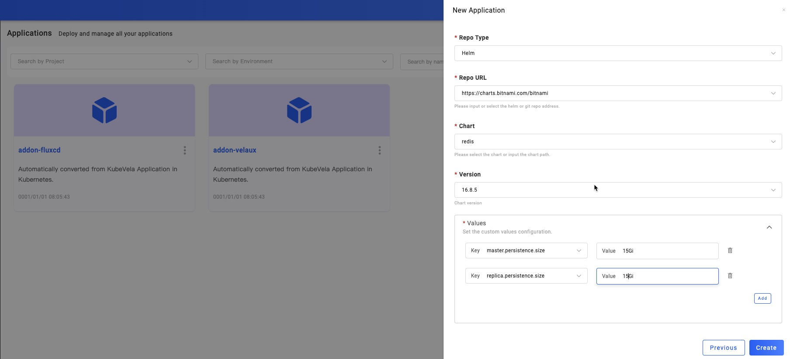

This section introduces that how you deploy Helm Chart into multi-environments and clusters.

The typical usage of deploying Helm Chart is to integrate middleware, many from in [bitnami](https://github.com/bitnami/charts) or open-source application tools such as Gitlab, Jenkins in [Helm Official Repo](https://hub.helm.sh/). KubeVela can help you easily deploy these applications to any managed cluster and manage them.

Starting from here, you will learn to use the KubeVela Addons to install plug-ins. The Helm Chart is currently supported by the FluxCD addon. In addition to the Helm Chart, FluxCD addon also supports Kustomize.

## Before starting

- Choose a Helm Chart you needed. Or in this case, we take [bitnami/redis](https://github.com/bitnami/charts/tree/master/bitnami/redis) as an example.
- Ensure that the cluster you deliver has a usable default StorageClass. Most of our delivery middleware requires data persistence, and the default StorageClass is needed to allocate PV.

## Enable fluxcd addon

Enabling Addon should have been experienced in the installation of KubeVela, like installing VelaUX. In this case, you will learn to enable addon in the UI page.

Let's get into the page of `Addon`. This page will automatically list the community Addons that can be installed. They are all from [Official Repo](https://github.com/oam-dev/catalog/tree/master/addons). We click `fluxcd` to check the details and status of this addon.

From the details, we can know that:

- Definitions： The extension capabilities provided by the addon may include component, trait, etc. For the fluxcd addon, it provides two component types, `helm` and `kustomize`, among which `helm` is the type we need to pay attention to and use here.

- Readme： Addon description, explain the capabilities and related information.

We can click the `Enable` button. After the fluxcd addon is enabled, it will be installed on all clusters connected to KubeVela, so it will take a certain amount of time.

When the addon is `enabled`, it means that it's ready to. You can start to deploy Helm Chart.

## Creating Redis application

You've must have mastered creating applications through the previous sections. When it comes to creating Redis with Helm Chart, all you need is to select type as `helm`, Then select the Target which has the default StorageClass that provides PV, and at last enter the deployment parameter configuration page.

As shown, you need to do the following configuration:

- Repo Type: Git and Helm are supported. In this example, we choose Helm.
- Repo URL: Fill in the repo address you needed. we type in: https://charts.bitnami.com/bitnami
- Chart: After fill Helm repo URL, will list all available chart in this field. You can choose one from the list, here we choose: redis.
- Version: After choose the helm chart, will list all available version of it. Choose one version of this chart, here we choose: 16.8.5.
- Values: Custom parameters of Chart. Since we are using ACK cluster in the example, PV has a minimum capacity requirement, 15Gi. In the same way, other parameters can also be configured according to your cluster's status.

After filling in the above parameters, click `Create` to complete the application creation and enter the application configuration page. The following steps will stay the same as you've learned in [Deploy First Application](../quick-start).

## Modify deployment parameters

Here we're unlocking new skills! Modify the parameters of the application. For any type of application, he can enter the application configuration page at any time by clicking the `Edit Properties` button at the top right of the `Baseline Config` page. This page is the same as the page when we created the application. It is automatically generated by combining the parameters defined by the Definition of each application type and the KubeVela UISchema specification.

After modifying the deployment parameters, the workflow of the environment must be executed to make the modified parameters take effect in the specified environment. Due to the existence of Revision, the configuration parameters will be saved in each historical version.

At this point, Helm Chart in KubeVela is no stranger to you, go ahead and try more!

<!--
## Next step
TODO v1.2
- [Deploy Cloud Services](./consume-cloud-services) -->
