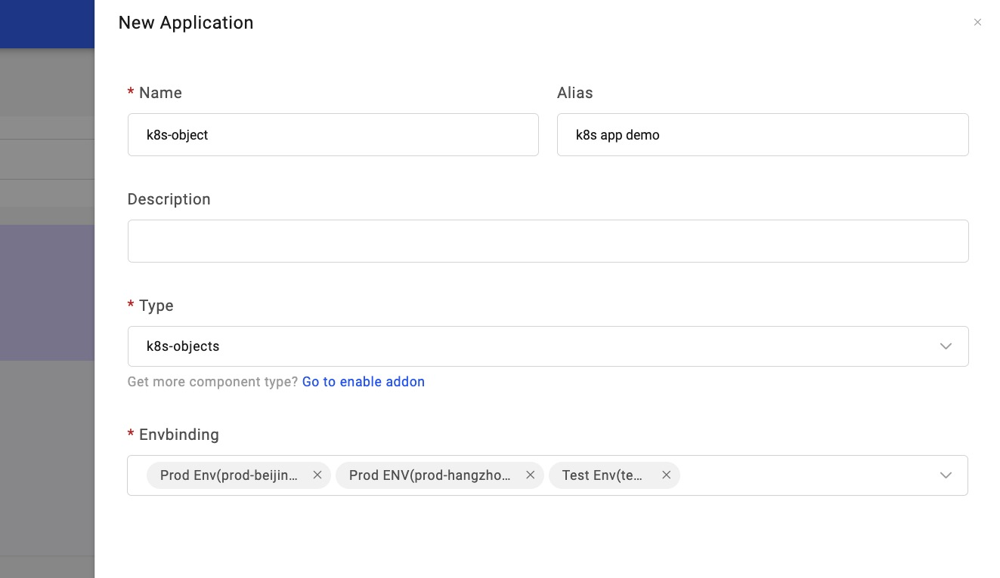
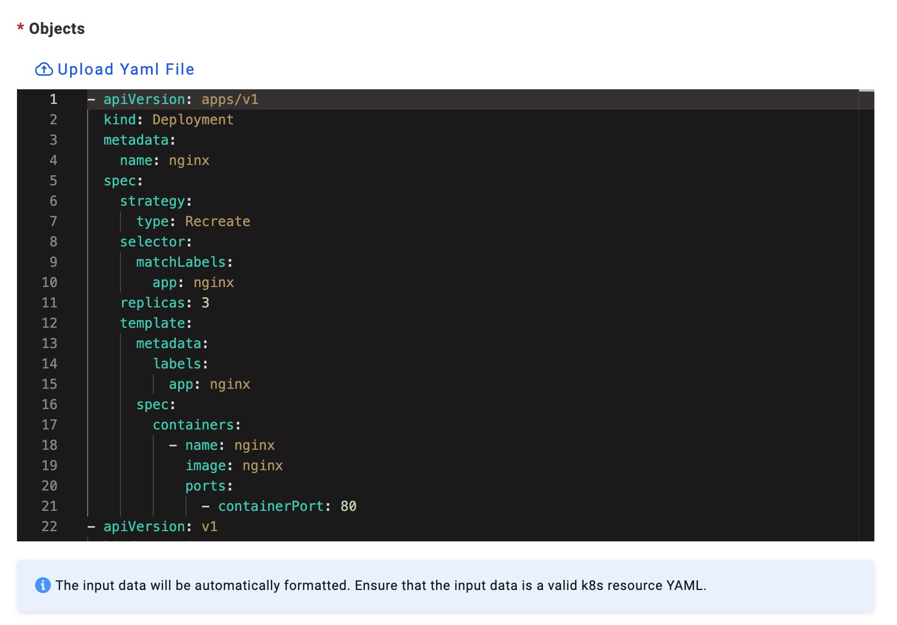
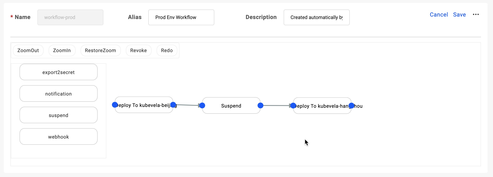

This section introduces that how you can deploy Kubernetes objects into multi environments and clusters.

KubeVela supports you to render, orchestrate and deploy Kubernetes objects. The common usage type is Deployment+Service. Using customized Workflow, you can deploy an application into multi-cluster in sequence. Hence you'll get to know:

1. Deploy Kubernetes objects.
2. Workflow and its usage.
3. Multi-env/cluster in application delivery.
4. The control loop of application deployment: Rollback, Terminate and Continue.

## Before starting

- Prepare a Deployment+Service yaml config resource.

<!-- - For setting up two and more runtime clusters, check out: [Manage Runtime Cluster](./manage-cluster) TODO v1.2-->

## Scheduling and creating Targets

[Target](../getting-started/core-concept#target) defines the namespace in runtime cluster for application delivery. Once Target created, namespace in runtime cluster created accordingly.

Clicking `New Target` into the creating process. Type in necessary Infos as Project, Cluster, Namespace to create. We create targets for 2 clusters. We create targets for 2 clusters. If you only have 1 cluster you can also use its namespaces to create several targets. For now, we at least give it to 3 Targets: 1 for test and 2 for prod environments.

## Creating Kubernetes application

After Target was created, we begin to create an application. Same to [Deploy First Application](../quick-start), we need to submit basic Infos:

(1) Select type: k8s-objects; NOTE that in one application please maintain at most one Workload type of resource, meaning without more than a Deployment or Statefulset.

(2) We schedule two environments, test and prod. Test environment links to the target for dev and prod environment select the other two targets.



(3) Upload your Yaml file. Note that, the name of the resource you specified must not conflict with existing ones. Also, the editor automatically formats the Yaml file.



After above, click `Create` to finish.

## Deploying test environment


Enter the further page, the application has automatically generated 2 environments and 2 workflows. Each environment has its workflow by default. A workflow consists of one or more steps such as `deploy2env`.

Firstly let's switch to the Tab of the test environment, click Deploy on the page. Since we only assigned one target for the test environment, there's one step for workflow. Looking at the status of its execution in the upper-right, it turns green when succeeded. If it shows red means that workflow went into trouble, you can click on the red sign to look through the detailed reason. Fix it accordingly and the deployment will continue to be regained.

After deployment is finished, refresh the list of instances to see Pods. Click for more if Pod shows abnormality.


As for the test environment, it sure can be updated at any time. When we update the parameters(image, instance), execute the workflow for an upgrade. Note that, choose the workflow for the test environment.


## Deploying prod environment

Let's switch to the Tab of the prod environment. It shows that it's not deployed yet. So now you can understand one basic thing for KubeVela, different environments in one application are completely dependant on each other, of each is an individual Application CR.

As we have two targets for the prod environment, it'll execute in sequence. If you hope to set up a manual approval before it gets into the second target, this is where workflow comes in.


we can see two generated workflow. Now we click the `Edit` in the workflow of the prod environment, drag out the `suspend` into the board at the right. Set up the configuration you needed.

Then we need to orchestrate their sequence. First disconnect existing steps (by clicking the line + delete button), connect the suspend step in the middle. After editing, you need to click the Save button on the upper right to save.



Back to the page of prod environment, click Deploy.


Monitoring the status on the upper right. When the first target finished deploying, a window pops up for you to give out a command.

`suspend` has three operations:

- Rollback: the revision reverts to the latest one in history, even with the first Target.
- Terminate: stop the deployment process but it will not change the first Target that already deployed.
- Continue: enter the execution of the next step.

If continued, the deployment goes on. In the list of instances, you can check out all the details.


## Deploy kubernetes objects via CLI.

This is a demo application with a kubernetes objects, the most kubernetes app are consists of Deployment and Service.
There are two policies and three workflow steps, this means deploying the app to two namespaces and waiting for human review after the first step is successful.

```yaml
apiVersion: core.oam.dev/v1beta1
kind: Application
metadata:
  name: app-with-k8s-objects
  namespace: default
spec:
  components:
    - name: k8s-demo-service
      properties:
        objects:
          - apiVersion: apps/v1
            kind: Deployment
            metadata:
              name: nginx
            spec:
              replicas: 2
              selector:
                matchLabels:
                  app: nginx
              strategy:
                type: Recreate
              template:
                metadata:
                  labels:
                    app: nginx
                spec:
                  containers:
                    - image: nginx
                      name: nginx
                      ports:
                        - containerPort: 80
          - apiVersion: v1
            kind: Service
            metadata:
              annotations:
                service.beta.kubernetes.io/aws-load-balancer-type: nlb
              labels:
                app: nginx
              name: nginx
              namespace: default
            spec:
              externalTrafficPolicy: Local
              ports:
                - name: http
                  port: 80
                  protocol: TCP
                  targetPort: 80
              selector:
                app: nginx
              type: LoadBalancer
      type: k8s-objects
  policies:
    - name: topology-default
      type: topology
      properties:
        clusters: ['local']
        namespace: default
    - name: topology-production
      type: topology
      properties:
        clusters: ['local']
        namespace: production
  workflow:
    steps:
      - name: deploy2default
        properties:
          policies: ['topology-default']
        type: deploy
      - name: suspend
        type: suspend
      - name: deploy2production
        properties:
          policies: ['topology-production']
        type: deploy
```

- About the topology policy, refence: [Topology](../end-user/policies/references#override)
- About the deploy workflow step, refence: [Deploy](../end-user/workflow/built-in-workflow-defs#deploy)

Deploy this application by the following command:

- create the namespace with the name `production` before deploying the application.

```shell
$ vela up -f https://kubevela.io/example/applications/create-namespace.yaml
```

- deploy the demo application.

```shell
$ vela up -f https://kubevela.io/example/applications/app-with-k8s-objects.yaml
```

- review and resume the workflow after the workflow becomes suspended.

```shell
$ vela workflow resume app-with-k8s-objects
```

Congrats! Now you've learned how to deploy Kubernetes objects.
