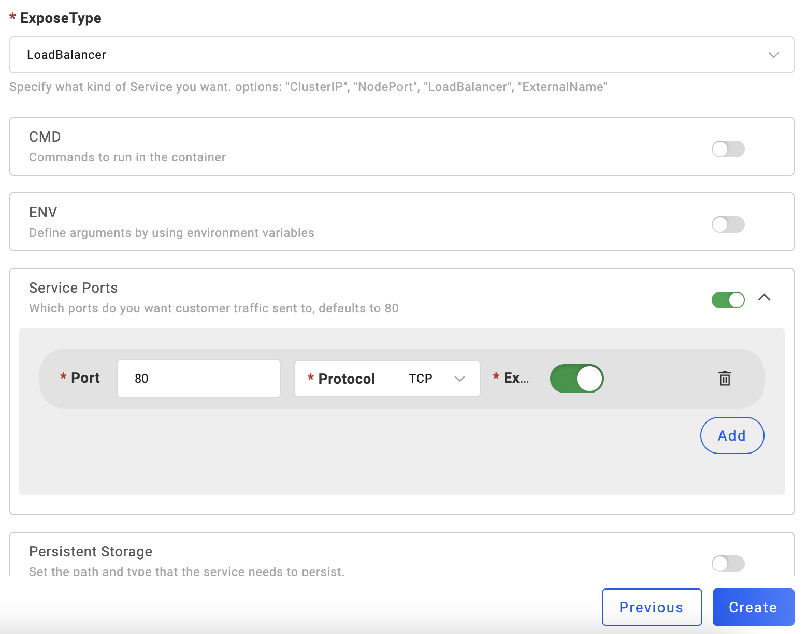
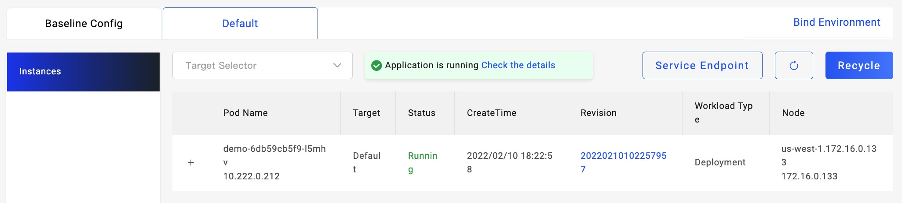

## Introduction

In our daily development, when image tags changed, it is more convenient for CI/CD if the environments can automatically deploy the new image. KubeVela provides this mechanism.

In KubeVela 1.2, [VelaUX](../install#3-install-velaux) provides a good way to do this. We can use KubeVela triggers to apply applications automatically.

In this section, we will use GitLab as code repository and Harbor as image repository to integrate with KubeVela triggers, as a result, it will automatically update application when image tags changed.

## Create Application

To use triggers, we need to create a new application on VelaUX first. We can create a new WebService type application and use LoadBalancer to expose port 80 for access.



## Create Triggers for Application

After creating the application, use `New Trigger` to create a trigger. Here we use `Harbor` as payload type to support requests from the `Harbor` image registry.


Check the details of the trigger, you can see the specific Webhook URL and the manual trigger command.


## Setup Harbor Trigger

Harbor payload triggers need to cooperate with Harbor image registry. After creating a trigger of type Harbor, we can copy the Webhook URL of the trigger and configure it in the Harbor image registry.


## Test and Apply

After these setups, we can now test the trigger.

Let's start by looking at the current app page, you can directly jump to the LoadBalancer address through the `Service Endpoint` of the application.



As you can see, the current Demo application's version is `v1.0.0`.


This source code of this demo is on the [GitLab] (https://gitlab.com/FogDong/KubeVela-GitOps-Demo-Code). There is also a CI file in this repo, in which steps are simple, every time the code is updated, it will automatically build the image and pushed to the image registry.

We can change the version in the code to `v2.0.0`:

```javascript
data(){
    return {
      v: 'v2.0.0',
    }
  },
```

After changing the code, the GitLab CI will automatically build the image and push it to the image registry.

In the access log of the Harbor trigger, we can see that Harbor sends a request to our Webhook URL when the latest image is pushed to the image registry.


Check the application revisions in VelaUX, you can see that the most recent revision was from `Webhook`.


Looking back at the app page, you can see that the app version has changed to `v2.0.0` and the background of the page has changed with the version.


## Summary

The KubeVela triggers' combination with the image registry is smooth and seamless. In addition to Harbor, KubeVela also supports ACR registry and custom trigger payload types.

With KubeVela triggers, we can easily apply application based on image tags automatically and complete iterations of application versions.
